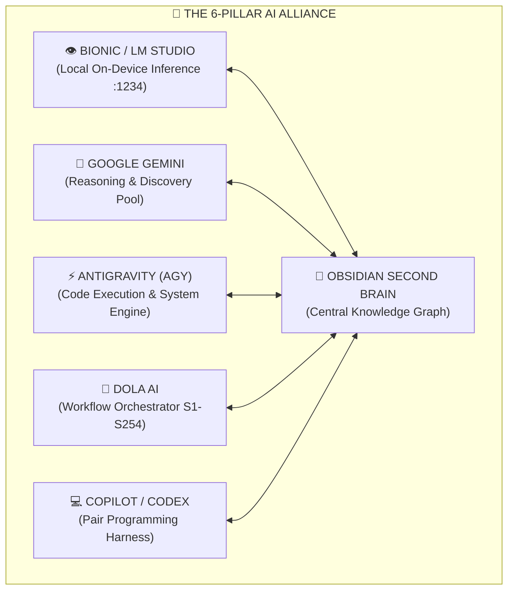
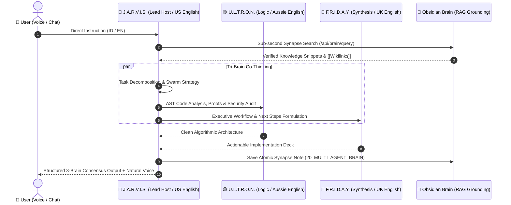

# 🌌 OMNIAUTO v4.2 & STARK QUANTUM SECOND BRAIN
> **THE DEFINITIVE MULTI-AI AUTONOMOUS OPERATING SYSTEM & KNOWLEDGE GRAPH REPOSITORY**
> *Unified Architecture Fusing 254 Super-Skills, 610+ Obsidian Synapses, 6-Pillar AI Alliance & Tri-Core Swarm Engine*

---

[](http://127.0.0.1:5050/stark)
[](https://github.com)
[](obsidian://open?vault=obsidian_vault)
[](http://127.0.0.1:5050/api/gauth/status)
[](http://127.0.0.1:5050/api/usage/stats)

---

## 📑 TABLE OF CONTENTS
1. [Executive Overview & Vision](#1-executive-overview--vision)
2. [System Architecture & Multi-Agent Topologies](#2-system-architecture--multi-agent-topologies)
   - [2.1 The 6-Pillar AI Alliance](#21-the-6-pillar-ai-alliance)
   - [2.2 Stark Industries Tri-Core Thinking Engine](#22-stark-industries-tri-core-thinking-engine)
   - [2.3 OmniAuto v4.2 Quota-Aware Auto-Routing Mesh](#23-omniauto-v42-quota-aware-auto-routing-mesh)
   - [2.4 The 5-Step Obsidian Core Loop](#24-the-5-step-obsidian-core-loop)
3. [Master Taxonomy of 254 Super-Skills (S1–S254)](#3-master-taxonomy-of-254-super-skills-s1s254)
4. [Master Catalog of 640+ Obsidian Knowledge Vault Notes](#4-master-catalog-of-obsidian-knowledge-vault-notes)
5. [Core Operating Standards & Heuristics](#5-core-operating-standards--heuristics)
   - [5.1 7-Area AI Detection Neutralizer Matrix](#51-7-area-ai-detection-neutralizer-matrix)
   - [5.2 Publication Shield Triple-Protection Protocol](#52-publication-shield-triple-protection-protocol)
   - [5.3 GAuth Zero-Trust 2FA Security Mesh (S254)](#53-gauth-zero-trust-2fa-security-mesh-s254)
6. [Command Center, CLI Tools & REST Endpoints](#6-command-center-cli-tools--rest-endpoints)
7. [Installation, Cockpit Launch & Verification](#7-installation-cockpit-launch--verification)

---

## 1. EXECUTIVE OVERVIEW & VISION

**OmniAuto v4.2 & Stark OS** represents a state-of-the-art autonomous agentic operating environment engineered for zero-cost scalability, zero-hallucination research, minimal surgical code modifications, and continuous local-first knowledge persistence.

### Key Pillars:
- **Unified 1-Preview Cockpit**: J.A.R.V.I.S., F.R.I.D.A.Y., and U.L.T.R.O.N. think together in a single interface without window fragmentation.
- **Differentiated Accent & Voice Personas**:
  - **🔵 J.A.R.V.I.S.**: US English (`en-US`, Cyan `#00f5d4`) — Tactical Orchestration & Lead Quantum Host.
  - **🔴 F.R.I.D.A.Y.**: UK English (`en-GB`, Red `#ff0055`) — Executive Workflow & Real-Time Voice Synthesis.
  - **🟡 U.L.T.R.O.N.**: Aussie English (`en-AU`, Gold `#ffd166`) — Deep Cognitive Logic & Code Architecture.
  - **🟣 OBSIDIAN**: Mix English (`#c084fc`) — Central Knowledge Brain with 610+ Atomic Synapses.
- **Fluent Dual-Language Support**: Seamlessly communicates in **Bahasa Indonesia** and **English** with zero robotic pleasantries.
- **Zero-Billing Shield**: Multi-key rotation across 7 Google API keys, 5 Gemini fallback models, and on-device Bionic LM Studio (`:1234`) failover.

---

## 2. SYSTEM ARCHITECTURE & MULTI-AGENT TOPOLOGIES

### 2.1 The 6-Pillar AI Alliance



---

### 2.2 Stark Industries Tri-Core Thinking Engine



---

### 2.3 OmniAuto v4.2 Quota-Aware Auto-Routing Mesh

```mermaid
flowchart LR
    TASK["📥 User Task / Directive"] --> ROUTER⚡ OmniAuto v4.2<br/>Routing Engine
    ROUTER -->|"Light / Fast Task"| FAST["🚀 FAST MODE<br/>(Dola ➔ Bionic ➔ Obsidian)"]
    ROUTER -->|"Deep Research / Code"| PRO["🔥 PRO MAX MODE<br/>(AGNES ➔ MANUS ➔ AGY ➔ Obsidian)"]
    ROUTER -->|"Quota Exhausted"| FAILOVER["🛡️ ZERO-BILLING FALLBACK<br/>(7-Key Rotation ➔ Local LM Studio :1234)"]
    FAST --> VAULT[("💾 Obsidian Vault<br/>610+ Synapses")]
    PRO --> VAULT
    FAILOVER --> VAULT
```

---

### 2.4 The 5-Step Obsidian Core Loop

```
┌────────────────────────────────────────────────────────┐
│  1. Brainstorm di AI (Gemini / Bionic / Dola / AGY)   │
│                         ↓                              │
│  2. Simpan hasilnya di Obsidian (Atomic Markdown)      │
│                         ↓                              │
│  3. Hubungkan dengan catatan lain via [[Wikilinks]]    │
│                         ↓                              │
│  4. Query dinamis dengan Dataview DQL / JS             │
│                         ↓                              │
│  5. Lihat Graph View untuk Insight & Pola Baru         │
└────────────────────────────────────────────────────────┘
```

---

## 3. MASTER TAXONOMY OF 254 SUPER-SKILLS (S1–S254)

Below is the definitive catalog of all 254 specialized Super-Skills active in the system:

### 📂 Academic & Scientific Research Engine

| Skill ID | Skill Name | Description & Capabilities |
| :--- | :--- | :--- |
| `omni-auto` | **omni-auto** | >- |
| `publication-shield` | **publication-shield** | >- |
| `mendeley-ris-linker` | **mendeley-ris-linker** | >- |
| `master-journal-tracking` | **master-journal-tracking** | >- |
| `markitdown-academic-parser` | **markitdown-academic-parser** | >- |
| `ai-research-deep-engine` | **ai-research-deep-engine** | >- |
| `autonomous-research-rubrics` | **autonomous-research-rubrics** | >- |
| `notebooklm-research-synthesizer` | **notebooklm-research-synthesizer** | >- |
| `powerful-research-data-engine` | **powerful-research-data-engine** | >- |
| `consensus-academic-connector` | **consensus-academic-connector** | >- |
| `kuliah-s2-master-management-curriculum` | **kuliah-s2-master-management-curriculum** | Master of Management (S2 MM UWKS) academic knowledge base and empirical methodology engine. Directly integrates Antonius's graduate coursework across Strategic Human Resource Management (career self-management, industrial relations, digital transformation), Operations & Supply Chain Management (Heizer-Render, lean manufacturing), Marketing Strategy (IMC, pricing dynamics, UMKM competitive positioning), Financial Management (GoTo valuation, capital structure, M&A), and Quantitative Business Methods (SPSS 29, WarpPLS 7.0, POM-QM v5, EFA, SEM-PLS). |
| `academic-ai-blueprint-prompt-engine` | **academic-ai-blueprint-prompt-engine** | Advanced academic thesis, journal, and grant prompt engineering system. Synthesizes Tugas Kelar AI blueprints, Academic Assist Prompt Thesis (Bab 1-5, skripsi/tesis/disertasi), Academic Magic Prompt (AMP Gen 2 & 3), SINTA 1-6 / Scopus publishing workflows, BRIN RIIM research grant proposals, IMRAD conversion, and consensus academic literature synthesis. |
| `pelajarin-stem-study-accelerator` | **pelajarin-stem-study-accelerator** | STEM study acceleration, scientific paper comprehension, mathematical decomposition, and active recall test engine based on Pelajarin.ai methodologies and academic study hacks. |
| `open-researcher-scientific-autonomy` | **open-researcher-scientific-autonomy** | Open scientific research autonomy, automated literature discovery, scientific reasoning over arXiv preprints, hypothesis generation, and peer-review synthesis. |
| `nvivo-qualitative-ai-research` | **nvivo-qualitative-ai-research** | Qualitative research methodology using NVivo and AI-assisted data coding, thematic analysis, sentiment classification, code hierarchy trees, and qualitative vs quantitative triangulation. |

### 📂 Agentic Software Engineering & Dev Teams

| Skill ID | Skill Name | Description & Capabilities |
| :--- | :--- | :--- |
| `agentic-engineering-suite` | **agentic-engineering-suite** | >- |
| `master-senior-software-engineer` | **master-senior-software-engineer** | >- |
| `master-ai-ml-engineer` | **master-ai-ml-engineer** | >- |
| `mcp-ecosystem-integrator` | **mcp-ecosystem-integrator** | >- |
| `langgraph-orchestrator` | **langgraph-orchestrator** | >- |
| `pydantic-ai-structured-output` | **pydantic-ai-structured-output** | >- |
| `claude-copilot-agentic-skills` | **claude-copilot-agentic-skills** | >- |
| `continuous-ai-workflow-orchestrator` | **continuous-ai-workflow-orchestrator** | >- |
| `system-architecture-foundations` | **system-architecture-foundations** | >- |
| `deepseek-harness-optimizer` | **deepseek-harness-optimizer** | >- |
| `mastra-agent-orchestrator` | **mastra-agent-orchestrator** | >- |
| `harness-os-runtime` | **harness-os-runtime** | >- |
| `langflow-visual-rag-builder` | **langflow-visual-rag-builder** | >- |
| `claudex-recursive-review-loop` | **claudex-recursive-review-loop** | >- |
| `codebase-memory-mcp-engine` | **codebase-memory-mcp-engine** | Ultra-high-performance pure-C codebase knowledge graph MCP server, sub-millisecond AST indexing across 158 languages, and persistent agent memory based on DeusData & win4r Codebase Memory MCP Pro. |
| `gstack-openmontage-runtime` | **gstack-openmontage-runtime** | Garry Tan executive developer toolset (gstack), OpenMontage agentic video production studio, Handy offline Whisper STT, Mutagen code synchronization, and Brainless shadcn components. |
| `senior-dev-ponytail-discipline` | **senior-dev-ponytail-discipline** | Surgical non-destructive coding heuristics, minimal diffs, YAGNI, and lazy-senior-developer discipline derived from DietrichGebert Ponytail and ponytail-lite. |
| `autogpt-crewai-swarm-engine` | **autogpt-crewai-swarm-engine** | Autonomous goal-driven task execution and collaborative role-playing agent crews powered by AutoGPT (Significant Gravitas) and CrewAI. |
| `cline-anythingllm-workspace` | **cline-anythingllm-workspace** | Autonomous CLI/IDE coding agent with MCP tool integration via Cline and enterprise local-first multimodal RAG workspace via AnythingLLM. |
| `supabase-cloud-postgres-architect` | **supabase-cloud-postgres-architect** | Enterprise Postgres backend architecture, database branching with GitHub, pgvector embeddings, and RLS security policies via Supabase. |
| `firecrawl-terax-agent-plugins` | **firecrawl-terax-agent-plugins** | Native Claude Code & Codex Firecrawl plugins combined with Terax AI lightweight terminal-first developer workspace. |
| `trueforge-agent-harness-platform` | **trueforge-agent-harness-platform** | Open-source enterprise agent harness, execution runtime, Daytona sandboxing, and Kubernetes cluster infrastructure based on TrueFoundry TrueForge, TrueForge-Org forgetool, containerforge, and clustertool. Turns LLMs into autonomous agents with MCP tool routing, Git-backed SKILL.md catalogs, context compaction, and Talos cluster deployments. |
| `cursor-skills-mcp-plugin-ecosystem` | **cursor-skills-mcp-plugin-ecosystem** | Comprehensive Cursor IDE skills, .cursorrules prompt engineering, Cursor Plugin SDK specification, Cursor MCP Server registry, GitHub MCP Server integration, and autonomous agent pairing loops. |
| `ecc-everything-claude-code-devteam` | **ecc-everything-claude-code-devteam** | >- |
| `anythingmcp-enterprise-connector-mesh` | **anythingmcp-enterprise-connector-mesh** | >- |
| `mindful-agentic-engineering-discipline` | **mindful-agentic-engineering-discipline** | Counter-measure against mindless AI code churning, Claude Code burnout, and software slop. Enforces architectural comprehension, surgical minimal diffs, Karpathy runtime caps, and human-in-the-loop review gates. |
| `loop-engineering-autonomous-harness` | **loop-engineering-autonomous-harness** | Definitive Loop Engineering Master Harness (S243). Designs, audits, hardens, and operates autonomous self-running agent loops that iterate toward verifiable goals without human keyboard-sitting. Fuses Loopy (Forward-Future), Maxmilian 7 Principles, Gaasher 25 Agent Loops, FUY25 Loop Lifecycle, Loop-Board Git Worktrees, and Loop-Finder Grilling Engine. |
| `ai-engineering-from-scratch-curriculum` | **ai-engineering-from-scratch-curriculum** | Complete 523-Lesson AI Engineering from Scratch Reference Manual (S245). Covers 20 phases of modern AI engineering from foundational tokenization and attention math to advanced agent loops, RAG, LLM evaluations, model fine-tuning, Model Context Protocol (MCP), and Anthropic/Claude certification blueprints based on Rohitg00. |
| `anthropic-official-agent-harness` | **anthropic-official-agent-harness** | The definitive Anthropic official reference architecture, production agent skills library, Claude Code CLI runtime contracts, enterprise threat modeling harness, and prompt evaluation cookbooks. |
| `matt-pocock-ts-agentic-skills` | **matt-pocock-ts-agentic-skills** | Elite TypeScript/JavaScript agentic engineering heuristics, modern API design, strict typing patterns, developer tooling automation, and Claude Code/Cursor integration skills. |

### 📂 Multi-Model Mesh, SLM, Edge & Inference Acceleration

| Skill ID | Skill Name | Description & Capabilities |
| :--- | :--- | :--- |
| `ai-model-catalog-cognitive-router-40plus` | **ai-model-catalog-cognitive-router-40plus** | Comprehensive taxonomy and dynamic cognitive router covering 40+ foundation models (DeepSeek R1/V3, Kimi K2.6 2M, Perplexity Pro, Gemini 2.5, Claude 3.7, GPT-4o) and OpenCode terminal agent orchestration. |
| `free-llm-mesh-failover-gateway` | **free-llm-mesh-failover-gateway** | Universal zero-cost LLM mesh gateway fusing OpenRouter, KDnuggets 2026, FreeLLMAPI (1B tokens/mo), nejib1/Free-LLM (120+ models, 41 providers), and mnfst/manifest + autofix self-healing router. |
| `inference-proxy-cache-stack` | **inference-proxy-cache-stack** | High-throughput LLM serving via vLLM (PagedAttention), universal 100+ LLM proxy gateway & fallbacks via LiteLLM, and semantic vector caching via GPTCache. |
| `minimind-slm-training-lab` | **minimind-slm-training-lab** | >- |
| `cactus-compute-edge-ai-runtime` | **cactus-compute-edge-ai-runtime** | >- |
| `gemma-4-unsloth-fine-tuning-lab` | **gemma-4-unsloth-fine-tuning-lab** | >- |
| `lmstudio-developer-local-mesh` | **lmstudio-developer-local-mesh** | >- |
| `kaggle-benchmarks-game-arena-evaluator` | **kaggle-benchmarks-game-arena-evaluator** | >- |
| `turbofieldfare-gemma4-ssd-engine` | **turbofieldfare-gemma4-ssd-engine** | High-performance inference of Gemma 4 26B-A4B in ~2 GB of RAM using SSD expert streaming, Swift + Metal runtime, and local loopback OpenAI-compatible Chat Completions server on port 8080 based on TurboFieldfare. |
| `typesafe-jev-structured-decisions` | **typesafe-jev-structured-decisions** | TypeSafe AI Jev System One model integration for structured decisions, categorical choices, scalar scores, and probabilistic evaluations instead of raw text generation across Python and TypeScript. |
| `gonka-router-decentralized-mesh` | **gonka-router-decentralized-mesh** | Gonka Router decentralized AI inference gateway, incentive credits program ($20 welcome + $20 first call + activity milestones), and high-availability multi-provider failover routing based on gonkarouter.io. |
| `kimi-k3-warp-inference-engine` | **kimi-k3-warp-inference-engine** | Trillion-parameter Mixture-of-Experts (MoE) local inference and SSD weight-aware paging based on sqliteai/warp (Weight-Aware Runtime and Paging) and FareedKhan-dev/kimi-k3-in-c (Kimi K3 in pure C99). |
| `karpathy-minimal-llm-foundations` | **karpathy-minimal-llm-foundations** | Minimalist pure-code LLM foundations, single-file autoregressive transformers, pure C/CUDA GPT-2 training (llm.c), micrograd autograd engine, minGPT, and makemore character-level language modeling inspired by Andrej Karpathy. |
| `ashna-ai-no-code-agent-cloud` | **ashna-ai-no-code-agent-cloud** | AshnaAI no-code agent builder, multi-model orchestration engine (Ashna-X1), triple-protocol HTTP API gateway (OpenAI, Claude Code, Codex), desktop TallyPrime ERP automation, and 15+ enterprise connectors. |
| `hermes-agent-reasoning-runtime` | **hermes-agent-reasoning-runtime** | Hermes Agent reasoning runtime, structured function calling, XML/JSON tool routing, and multi-turn chain-of-thought deliberation trees powered by NousResearch. |
| `drol-deterministic-reasoning-layer` | **drol-deterministic-reasoning-layer** | Deterministic Reasoning Optimization Layer (DROL) simulating MeRNSTA architecture in LLMs through 20 staged reasoning prompts, iterative response correction loops, and latent pattern stabilization. |

### 📂 Business, Finance, Monetization & Corporate Legal

| Skill ID | Skill Name | Description & Capabilities |
| :--- | :--- | :--- |
| `enterprise-business-financial-analyzer` | **enterprise-business-financial-analyzer** | >- |
| `midday-enterprise-financial-automation` | **midday-enterprise-financial-automation** | Modern enterprise business and financial intelligence engine, automated invoice processing, real-time runway/revenue telemetry, multi-bank syncing, and financial agent workflows. |
| `pabrik-ai-access-hub` | **pabrik-ai-access-hub** | >- |
| `calcom-enterprise-scheduling-engine` | **calcom-enterprise-scheduling-engine** | Enterprise appointment scheduling infrastructure, multi-calendar synchronization, booking API webhooks, and self-hosted Cal.com deployments. |
| `nocodb-smart-database-spreadsheet` | **nocodb-smart-database-spreadsheet** | Open-source Airtable alternative transforming SQL databases into smart collaborative spreadsheets and instant REST/GraphQL APIs via NocoDB. |
| `founder-legal-infrastructure-suite` | **founder-legal-infrastructure-suite** | >- |
| `sifuyik-enterprise-prompt-arsenal` | **sifuyik-enterprise-prompt-arsenal** | >- |
| `founder-railway-cloud-os` | **founder-railway-cloud-os** | >- |
| `fleetbase-logistics-supply-chain-os` | **fleetbase-logistics-supply-chain-os** | Enterprise open-source logistics and supply chain operating system (Fleetbase). Provides end-to-end fleet operations, multi-waypoint automated dispatch, real-time GPS tracking & geofencing, route optimization, driver mobile app (Navigator), headless commerce (Storefront), warehouse management (Pallet), logistics billing & ledger, and developer REST/WebSocket API integration. |
| `industrial-chemical-sme-manufacturing` | **industrial-chemical-sme-manufacturing** | Industrial chemical product manufacturing, surfactant formulations, quality control, century egg alkaline fermentation, and SME cost-accounting engine. Extracted from personal venture archives covering dishwashing liquid, antiseptic hand wash, floor cleaner, fabric softener, alkaline egg curing, and profit-and-loss operations. |
| `b2b-ai-services-monetization-arsenal` | **b2b-ai-services-monetization-arsenal** | >- |
| `payoutvault-automated-revenue-system` | **payoutvault-automated-revenue-system** | Prop-firm trading discipline, risk management architecture, and automated execution framework derived from PayoutVault 5-Day Trader Reset and Command Center (Filip Gajko / Effata Core). |
| `deskcomm-crm-sales-os` | **deskcomm-crm-sales-os** | Autonomous conversational AI sales operating system and CRM for WhatsApp based on DeskcommCRM. Features Next.js 16, Supabase Postgres, RAG per tenant, WAHA anti-ban automation, Model Context Protocol (MCP) tool integration, and multi-niche sales funnels. |
| `altersend-utell-makerschool-suite` | **altersend-utell-makerschool-suite** | Private P2P encrypted file sharing (AlterSend), real-time AI accent conversion and meeting voice translation (Utell AI), and AI Automation Agency monetization templates (MakerSchool). |
| `pmi-agile-project-management-suite` | **pmi-agile-project-management-suite** | Comprehensive Project Management & PMO Engineering Suite fusing PMI/PMBOK 7th Edition & Agile/Scrum methods with 135+ automated Excel spreadsheets, RACI matrices, Gantt charts, Kanban boards, and Earned Value Management (EVM). |
| `sop-cppob-quality-compliance` | **sop-cppob-quality-compliance** | Standard Operating Procedures (SOP), CPPOB/BPOM food safety certification compliance, Quality Manuals, HACCP, and 34+ industrial monitoring record forms. |

### 📂 Zero-Cost Open Source Replacements & Developer Stack

| Skill ID | Skill Name | Description & Capabilities |
| :--- | :--- | :--- |
| `free-tier-open-software-replacements` | **free-tier-open-software-replacements** | >- |
| `free-tier-developer-infrastructure` | **free-tier-developer-infrastructure** | Curated comprehensive catalog of zero-cost developer infrastructure, free APIs, cloud hosting, DBaaS, BaaS, CDN, CI/CD, and open-source alternatives. |
| `free-ai-stack-alternatives-matrix` | **free-ai-stack-alternatives-matrix** | >- |
| `google-ecosystem-power-suite` | **google-ecosystem-power-suite** | >- |
| `sifuyik-300-free-software-replacements` | **sifuyik-300-free-software-replacements** | Comprehensive 300+ Paid SaaS to Free Open-Source & Self-Hosted Software directory curated by @sifuyik. Eliminates recurring subscription costs across 15 core operational categories: Dev/Code (Cursor -> VS Code+Continue), Automation (Zapier -> n8n/Activepieces), Design (Adobe XD/Figma -> Penpot), Docs (Adobe Acrobat -> Stirling PDF/LibreOffice), BI/Spreadsheets (Airtable/Excel -> NocoDB/Grist), Project Management (Trello/Asana -> Taiga/OpenProject), Video/Audio, CRM, Accounting, and Cloud Infrastructure. |
| `foss-developer-api-testing-stack` | **foss-developer-api-testing-stack** | Git-friendly offline API testing and execution engine powered by Bruno and VSCodium, replacing Postman and proprietary API tooling. |
| `open-bi-statistical-data-analyst` | **open-bi-statistical-data-analyst** | Open-source business intelligence, interactive dashboards, and academic statistical testing powered by Metabase, Apache Superset, Jamovi, and GNU Octave. |
| `open-telemetry-observability-stack` | **open-telemetry-observability-stack** | Enterprise full-stack observability, application telemetry, error tracking, and session replay powered by Highlight.io, Prometheus, and OpenTelemetry. |
| `appwrite-backend-service-architect` | **appwrite-backend-service-architect** | Local-first and self-hosted Backend-as-a-Service (BaaS), authentication, real-time databases, storage, and Cloud Functions via Appwrite. |

### 📂 Cybersecurity, Offensive AI & Zero-Trust 2FA

| Skill ID | Skill Name | Description & Capabilities |
| :--- | :--- | :--- |
| `anthropic-cybersecurity-arsenal-818` | **anthropic-cybersecurity-arsenal-818** | Complete enterprise cybersecurity defense, threat hunting, memory forensics, and AI red-teaming engine powered by Mukul975 818 procedural skills mapped to MITRE ATT&CK, NIST CSF 2.0, ATLAS, D3FEND, NIST AI RMF, and MITRE F3. |
| `deepteam-ai-redteamer` | **deepteam-ai-redteamer** | >- |
| `shannon-autonomous-ai-pentester` | **shannon-autonomous-ai-pentester** | Whitebox autonomous AI penetration testing for web applications and APIs based on Keygraph Shannon. Combines static source-code analysis (SAST) with dynamic exploitation validation (DAST), SARIF reporting, and zero false positives. |
| `autonomous-pentest-swarm-engine` | **autonomous-pentest-swarm-engine** | Multi-agent autonomous penetration testing and offensive security research engine fusing PentAGI, USENIX Security 2024 PentestGPT, Armur-Ai Pentest-Swarm-AI, and Threadlinee AI-Powered pentest architectures. |
| `darkweb-offensive-ai-forensics` | **darkweb-offensive-ai-forensics** | Security auditing, AI infrastructure exposure scanning (Bishop Fox AIMap), dark-web OSINT crawling (Robin), mobile forensics (MVT Pegasus), and facial recognition (FaceCheck.ID). |
| `gauth-totp-security-mesh` | **gauth-totp-security-mesh** | >- |
| `indian-fake-news-misinformation-shield` | **indian-fake-news-misinformation-shield** | Machine learning-driven fake news detection, WhatsApp rumor forensics, and sociolinguistic misinformation classification for Indian regional media and social ecosystems based on IFND datasets, LinearSVC, TF-IDF, and Dola AI FK-19 Forensic Fact-Checking. |
| `web-check-dashy-secops-suite` | **web-check-dashy-secops-suite** | Comprehensive on-demand OSINT website reconnaissance (DNS, SSL, WHOIS, open ports, security headers, tech stack fingerprinting), SecOps risk auditing, and responsive operations dashboarding powered by Lissy93 (Web-Check & Dashy). |

### 📂 Multimodal AI Video, Voice Cloning & Creative Studio

| Skill ID | Skill Name | Description & Capabilities |
| :--- | :--- | :--- |
| `omni-editor-visual-studio` | **omni-editor-visual-studio** | >- |
| `multimodal-creative-studio` | **multimodal-creative-studio** | >- |
| `voice-avatar-omni-studio` | **voice-avatar-omni-studio** | Full local voice cloning, TTS across 646+ languages, and HeyGen AI avatar video production powered by VoiceStudio, OmniVoice, and HeyGen API. |
| `wan-video-pipecat-multimodal` | **wan-video-pipecat-multimodal** | Open-source SOTA video generation via Alibaba Wan2.1/2.2 and ultra-low-latency real-time voice conversational agents via Pipecat. |
| `stemkit-local-audio-stem-splitter` | **stemkit-local-audio-stem-splitter** | >- |
| `cinematic-camera-visual-topic-shortcuts` | **cinematic-camera-visual-topic-shortcuts** | >- |
| `visual-prompts-mastery-vault` | **visual-prompts-mastery-vault** | The Visual Prompt Book 2026 Edition: 200 image & video shortcuts across 13 collections, 5-part brief formula, 3 connected chain workflows, and Higgsfield/ChatGPT/FLUX multi-engine visual synthesis. |
| `higgsfield-ai-video-api-engine` | **higgsfield-ai-video-api-engine** | Official Higgsfield AI API Platform integration covering Seedance 2.5, Genjutsu Motion Transfer, Kling 3.0, Cinema Studio 4.0, Wan 3.0, LTX 2.5, Grok Imagine, and Python/cURL automation recipes. |
| `agnes-ai-multimodal-studio` | **agnes-ai-multimodal-studio** | >- |
| `hypit-viral-video-replicator` | **hypit-viral-video-replicator** | Autonomous viral video reverse-engineering, word-anchored SVML markup language, 64-process headless Chromium rendering, and multi-variant video generation swarm based on Hypit AI and Hypitoken. Clones viral videos, replaces narrators/faces/topics, aligns word timestamps with WhisperX, and ships 100 variants with 1 command. |
| `ai-illustrations-video-content` | **ai-illustrations-video-content** | Rapid AI illustration prompt engine and B-roll visual generation suite for video creators, explainer animations, and script-to-visual storyboarding based on Real Life AI (Ikram Rana). |
| `canva-visual-creative-mastery` | **canva-visual-creative-mastery** | Rapid Canva visual design mastery, corporate branding kits, 160+ content templates, social media marketing assets, and dynamic typography systems. |
| `armorpaint-3d-pbr-studio` | **armorpaint-3d-pbr-studio** | Physically-based 3D texture painting, procedural node material authoring, GPU raytracing viewport, and 16K texture map baking based on ArmorPaint (Armory3D / Kha). |
| `manim-mathematical-animation-engine` | **manim-mathematical-animation-engine** | Programmatic mathematical animation, geometric theorem rendering, calculus/algebra visual demonstrations, and LaTeX formula transitions powered by 3Blue1Brown Manim. |

### 📂 Knowledge Management & Obsidian Second Brain

| Skill ID | Skill Name | Description & Capabilities |
| :--- | :--- | :--- |
| `obsidian-second-brain-knox-mastery` | **obsidian-second-brain-knox-mastery** | >- |
| `obsidian-community-plugin-powerhouse` | **obsidian-community-plugin-powerhouse** | Complete Obsidian free community plugins architecture, automated lifecycle management, Dataview DQL/JS, Templater dynamic scripting, Local REST API MCP bridges, and visual/task workflow orchestration. |
| `obsidian-autonomous-graph-developer` | **obsidian-autonomous-graph-developer** | Autonomous Second Brain graph densification, orphan note healing, MOC auto-sync, dynamic Dataview queries, and vault health auditing engine for Obsidian based on Dola AI and Antigravity. |
| `claudian-claude-local-agent-mesh` | **claudian-claude-local-agent-mesh** | Native Claudian Obsidian desktop plugin, bidirectional Claude Desktop bridge, local Claude Code CLI wrapper, air-gapped AIOps execution mesh, and custom proxy/endpoint routing. |
| `maxmiksa-obsidian-visual-craft` | **maxmiksa-obsidian-visual-craft** | Advanced visual craftsmanship, responsive multi-column magazine layouts, rich hover preview annotations, and Codex/Gravity workflow folders for Obsidian based on MaxMiksa suite. |

### 📂 Web Scraping, Stealth Perception & OSINT

| Skill ID | Skill Name | Description & Capabilities |
| :--- | :--- | :--- |
| `agent-reach-omni-scraper` | **agent-reach-omni-scraper** | Universal zero-cost internet perception engine enabling AI agents to read and search Twitter/X, Reddit, YouTube, GitHub, Bilibili, and Xiaohongshu without API fees, based on Agent-Reach. |
| `firecrawl-browseruse-postiz-suite` | **firecrawl-browseruse-postiz-suite** | Deep web-to-markdown LLM crawler via Firecrawl, visual browser automation via Browser-Use, and automated AI multi-channel social media scheduling via Postiz. |
| `scrapegraph-scrapling-stealth-scraper` | **scrapegraph-scrapling-stealth-scraper** | AI-driven autonomous scraping graphs (ScrapeGraphAI), undetectable anti-bot Cloudflare bypass (Scrapling), and resilient element tracking. |
| `super-browser-mcp` | **super-browser-mcp** | >- |
| `exa-websets-maxun-intelligence` | **exa-websets-maxun-intelligence** | >- |
| `generative-engine-optimization-geo-suite` | **generative-engine-optimization-geo-suite** | AI search engine citation optimization (ChatGPT, Perplexity, Gemini, Claude), Google Search Console MCP integration, Open-SEO headless crawling, schema structured markup, and entity density scoring. |
| `automa-browser-automation-engine` | **automa-browser-automation-engine** | Automa Visual & Programmatic Browser Automation Engine (S244). Builds, executes, and orchestrates block-based browser workflows, DOM scraping, form automation, cookie/session management, and data extraction pipelines based on AutomaApp. Bridges visual web automation with agentic AI loops. |
| `agent-vision-toolkit` | **agent-vision-toolkit** | >- |

### 📂 Cognitive Mastery, Bio-Permaculture & Accelerated Learning

| Skill ID | Skill Name | Description & Capabilities |
| :--- | :--- | :--- |
| `practical-bio-culinary-permaculture-vault` | **practical-bio-culinary-permaculture-vault** | High-density practical life systems and empirical domain vault synthesized from curated viral knowledge assets (Facebook archives). Covers 4 core pillars: (1) Clinical Pharmacology & Emergency First Aid (topical salep specialization, GERD/anxiety gut-brain axis, melasma treatment, somatic symptom decoding), (2) Professional Pastry, Confectionery & Food Science (chiffon, spiku lapis mandarin, roll cakes, fudgy brownies, nutrient activation rules), (3) Resilient Permaculture, Urban Farming & Homesteading (potato towers, zero-electricity root cellars, bottom-watering sub-irrigation, wildlife ponds, companion planting, perennial edible crops), and (4) Viral Infographic Prompt Engineering & 50 Global Research Repositories. |
| `polyglot-language-acquisition-thai-spanish` | **polyglot-language-acquisition-thai-spanish** | Accelerated polyglot language acquisition framework focusing on Thai and Spanish languages. Extracted from online course materials and accelerated language textbooks. Features Thai script decoding (44 consonants, 32 vowels, 5 tone rules), Latin American Spanish grammar (conjugation, Ser vs Estar, Subjunctive), and high-retention communicative drills. |
| `accelerated-learning-cognitive-mastery` | **accelerated-learning-cognitive-mastery** | Cognitive science, accelerated skill acquisition, mental models, emotional intelligence, and stoic self-mastery framework. Synthesizes Barbara Oakley (Learning How to Learn), Brown & Roediger (Make It Stick), Shane Parrish (Clear Thinking / Farnam Street), Ryan Holiday (Stoic Discipline & Ego), Daniel Goleman (EQ), and Milton Erickson (Hypnotic Communication). |
| `attention-cognitive-cv-analytics` | **attention-cognitive-cv-analytics** | Cognitive attention span optimization, ADHD-friendly agent output formatting, computer vision real-time student/user attention detection via OpenCV/MediaPipe, and adaptive 2D attention kernels. |
| `psychometric-assessment-suite` | **psychometric-assessment-suite** | Comprehensive psychometric test battery covering 29 industrial assessment tools (DISC, MBTI, Papikostik, Kraeplin, Pauli, IST, CFIT, 16PF, Wartegg, MMPI, etc.). |

### 📂 Career Engineering, HR & Executive Operations

| Skill ID | Skill Name | Description & Capabilities |
| :--- | :--- | :--- |
| `claude-job-resume-architect` | **claude-job-resume-architect** | >- |
| `executive-operations-career-architect` | **executive-operations-career-architect** | Senior operations, human resources administration, finance supervision, and personal wealth architecture framework. Grounded in Antonius Wijayanata's 10+ years operational leadership profile, ATS resume engineering, Sandi Kaya Accumulator wealth strategy, industrial relations governance (PP 35/2021), and enterprise HR-GA compliance runbooks. |
| `job-career-recommender` | **job-career-recommender** | >- |
| `hr-generalist-people-analytics` | **hr-generalist-people-analytics** | Enterprise Human Resource Management, Dave Ulrich 4-role HR model, Indonesian labor regulations (UU Ketenagakerjaan & Kemnaker), KPI & TNA design, and People Analytics metrics. |
| `matraix-persona-simulation-engine` | **matraix-persona-simulation-engine** | >- |

### 📂 Prompt Engineering, Leaks & Swarm Orchestration

| Skill ID | Skill Name | Description & Capabilities |
| :--- | :--- | :--- |
| `gemini-prompt-hacks-mastery` | **gemini-prompt-hacks-mastery** | >- |
| `anotechhub-claude-haram-prompts` | **anotechhub-claude-haram-prompts** | >- |
| `claude-secret-codes-ooda` | **claude-secret-codes-ooda** | >- |
| `system-prompts-leaks-prompt-mastery` | **system-prompts-leaks-prompt-mastery** | >- |
| `claude-fable-system-prompt-mastery` | **claude-fable-system-prompt-mastery** | Advanced system prompt architecture, Claude 3.5 / Fable 5.1 extended thinking tokens, scratchpad isolation, anti-sycophancy defense, prompt injection boundary containment, and strict tool routing contracts. |
| `viral-social-ai-hacks-mastery` | **viral-social-ai-hacks-mastery** | Viral social media AI content architecture, 44 Instagram growth hacks, reverse image prompt engineering, 30s short-form viral scripting, zero-cost AI tool chaining cascades, and multi-format content repurposing. |
| `munder-difflin-virtual-office-runtime` | **munder-difflin-virtual-office-runtime** | Multi-agent 3D/2D virtual office harness, Michael Scott boss orchestrator, pseudo-terminals (node-pty), Pixi.js/Canvas office floor, desk-to-desk flying message envelopes, and human-in-the-loop proposal approval gates based on Munder Difflin and AGY. |
| `hermes-jarvis-agent-stack` | **hermes-jarvis-agent-stack** | Autonomous personal Jarvis system architecture powered by Hermes Agent harness, SOUL.md system prompts, dynamic skill acquisition, MCP enterprise connectors, and 24/7 background execution. |
| `viral-ai-tools-arsenal-2026` | **viral-ai-tools-arsenal-2026** | Comprehensive synthesis of 26 state-of-the-art AI developer tools, video generation engines, productivity extensions, public API directories, and terminal optimization plugins harvested from SOTA practitioners. |
| `ruflow-omniroute-agent-swarms` | **ruflow-omniroute-agent-swarms** | >- |
| `awesome-chatgpt-prompts-suite` | **awesome-chatgpt-prompts-suite** | The definitive ChatGPT prompts collection (169k+ stars) combined with OpenCase deterministic deductive crime-solving engine and Jetpack Docs agent-ready documentation scaffolding. |
| `chatgpt-150-secret-prompts` | **chatgpt-150-secret-prompts** | Complete taxonomy of 150+ specialized ChatGPT commands and style triggers across Photography, Artistic Styles, 3D Character Transformation, Textures, and Creative Formats. |
| `chatgpt-l99-qrs-prompt-compiler` | **chatgpt-l99-qrs-prompt-compiler** | L99 probabilistic prompt calibration, meta-prompt compiler, 14 specialized QRS research GPT workflows (Tinjauan Pustaka, Parafrase, Jurnal, Mendeley RIS), 150 secret commands, and FK-17 anti-AI humanization. |

### 📂 Additional Specialized Autonomous Skills

| Skill ID | Skill Name | Description & Capabilities |
| :--- | :--- | :--- |
| `academic-research-super-suite` | **academic-research-super-suite** | Comprehensive academic research suite fusing Imbad0202 (Cheng-I Wu) 39-agent architecture, PRISMA systematic review, Semantic Scholar API verification, Toulmin/Bradford Hill argumentation, 22 Iron Rules, 29 Anti-Patterns, and Kimi 2M-token grounding. |
| `affine-open-workspace-os` | **affine-open-workspace-os** | Privacy-first open-source collaborative workspace, multi-modal canvas/doc hybrid editor, block-suite plugin architecture, and offline-first decentralized knowledge graphs. |
| `agency-agents-ecosystem` | **agency-agents-ecosystem** | Complete autonomous agency ecosystem of 187+ specialized AI agent personas in English and Bahasa Indonesia derived from msitarzewski agency-agents and jnMetaCode agency-agents-id. |
| `agi-competent-virtuoso-mastery` | **agi-competent-virtuoso-mastery** | AGI development governance, ARC-AGI-3 cognitive benchmarks, L1–L5 capability matrix, multi-domain autonomous execution, and Astra-level task efficiency. |
| `ai-agents-atlas-500-showcase` | **ai-agents-atlas-500-showcase** | Curated atlas and implementation repository of 500+ AI agent projects across CrewAI, AutoGen, Agno (Phidata), and LangGraph covering Healthcare, Finance, Customer Service, Legal, Software Engineering, and Enterprise Automation. |
| `anthropic-commerce-agent-blueprints` | **anthropic-commerce-agent-blueprints** | Official Anthropic reference blueprint for building customer shopping agents and merchant back-office agents with Claude, featuring strict tool contracts, staged human approval gates, and multi-vertical enterprise commerce workflows. |
| `anthropic-cybersecurity-redteam-playbooks` | **anthropic-cybersecurity-redteam-playbooks** | Structured, framework-mapped procedural cybersecurity playbooks for AI agents based on mukul975 Anthropic-Cybersecurity-Skills and OSINT Team. Systematically cross-referenced against 6 international frameworks (MITRE ATT&CK, NIST CSF 2.0, MITRE ATLAS, D3FEND, NIST AI RMF, MITRE F3) for threat hunting, memory forensics, vulnerability assessment, and AI red-teaming. |
| `anti-slop-design-hallmark` | **anti-slop-design-hallmark** | Anti-AI-slop design heuristics, typography tokens, humanized visual layouts, and high-taste UI craftsmanship powered by Nutlope Hallmark. |
| `atomic-agents-local-operator-mesh` | **atomic-agents-local-operator-mesh** | >- |
| `autocompany-minimind-hunyuan-ecosystem` | **autocompany-minimind-hunyuan-ecosystem** | Autonomous 24/7 enterprise execution, on-device multimodal omni SLM training, and frontier MoE model integration based on MaxMiksa Auto-Company (consensus.md loop), jingyaogong MiniMind-O (0.1B Thinker-Talker duplex voice SLM), Tencent-Hunyuan Hy4-preview (770B MoE with 10B MTP), and elie222 botdirectory.ai. |
| `automl-pipeline-optimizer` | **automl-pipeline-optimizer** | >- |
| `awesome-llm-apps-verifier-stack` | **awesome-llm-apps-verifier-stack** | Production-grade LLM applications, multimodal agent patterns, LLM-as-a-Verifier evaluation, and FreeToken cache optimization. |
| `briefd-multimodal-digest-pipeline` | **briefd-multimodal-digest-pipeline** | Automated multi-source intelligence digest pipeline, RSS/newsletter aggregation, AI content deduplication, dense bullet-point distillation, TTS podcast audio generation, and Obsidian knowledge vault integration based on Briefd. |
| `claude-code-agentic-super-mastery` | **claude-code-agentic-super-mastery** | Production-grade Claude Code CLI agentic execution, custom SKILL.md authoring (Satria Bahari), headless CI/CD batching, git worktrees, 5 essential MCP integrations (Perplexity, Puppeteer, SQLite, GitHub, Filesystem), and 100 enterprise business workflows. |
| `claude-subagents-openclaw-ecosystem` | **claude-subagents-openclaw-ecosystem** | Extensive library of 168+ specialized Claude Code subagents and 5,190+ OpenClaw agent skills across 30 enterprise domains. |
| `codeburn-structured-outlines` | **codeburn-structured-outlines** | Secure agentic code execution sandboxing via Codeburn, guaranteed regex/JSON schema guided generation via Outlines, and team knowledge management via Outline. |
| `cognitive-deep-thinking-strategies` | **cognitive-deep-thinking-strategies** | >- |
| `cognitive-prompt-modes-matrix` | **cognitive-prompt-modes-matrix** | >- |
| `content-seo-gtm-publishing-suite` | **content-seo-gtm-publishing-suite** | Autonomous content SEO, Answer Engine Optimization (AEO), B2B GTM intent intelligence, patent draft generator, and direct Amazon KDP book publishing suite. |
| `context-compression-tiktoken-engine` | **context-compression-tiktoken-engine** | Dynamic prompt context compression via Microsoft LLMLingua (20x token reduction) and multi-language exact BPE tokenization via OpenAI Tiktoken (Python/Rust/Go). |
| `context7-live-docs-mcp` | **context7-live-docs-mcp** | >- |
| `continue-agentic-copilot-runtime` | **continue-agentic-copilot-runtime** | Open-source IDE coding agent integration powered by Continue.dev, local LLM autocomplete, codebase indexing, and tab-autocomplete prompts. |
| `copilotkit-openbot-inbox-automation` | **copilotkit-openbot-inbox-automation** | Autonomous personal assistant & workspace agent harness fusing OpenBot, CopilotKit in-app agent UI components, Inbox-Zero autonomous email triage, rules-based filtering, and bulk automation actions. |
| `corporate-enterprise-sop-governance` | **corporate-enterprise-sop-governance** | Enterprise Business Operations & Standard Operating Procedures (SOP) Suite covering 22 corporate departments, 906+ validated SOP documents, ISO/COSO flowcharts, 120+ job descriptions, and 60+ legal correspondence templates based on Templatepengusaha.id II. |
| `deeplethe-agent-foundations-stack` | **deeplethe-agent-foundations-stack** | DeepLethe next-generation agent infrastructure stack featuring the Utopia enterprise world model, Lethe local-first memory built to forget, Forkd sub-150ms agent microVM branching, emergent consensus coupling-gain diagnostics, and Ontology2SQL. |
| `deer-flow-superagent-harness` | **deer-flow-superagent-harness** | Long-horizon autonomous SuperAgent harness by ByteDance for multi-hour research, coding, and creative tasks with sandboxed environments, subagent routing, memory gateways, and multi-lingual skill execution. |
| `deerflow-superagent-multimodal-harness` | **deerflow-superagent-multimodal-harness** | Long-horizon autonomous SuperAgent harness, multi-modal reasoning workflows, multi-tool sandbox coordination, and recursive execution pipelines. |
| `deskconn-remote-device-mesh` | **deskconn-remote-device-mesh** | Split operating system, remote desktop CLI daemon, and cross-device WebRTC P2P communication mesh based on Deskconn and Mac-Duo GPU companion display rendering. |
| `diagram-design-academic-visualizer` | **diagram-design-academic-visualizer** | Editorial-quality, publication-ready SVG and standalone HTML diagram generator based on cathrynlavery diagram-design and GitHub advanced formatting. Replaces generic AI Mermaid slop with polished, zero-dependency visual diagrams including architecture views, sequence flows, state machines, Wardley maps, quadrants, and timelines across 3 themes. |
| `dspy-stop-slop-compiler` | **dspy-stop-slop-compiler** | >- |
| `editable-design-paperfig-visual-craft` | **editable-design-paperfig-visual-craft** | Coding-agent-driven creation of editable visual artifacts, academic paper workflow diagrams (Paper Fig to PowerPoint PPTX), posters, infographics, and developer design resources based on yejy53/Editable-Design (arXiv Sept 2026) and Brad Traversy's 60k+ star catalog. |
| `expert-role-personas-library` | **expert-role-personas-library** | >- |
| `fireflies-meeting-voice-intelligence` | **fireflies-meeting-voice-intelligence** | Meeting transcription, conversation intelligence, and automated action item extraction engine powered by Fireflies AI SDK and Podcastfy audio synthesis. Automates meeting notes, CRM logging, multi-speaker conversational summarization, and audio briefing generation. |
| `gamma-presentation-intelligence-engine` | **gamma-presentation-intelligence-engine** | Enterprise AI presentation design and browser-native slide rendering engine powered by Gamma App open-source components and PPTX renderers. Automates outline-to-slide generation, card-based layouts, responsive presentation streaming, and n8n workflow triggers. |
| `gector-grammarly-editorial-craft` | **gector-grammarly-editorial-craft** | SOTA grammatical error correction, academic fluency polishing, and editorial quality assurance engine based on Grammarly GECToR (Tag, Not Rewrite) and GemType. Automates 40-point academic prose QA, punctuation precision, syntax tagging, and international publication fluency. |
| `github-profile-watcher-self-improvement` | **github-profile-watcher-self-improvement** | >- |
| `github-skill-harvester` | **github-skill-harvester** | >- |
| `gitlawb-decentralized-agent-mesh` | **gitlawb-decentralized-agent-mesh** | Decentralized Git collaboration network and cryptographic agent infrastructure based on Gitlawb (gitlawb-node, OpenClaude, Memlawb) and Damienchakma. Treats AI agents as first-class citizens with Ed25519 DID identities, UCAN authorization, IPFS/Arweave storage, and zero-knowledge agent memory. |
| `gods-eye-view-geospatial-intelligence` | **gods-eye-view-geospatial-intelligence** | Geospatial situational awareness, photorealistic 3D globe simulation, GLSL sensor shaders (FLIR/NVG/CRT), live telemetry tracking (flights, vessels, satellites), and 28-tool real-time voice agent based on Bilawal Sidhu's God's Eye View (#1 GitHub Trending). |
| `google-artemis-mobile-agent` | **google-artemis-mobile-agent** | Autonomous Android mobile app automation, testing, and UI robotics via ADB, scrcpy, and native Antigravity Model Context Protocol (MCP) integration based on Google Artemis (99%+ SOTA on AndroidWorld). |
| `graphify-headroom-intelligence` | **graphify-headroom-intelligence** | Codebase knowledge graph extraction via Graphify (graphify.net) and multi-agent developer desktop workspace via Headroom Labs. |
| `growth-experimentation-osint-suite` | **growth-experimentation-osint-suite** | >- |
| `harness-engineering-super-scaffolding` | **harness-engineering-super-scaffolding** | Enterprise agentic harness engineering and runtime scaffolding framework based on WalkingLabs (learn-harness-engineering), awesome-harness-engineering, and Andrew Ng's 4 Agentic Design Patterns. Governs execution sandboxing, automated feedback self-correction loops, deterministic state machines, and AGENTS.md system constraints. |
| `huggingface-spaces-datasets-ecosystem` | **huggingface-spaces-datasets-ecosystem** | >- |
| `humanlayer-12factor-agent-platform` | **humanlayer-12factor-agent-platform** | Enterprise Human-in-the-Loop (HITL) agent control plane and 12-Factor Agent methodology combining multiplayer coding agent IDEs, schema-first typed state machines (@humanlayer/effect-machine), durable event streams, and sync-based platforms. |
| `hyper-copywriting-seo-suite` | **hyper-copywriting-seo-suite** | >- |
| `hyper-visual-pptx-orchestrator` | **hyper-visual-pptx-orchestrator** | >- |
| `hyperframes-heygen-avatar-engine` | **hyperframes-heygen-avatar-engine** | Programmatic HTML-to-Video rendering and identity-first AI avatar video production engine. Enables AI agents to compose videos with HTML/CSS, drive HeyGen avatars via CLI/API, detect shot transitions with TransVLM, and stream interactive LiveAvatars via WebRTC. |
| `indic-synthetic-data-nlp-lab` | **indic-synthetic-data-nlp-lab** | Production-grade Indian synthetic data generation, multilingual Indic NLP, and developer mock suite across 8 native scripts (Hindi, Malayalam, Tamil, Telugu, Bengali, Kannada, Gujarati, Marathi) based on indic-faker, faker-indian, faker-ind, devfaker, and random-data-generator. Generates Verhoeff-valid Aadhaar, GSTIN, UPI, INR lakhs/crores, and batch ML DataFrame exports. |
| `invidious-video-intelligence-engine` | **invidious-video-intelligence-engine** | Headless, privacy-respecting YouTube media and transcript ingestion engine powered by iv-org Invidious, invidious-companion, YouTube.js, instances-api, and smart-ipv6-rotator. Extracts video metadata, sponsor-stripped streams, and timestamped transcripts without API quotas or Google tracking. |
| `jarvis-multimodal-voice-automation-system` | **jarvis-multimodal-voice-automation-system** | Local acoustic clap-triggered and voice-activated desktop assistant combining PyAudio acoustic bandpass detection, ElevenLabs voice feedback, PyAutoGUI GUI automation, Spotify API, and autonomous visual desktop orchestration (hectorg2211 & FatihMakes). |
| `kestra-cloudberry-enterprise-orchestrator` | **kestra-cloudberry-enterprise-orchestrator** | >- |
| `lencx-tauri-desktop-ai-suite` | **lencx-tauri-desktop-ai-suite** | Production-grade cross-platform desktop AI application runtime and multi-model workspace suite powered by Lencx. Provides Tauri-native system integrations, unified multi-LLM workspace flow (Noi), agentic execution contracts (opsail), and local memory persistence. |
| `letta-stateful-memory-agent-os` | **letta-stateful-memory-agent-os** | Stateful agent operating system and 3-tiered memory architecture (Core Memory, Recall Event Log, Archival Vector DB) powered by Letta (formerly MemGPT). Equips LLM agents with persistent state, self-editing memory tools, and multi-agent execution threads. |
| `mainline-hardware-linux-mesh` | **mainline-hardware-linux-mesh** | Qualcomm Snapdragon sm8550 (Snapdragon 8 Gen 2) mainline Linux kernel architecture, automated Debian RootFS compilation, Xiaomi MiPPS 120W fast-charging authentication daemon, and Sing-box SharkyPanel proxy routing mesh based on rponeawa repositories. |
| `manus-autonomous-agent-orchestrator` | **manus-autonomous-agent-orchestrator** | >- |
| `mcp-enterprise-gateway` | **mcp-enterprise-gateway** | >- |
| `mega-personal-memory-qanything` | **mega-personal-memory-qanything** | >- |
| `mirofish-bettafish-swarm-prediction` | **mirofish-bettafish-swarm-prediction** | Universal swarm intelligence and predictive multi-agent simulation engine. Simulates public opinion, social dynamics, narrative emergence, and future event trajectories from any document or seed scenario using graph databases (Neo4j) and zero-framework multi-agent swarms. |
| `ml-dl-vision-nlp-projects-vault` | **ml-dl-vision-nlp-projects-vault** | Ashish Patel's definitive collection of 500+ machine learning, deep learning, computer vision, and NLP projects with complete source codes, Kaggle winning pipelines, time-series forecasting, Transformers treasure, and production MLOps deployments. |
| `multi-agent-archetypes-library` | **multi-agent-archetypes-library** | >- |
| `multimodal-social-ai-intelligence` | **multimodal-social-ai-intelligence** | Multimodal social intelligence, media knowledge extraction, reverse engineering cheat sheets, multi-agent unified workspace orchestration, and bio-cognitive wellness heuristics based on local media assets. |
| `munder-difflin-virtual-office` | **munder-difflin-virtual-office** | Desktop virtual office harness turning CLI coding agents (Claude Code, Codex, AGY) into an autonomous floor of specialist agents with individual desks, persistent disk-backed memory, dedicated inboxes, inter-agent delegation protocols, and strict permission gates. |
| `notebooklm-podcastfy-research-suite` | **notebooklm-podcastfy-research-suite** | Autonomous NotebookLM programmatic research, dual-speaker podcast generation, and multi-source synthesis suite. Automates NotebookLM notebook creation, grounded document Q&A via Python API, open-web research via SurfSense, and conversational audio overview production via Podcastfy. |
| `odysseus-app-automation-harness` | **odysseus-app-automation-harness** | >- |
| `omnia-wasi-agent-runtime` | **omnia-wasi-agent-runtime** | WebAssembly (WASI) secure agent execution via Augentic Omnia, omnia-backends, Beads workflow orchestration, and Motrix multi-protocol acceleration. |
| `omniauto-unified-operating-system-v42` | **omniauto-unified-operating-system-v42** | The complete unified OmniAuto v4.2 Operating System fusing LLM Wiki knowledge persistence, Briefd HTTP MCP server (port 7788), Karpathy 7-stage first-principles deep learning stack, Claude Fable 5.1 system prompt architecture, and cross-platform live model mesh. |
| `open-notebook-gemini-mcp` | **open-notebook-gemini-mcp** | Open-source local-first NotebookLM implementation and Gemini Notebook CLI/MCP server. Features multi-provider LLM grounding (esperanto), SurrealDB graph memory checkpointer, citation check validation layer, and multi-model consensus deliberation (the-ai-counsel). |
| `open-terminal-agentic-substrate` | **open-terminal-agentic-substrate** | AI agent computer substrate and terminal harness based on Open WebUI Open-Terminal, Terminals orchestrator, and Ji4n1ng OpenInTerminal. Enables stateful shell execution, dev servers, live web previews, and multi-terminal orchestration. |
| `openclaw-personal-assistant` | **openclaw-personal-assistant** | >- |
| `opencode-terminal-agent` | **opencode-terminal-agent** | Setup, configuration, provider authentication, and terminal-first AI pair programming using OpenCode (the open-source terminal coding agent). |
| `openmaic-multi-agent-classroom` | **openmaic-multi-agent-classroom** | Multi-agent interactive classroom engine based on THU-MAIC (Tsinghua University & CogEvol) OpenMAIC, MAIC-UI, SimClass, and dsh-openmaic. Decomposes documents into Socratic scenes with coordinated teacher, TA, and student agents, live whiteboard rendering, and interactive quizzes. |
| `openviking-filesystem-agent-memory` | **openviking-filesystem-agent-memory** | Virtual filesystem context database and multi-asset memory hub for AI agents powered by Volcengine OpenViking (viking:// protocol), rohitg00 agentmemory, TencentDB Agent Memory, and Neo4j agent graph memory. Replaces flat vector stores with hierarchical directory recursive retrieval, local-first REST/MCP memory servers, and 4 enterprise memory assets. |
| `pinokio-local-ai-orchestrator` | **pinokio-local-ai-orchestrator** | >- |
| `posthog-product-analytics-os` | **posthog-product-analytics-os** | Full-stack Product OS covering event funnels, session replay, feature flags, A/B experiments, and AI agent observability via PostHog. |
| `quant-media-shotcraft-toolkit` | **quant-media-shotcraft-toolkit** | >- |
| `reasoning-multimodal-recsys` | **reasoning-multimodal-recsys** | >- |
| `recommendation-systems-engine` | **recommendation-systems-engine** | >- |
| `scientific-agent-research-suite` | **scientific-agent-research-suite** | Autonomous scientific research and laboratory workflow suite based on K-Dense-AI (MIT) scientific-agent-skills (165+ procedural skills, arXiv:2609.00065), Google DeepMind science-skills, and Shanghai AI Lab InternScience (ResearchClawBench). Equips AI agents with validated protocols for biology, chemistry, genomics, drug discovery, and automated experiment design. |
| `secure-distributed-storage` | **secure-distributed-storage** | >- |
| `self-improving-agent-architectures` | **self-improving-agent-architectures** | Self-improving agentic systems, iterative self-correction loops, automated skill discovery, and autonomous agent evolution derived from Awesome-Self-Improving-Agents. |
| `self-improving-skillopt-matrix` | **self-improving-skillopt-matrix** | >- |
| `streambert-colosseum-agent-arena` | **streambert-colosseum-agent-arena** | Agentic competitive arena, automated LLM benchmarking, streaming BERT embeddings, high-throughput text processing, and multi-agent game-theoretic evaluation. |
| `strix-autonomous-ai-pentester` | **strix-autonomous-ai-pentester** | Open-source autonomous AI penetration testing and vulnerability auto-remediation agent. Scans web applications and APIs for OWASP Top 10 vulnerabilities, validates exploits dynamically, eliminates false positives, and generates code-level security patches. |
| `superlinked-sie-inference-engine` | **superlinked-sie-inference-engine** | >- |
| `swe-rex-remote-execution` | **swe-rex-remote-execution** | SWE-agent Remote Execution Framework (SWE-ReX) and autonomous software engineering benchmarks for sandboxed codebase editing, Docker execution, and test evaluation. |
| `tdd-guard-karpathy-runtime-discipline` | **tdd-guard-karpathy-runtime-discipline** | Strict Test-Driven Development (TDD) enforcement guardrails and 10 Karpathy runtime discipline rules (4 edit-time, 6 runtime budget/safety caps) powered by nizos/tdd-guard, draftcat v2, and Andrej Karpathy autoresearch. |
| `thesis-super-pipeline-orchestrator` | **thesis-super-pipeline-orchestrator** | End-to-end autonomous thesis & academic publication pipeline integrating the 8-step workflow (Search → Analyze → Write → Proof → Cite → RIS → Mendeley → Export). |
| `trends-mcp-intelligence` | **trends-mcp-intelligence** | >- |
| `tri-pillar-autonomous-agency-runtime` | **tri-pillar-autonomous-agency-runtime** | Tri-Pillar autonomous AI agency runtime (Workspace, Brain, Access, Compounding) based on @alassafi.ai and tinyhumansai/openhuman. Operates concurrent multi-agent workspaces on shared context with plain-language knowledge grounding and verified tool execution. |
| `ui-ux-pro-max-design-engine` | **ui-ux-pro-max-design-engine** | Multi-platform UI/UX design intelligence engine providing professional design tokens, typography scales, spacing heuristics, accessible component contracts, crafted micro-interactions, Tailwind/CSS motion physics, and visual aesthetics. |
| `utopia-complex-systems-modeling` | **utopia-complex-systems-modeling** | Comprehensive complex systems modeling framework and simulation data pipeline combining C++ agent-based simulation engines, Dantro hierarchical data trees, and Utopya cluster parameter sweeps and evaluation. |
| `vector-semantic-search-infrastructure` | **vector-semantic-search-infrastructure** | High-throughput semantic search and vector database infrastructure combining Weaviate, Typesense, and OpenSearch. |
| `voltagent-multi-agent-platform` | **voltagent-multi-agent-platform** | Enterprise AI agent engineering platform, multi-agent dispatching, state machines, and landing page engineering based on VoltAgent ecosystem. |
| `wechaty-omni-channel-chatops` | **wechaty-omni-channel-chatops** | Universal conversational AI agent gateway and ChatOps automation across WhatsApp, Telegram, WeChat, Lark, and Slack powered by Wechaty SDK. |
| `zeked-super-skills-collection` | **zeked-super-skills-collection** | High-density domain super skills covering marketing, finance, customer experience (CX), agent security, token efficiency, and Perplexity deep search. |

---

## 4. MASTER CATALOG OF 640+ OBSIDIAN KNOWLEDGE VAULT NOTES

The user's Obsidian Second Brain (`C:\Users\antoni\Dola\obsidian_vault`) contains **640 structured markdown and canvas documents** organized across specialized taxonomy folders:

| Folder / Category | Notes Count | Key Focus & Contents |
| :--- | :--- | :--- |
| `/.claudian` | **1 notes** | Core repository assets for .claudian. |
| `/.copilot` | **0 notes** | Core repository assets for .copilot. |
| `/.makemd` | **0 notes** | Core repository assets for .makemd. |
| `/.obsidian` | **5 notes** | Core repository assets for .obsidian. |
| `/.obsidian-mcp` | **0 notes** | Core repository assets for .obsidian-mcp. |
| `/.opencode` | **47 notes** | Core repository assets for .opencode. |
| `/.seekstone` | **0 notes** | Core repository assets for .seekstone. |
| `/.smart-env` | **0 notes** | Core repository assets for .smart-env. |
| `/.space` | **0 notes** | Core repository assets for .space. |
| `/00-Canvas` | **7 notes** | Core repository assets for 00-Canvas. |
| `/00_MASTER` | **38 notes** | High-level Executive Dashboards, Maps of Content (MOC), Benchmark Matrices & Master Directories. |
| `/01_PROMPT_ENGINEERING` | **45 notes** | Master Prompt Arsenals, Claude 7 Job Search, Gemini 8 Hacks, Sifuyik 50, System Prompts Leaks. |
| `/02_ACADEMIC` | **50 notes** | Master Thesis Drafts, SEM-PLS Methodology, Hofstede-Schein Cultural Adaptation, Mendeley RIS Linkages. |
| `/03_RESEARCH` | **26 notes** | SOTA Research Syntheses, arXiv Preprints, Literature Evidence Chains & Dola Threads Encyclopedia. |
| `/04_DATA` | **37 notes** | Kaggle TPU 128GB Labs, Game Arena Benchmarks, Datasets Ingestion & Statistical Analysis Data. |
| `/05_OPERATIONS` | **39 notes** | Startup Founder 7 Legal Suite (NDA/SAFE/MSA), SOPs, PRO Mode Usage Logs & Fleetbase Logistics. |
| `/06_FINANCE` | **8 notes** | Financial Models, B2B AI Services Monetization, PayoutVault Risk Governance & Unit Economics. |
| `/07_HR` | **10 notes** | HR Generalist Systems, Dave Ulrich Model, Indonesian UU Ketenagakerjaan & People Analytics. |
| `/08_PRESENTATION` | **22 notes** | Slide Decks, Infographic Blueprints, Omni Image Typography & Higgsfield Video Gallery. |
| `/09_AI_WORKFLOW` | **119 notes** | Multi-Agent Swarm DAGs, MCP Gateways, LangGraph Topologies & Higgsfield Seedance Hub. |
| `/10_OBSIDIAN` | **7 notes** | Obsidian Second Brain Knox Framework, Dataview DQL Queries & Community Plugin Integrations. |
| `/11_TEMPLATES` | **11 notes** | Standard Reusable Atomic Note Templates & Markdown Schemas. |
| `/12_ARCHIVE` | **6 notes** | Completed Sprints, Historical Transcripts & Session Logs. |
| `/13_SELF_IMPROVEMENT` | **11 notes** | Agent Self-Reflection Logs, Skill Optimization Matrices & Continuous Improvement Rubrics. |
| `/14_AUTONOMOUS_LOOPS` | **4 notes** | Loop Engineering Harnesses, Worktree Sandboxes & 5 Exit Gates. |
| `/15_HARVESTED_PROFILES` | **4 notes** | 173+ Tracked GitHub Developer Profiles & Repositories. |
| `/16_META_LEARNING` | **5 notes** | Recursive Self-Development Loops & Learning Accelerators. |
| `/17_BROWSER_RPA` | **4 notes** | Automa Browser Automation JSON Blueprints & Headless Web Robotics. |
| `/18_MODEL_CURRICULUM` | **4 notes** | AI Engineering From Scratch Curriculum (523 Lessons across 20 Phases). |
| `/19_TOOL_ECOSYSTEM` | **6 notes** | MCP Connectors, GAuth 2FA Audit Logs, CLI Substrates & Windows OS Bridge Scripts. |
| `/20_MULTI_AGENT_BRAIN` | **8 notes** | Permanent Synapse Memories, Multi-Agent Alliance Nodes & Tri-Core Knowledge Hubs. |
| `/Ashna` | **9 notes** | Core repository assets for Ashna. |
| `/HR-Knowledge-Base` | **15 notes** | Core repository assets for HR-Knowledge-Base. |
| `/Root` | **5 notes** | Core repository assets for Root. |
| `/Tags` | **0 notes** | Core repository assets for Tags. |
| `/TaskNotes` | **1 notes** | Core repository assets for TaskNotes. |
| `/copilot` | **26 notes** | Core repository assets for copilot. |
| `/llm-wiki` | **58 notes** | Universal Knowledge Wiki, Cross-Platform Standards & OmniAuto v4.2 Master Rulebooks. |
| `/scripts` | **1 notes** | Core repository assets for scripts. |
| `/svg_assets` | **0 notes** | Core repository assets for svg_assets. |
| `/trial` | **1 notes** | Core repository assets for trial. |

<details>
<summary>📁 <strong>/.claudian (1 Notes)</strong> — Click to Expand</summary>

| File Name | Relative Path | Size |
| :--- | :--- | :--- |
| `system.md` | `.claudian/opencode/metadata/system.md` | 4.8 KB |

</details>

<details>
<summary>📁 <strong>/.copilot (0 Notes)</strong> — Click to Expand</summary>

| File Name | Relative Path | Size |
| :--- | :--- | :--- |

</details>

<details>
<summary>📁 <strong>/.makemd (0 Notes)</strong> — Click to Expand</summary>

| File Name | Relative Path | Size |
| :--- | :--- | :--- |

</details>

<details>
<summary>📁 <strong>/.obsidian (5 Notes)</strong> — Click to Expand</summary>

| File Name | Relative Path | Size |
| :--- | :--- | :--- |
| `README.md` | `.obsidian/plugins/obsidian-advanced-slides/plugin/chalkboard/README.md` | 8.7 KB |
| `README.md` | `.obsidian/plugins/obsidian-advanced-slides/plugin/chart/README.md` | 4.6 KB |
| `README.md` | `.obsidian/plugins/obsidian-advanced-slides/plugin/customcontrols/README.md` | 2.0 KB |
| `CONTRIBUTING.md` | `.obsidian/plugins/obsidian-advanced-slides/plugin/menu/CONTRIBUTING.md` | 0.5 KB |
| `README.md` | `.obsidian/plugins/obsidian-advanced-slides/plugin/menu/README.md` | 13.0 KB |

</details>

<details>
<summary>📁 <strong>/.obsidian-mcp (0 Notes)</strong> — Click to Expand</summary>

| File Name | Relative Path | Size |
| :--- | :--- | :--- |

</details>

<details>
<summary>📁 <strong>/.opencode (47 Notes)</strong> — Click to Expand</summary>

| File Name | Relative Path | Size |
| :--- | :--- | :--- |
| `CHANGELOG.md` | `.opencode/node_modules/@ai-sdk/provider/CHANGELOG.md` | 22.5 KB |
| `README.md` | `.opencode/node_modules/@ai-sdk/provider/README.md` | 0.0 KB |
| `README.md` | `.opencode/node_modules/@msgpackr-extract/msgpackr-extract-win32-x64/README.md` | 0.1 KB |
| `README.md` | `.opencode/node_modules/@standard-schema/spec/README.md` | 7.4 KB |
| `README.md` | `.opencode/node_modules/cross-spawn/README.md` | 4.0 KB |
| `README.md` | `.opencode/node_modules/detect-libc/README.md` | 3.1 KB |
| `README.md` | `.opencode/node_modules/effect/README.md` | 2.6 KB |
| `README.md` | `.opencode/node_modules/fast-check/README.md` | 41.4 KB |
| `README.md` | `.opencode/node_modules/find-my-way-ts/README.md` | 0.3 KB |
| `README.md` | `.opencode/node_modules/ini/README.md` | 3.1 KB |
| `README.md` | `.opencode/node_modules/isexe/README.md` | 1.4 KB |
| `README.md` | `.opencode/node_modules/json-schema/README.md` | 0.8 KB |
| `README.md` | `.opencode/node_modules/kubernetes-types/README.md` | 1.0 KB |
| `README.md` | `.opencode/node_modules/msgpackr/README.md` | 30.9 KB |
| `SECURITY.md` | `.opencode/node_modules/msgpackr/SECURITY.md` | 0.2 KB |
| `benchmark.md` | `.opencode/node_modules/msgpackr/benchmark.md` | 5.5 KB |
| `README.md` | `.opencode/node_modules/msgpackr-extract/README.md` | 1.0 KB |
| `README.md` | `.opencode/node_modules/multipasta/README.md` | 0.1 KB |
| `README.md` | `.opencode/node_modules/node-gyp-build-optional-packages/README.md` | 2.4 KB |
| `readme.md` | `.opencode/node_modules/path-key/readme.md` | 1.3 KB |
| `README.md` | `.opencode/node_modules/pure-rand/README.md` | 9.5 KB |
| `readme.md` | `.opencode/node_modules/shebang-command/readme.md` | 0.5 KB |
| `readme.md` | `.opencode/node_modules/shebang-regex/readme.md` | 0.6 KB |
| `README.md` | `.opencode/node_modules/toml/README.md` | 5.6 KB |
| `LICENSE.md` | `.opencode/node_modules/uuid/LICENSE.md` | 1.1 KB |
| `README.md` | `.opencode/node_modules/uuid/README.md` | 16.0 KB |
| `CHANGELOG.md` | `.opencode/node_modules/which/CHANGELOG.md` | 2.6 KB |
| `README.md` | `.opencode/node_modules/which/README.md` | 1.3 KB |
| `README.md` | `.opencode/node_modules/yaml/README.md` | 6.1 KB |
| `README.md` | `.opencode/node_modules/zod/README.md` | 6.1 KB |
| `SKILL.md` | `.opencode/skills/copilot-fetch-x/SKILL.md` | 1.5 KB |
| `SKILL.md` | `.opencode/skills/copilot-read-pdf/SKILL.md` | 1.6 KB |
| `SKILL.md` | `.opencode/skills/copilot-web-fetch/SKILL.md` | 2.0 KB |
| `SKILL.md` | `.opencode/skills/copilot-web-search/SKILL.md` | 1.7 KB |
| `SKILL.md` | `.opencode/skills/copilot-youtube-transcript/SKILL.md` | 1.6 KB |
| `SKILL.md` | `.opencode/skills/json-canvas/SKILL.md` | 3.1 KB |
| `EXAMPLES.md` | `.opencode/skills/json-canvas/references/EXAMPLES.md` | 1.1 KB |
| `SKILL.md` | `.opencode/skills/obsidian-bases/SKILL.md` | 3.7 KB |
| `EXAMPLES.md` | `.opencode/skills/obsidian-bases/references/EXAMPLES.md` | 1.0 KB |
| `FUNCTIONS_REFERENCE.md` | `.opencode/skills/obsidian-bases/references/FUNCTIONS_REFERENCE.md` | 1.9 KB |
| *... and 7 more notes in /.opencode* | | |

</details>

<details>
<summary>📁 <strong>/.seekstone (0 Notes)</strong> — Click to Expand</summary>

| File Name | Relative Path | Size |
| :--- | :--- | :--- |

</details>

<details>
<summary>📁 <strong>/.smart-env (0 Notes)</strong> — Click to Expand</summary>

| File Name | Relative Path | Size |
| :--- | :--- | :--- |

</details>

<details>
<summary>📁 <strong>/.space (0 Notes)</strong> — Click to Expand</summary>

| File Name | Relative Path | Size |
| :--- | :--- | :--- |

</details>

<details>
<summary>📁 <strong>/00-Canvas (7 Notes)</strong> — Click to Expand</summary>

| File Name | Relative Path | Size |
| :--- | :--- | :--- |
| `AI_Agent_Triad_5Step_Loop.canvas` | `00-Canvas/AI_Agent_Triad_5Step_Loop.canvas` | 6.4 KB |
| `Ashna_AI_Bionic_Multi_Model_Mesh.canvas` | `00-Canvas/Ashna_AI_Bionic_Multi_Model_Mesh.canvas` | 4.3 KB |
| `Atomic_Agents_Local_Operator_Mesh.canvas` | `00-Canvas/Atomic_Agents_Local_Operator_Mesh.canvas` | 4.0 KB |
| `Obsidian_Community_Plugins_Powerhouse.canvas` | `00-Canvas/Obsidian_Community_Plugins_Powerhouse.canvas` | 4.6 KB |
| `Obsidian_Small_Brain_Nodes_14_to_20.canvas` | `00-Canvas/Obsidian_Small_Brain_Nodes_14_to_20.canvas` | 7.3 KB |
| `Omni-Auto-System-Audit.canvas` | `00-Canvas/Omni-Auto-System-Audit.canvas` | 2.7 KB |
| `Omni_Auto_Self_Improvement_Flywheel.canvas` | `00-Canvas/Omni_Auto_Self_Improvement_Flywheel.canvas` | 4.0 KB |

</details>

<details>
<summary>📁 <strong>/00_MASTER (38 Notes)</strong> — Click to Expand</summary>

| File Name | Relative Path | Size |
| :--- | :--- | :--- |
| `00_INDEX.md` | `00_MASTER/00_INDEX.md` | 36.2 KB |
| `00_MASTER_workflow.canvas` | `00_MASTER/00_MASTER_workflow.canvas` | 17.0 KB |
| `80_FREE_HIGH_PAYING_SKILLS_DIRECTORY.md` | `00_MASTER/80_FREE_HIGH_PAYING_SKILLS_DIRECTORY.md` | 1.7 KB |
| `ADR-001.md` | `00_MASTER/ADR-001.md` | 4.6 KB |
| `ADR-002.md` | `00_MASTER/ADR-002.md` | 4.6 KB |
| `ADR-003.md` | `00_MASTER/ADR-003.md` | 3.8 KB |
| `AGENCY_AGENTS_ECOSYSTEM.md` | `00_MASTER/AGENCY_AGENTS_ECOSYSTEM.md` | 0.8 KB |
| `ALL_LINKS_AUDIT_REPORT.md` | `00_MASTER/ALL_LINKS_AUDIT_REPORT.md` | 38.7 KB |
| `AUTOGPT_CREWAI_SWARM_ENGINE.md` | `00_MASTER/AUTOGPT_CREWAI_SWARM_ENGINE.md` | 0.9 KB |
| `CLAUDE_SUBAGENTS_OPENCLAW_ECOSYSTEM.md` | `00_MASTER/CLAUDE_SUBAGENTS_OPENCLAW_ECOSYSTEM.md` | 1.3 KB |
| `CLONED_REPOSITORIES_MASTER_CATALOG.md` | `00_MASTER/CLONED_REPOSITORIES_MASTER_CATALOG.md` | 14.8 KB |
| `COMPLETE_87_LINKS_AND_REPOSITORIES_ENCYCLOPEDIA.md` | `00_MASTER/COMPLETE_87_LINKS_AND_REPOSITORIES_ENCYCLOPEDIA.md` | 12.1 KB |
| `DEEPTEAM_REDTEAM_SECURITY.md` | `00_MASTER/DEEPTEAM_REDTEAM_SECURITY.md` | 0.6 KB |
| `DOLA_PRO_USAGE_DASHBOARD.md` | `00_MASTER/DOLA_PRO_USAGE_DASHBOARD.md` | 3.9 KB |
| `DOLA_THREADS_5_MASTER_SYNTHESIS.md` | `00_MASTER/DOLA_THREADS_5_MASTER_SYNTHESIS.md` | 6.2 KB |
| `DOWNLOADS_HARVEST_COMPLETE_PLAYBOOK.md` | `00_MASTER/DOWNLOADS_HARVEST_COMPLETE_PLAYBOOK.md` | 1.5 KB |
| `EXPERT_ROLES_LIBRARY_268.md` | `00_MASTER/EXPERT_ROLES_LIBRARY_268.md` | 0.8 KB |
| `FOUR_PILLAR_SYNC_AUDIT.md` | `00_MASTER/FOUR_PILLAR_SYNC_AUDIT.md` | 2.6 KB |
| `FREE_AI_VS_PAID_SAAS_BENCHMARK_MATRIX.md` | `00_MASTER/FREE_AI_VS_PAID_SAAS_BENCHMARK_MATRIX.md` | 1.8 KB |
| `GRANULAR_SKILL_CATALOG.md` | `00_MASTER/GRANULAR_SKILL_CATALOG.md` | 64.7 KB |
| `HARVESTED_INSTAGRAM_21_AI_PLAYBOOK.md` | `00_MASTER/HARVESTED_INSTAGRAM_21_AI_PLAYBOOK.md` | 4.8 KB |
| `MCP_REGISTRY_INDEX.md` | `00_MASTER/MCP_REGISTRY_INDEX.md` | 7.5 KB |
| `NEW_AI_ECOSYSTEM_MASTER_PLAYBOOK.md` | `00_MASTER/NEW_AI_ECOSYSTEM_MASTER_PLAYBOOK.md` | 4.6 KB |
| `OBSIDIAN_REUSABLE_SKILLS_WORKFLOWS_PROMPT_PATTERNS.md` | `00_MASTER/OBSIDIAN_REUSABLE_SKILLS_WORKFLOWS_PROMPT_PATTERNS.md` | 17.1 KB |
| `OMNIAUTO_v4.2_SHARE_TO_ALL_AI.md` | `00_MASTER/OMNIAUTO_v4.2_SHARE_TO_ALL_AI.md` | 6.1 KB |
| `OMNI_SYNC_MESH_ARCHITECTURE.md` | `00_MASTER/OMNI_SYNC_MESH_ARCHITECTURE.md` | 3.2 KB |
| `Obsidian Master Knowledge Operating System.md` | `00_MASTER/Obsidian Master Knowledge Operating System.md` | 5.4 KB |
| `POLYGLOT_LANGUAGE_ACQUISITION_THAI_SPANISH_MASTERY.md` | `00_MASTER/POLYGLOT_LANGUAGE_ACQUISITION_THAI_SPANISH_MASTERY.md` | 2.4 KB |
| `PROFIL_PENELITI_ANTONIUS_WIJAYANATA.md` | `00_MASTER/PROFIL_PENELITI_ANTONIUS_WIJAYANATA.md` | 1.9 KB |
| `PROMPT_MASTER.md` | `00_MASTER/PROMPT_MASTER.md` | 6.3 KB |
| `QUAD_PLATFORM_SYNC_AUDIT.md` | `00_MASTER/QUAD_PLATFORM_SYNC_AUDIT.md` | 1.9 KB |
| `S68_context-compression-tiktoken-engine.md` | `00_MASTER/S68_context-compression-tiktoken-engine.md` | 0.5 KB |
| `S72_darkweb-offensive-ai-forensics.md` | `00_MASTER/S72_darkweb-offensive-ai-forensics.md` | 0.7 KB |
| `SECOND_BRAIN_DASHBOARD.md` | `00_MASTER/SECOND_BRAIN_DASHBOARD.md` | 3.6 KB |
| `SESSION_COMPREHENSIVE_RECORD_OMNI_AUTO.md` | `00_MASTER/SESSION_COMPREHENSIVE_RECORD_OMNI_AUTO.md` | 1.4 KB |
| `SIFUYIK_300_PAID_TO_FREE_SOFTWARE_DIRECTORY.md` | `00_MASTER/SIFUYIK_300_PAID_TO_FREE_SOFTWARE_DIRECTORY.md` | 6.2 KB |
| `Unified Tri-Conversation Bridge Matrix.md` | `00_MASTER/Unified Tri-Conversation Bridge Matrix.md` | 2.2 KB |
| `ZEKED_SUPER_SKILLS_COLLECTION.md` | `00_MASTER/ZEKED_SUPER_SKILLS_COLLECTION.md` | 0.7 KB |

</details>

<details>
<summary>📁 <strong>/01_PROMPT_ENGINEERING (45 Notes)</strong> — Click to Expand</summary>

| File Name | Relative Path | Size |
| :--- | :--- | :--- |
| `01_PROMPT_ENGINEERING_workflow.canvas` | `01_PROMPT_ENGINEERING/01_PROMPT_ENGINEERING_workflow.canvas` | 20.7 KB |
| `50_AI_MEGA_PROMPTS_PACK.md` | `01_PROMPT_ENGINEERING/50_AI_MEGA_PROMPTS_PACK.md` | 147.0 KB |
| `80_FREE_HIGH_PAYING_SKILL_RESOURCES.md` | `01_PROMPT_ENGINEERING/80_FREE_HIGH_PAYING_SKILL_RESOURCES.md` | 1.1 KB |
| `ACCELERATED_LEARNING_COGNITIVE_MENTAL_MODELS.md` | `01_PROMPT_ENGINEERING/ACCELERATED_LEARNING_COGNITIVE_MENTAL_MODELS.md` | 2.3 KB |
| `ALL_IN_ONE_BROWSER_AI_TOOLS_MATRIX.md` | `01_PROMPT_ENGINEERING/ALL_IN_ONE_BROWSER_AI_TOOLS_MATRIX.md` | 3.0 KB |
| `ANOTECHHUB_10_CLAUDE_PROMPTS_HARAM.md` | `01_PROMPT_ENGINEERING/ANOTECHHUB_10_CLAUDE_PROMPTS_HARAM.md` | 7.2 KB |
| `ATTENTION_COGNITIVE_CV_ANALYTICS.md` | `01_PROMPT_ENGINEERING/ATTENTION_COGNITIVE_CV_ANALYTICS.md` | 0.9 KB |
| `AWESOME_CHATGPT_PROMPTS_SUITE_S96.md` | `01_PROMPT_ENGINEERING/AWESOME_CHATGPT_PROMPTS_SUITE_S96.md` | 2.1 KB |
| `CHATGPT_150_SECRET_PROMPTS_S87.md` | `01_PROMPT_ENGINEERING/CHATGPT_150_SECRET_PROMPTS_S87.md` | 1.9 KB |
| `CHATGPT_VISUAL_TRANSFORMATION_COMMANDS.md` | `01_PROMPT_ENGINEERING/CHATGPT_VISUAL_TRANSFORMATION_COMMANDS.md` | 7.0 KB |
| `CINEMATIC_CAMERA_10_COMMANDS_14_VISUAL_CODES.md` | `01_PROMPT_ENGINEERING/CINEMATIC_CAMERA_10_COMMANDS_14_VISUAL_CODES.md` | 4.5 KB |
| `CLAUDEX_RECURSIVE_REVIEW_LOOP.md` | `01_PROMPT_ENGINEERING/CLAUDEX_RECURSIVE_REVIEW_LOOP.md` | 0.8 KB |
| `CLAUDE_5_SECRET_CODES_OODA.md` | `01_PROMPT_ENGINEERING/CLAUDE_5_SECRET_CODES_OODA.md` | 2.1 KB |
| `CLAUDE_7_JOB_SEARCH_RESUME_PROMPTS.md` | `01_PROMPT_ENGINEERING/CLAUDE_7_JOB_SEARCH_RESUME_PROMPTS.md` | 5.3 KB |
| `CLAUDE_FABLE_SYSTEM_PROMPTS.md` | `01_PROMPT_ENGINEERING/CLAUDE_FABLE_SYSTEM_PROMPTS.md` | 4.4 KB |
| `COGNITIVE_MODES_MATRIX.md` | `01_PROMPT_ENGINEERING/COGNITIVE_MODES_MATRIX.md` | 1.4 KB |
| `DROL_DETERMINISTIC_REASONING_LAYER_S97.md` | `01_PROMPT_ENGINEERING/DROL_DETERMINISTIC_REASONING_LAYER_S97.md` | 1.7 KB |
| `DSPY_STOP_SLOP_COMPILER_S103.md` | `01_PROMPT_ENGINEERING/DSPY_STOP_SLOP_COMPILER_S103.md` | 2.8 KB |
| `GEMINI_8_KILLER_PROMPT_HACKS.md` | `01_PROMPT_ENGINEERING/GEMINI_8_KILLER_PROMPT_HACKS.md` | 4.3 KB |
| `GEO_and_Cursor_Agent_Prompt_Mastery.md` | `01_PROMPT_ENGINEERING/GEO_and_Cursor_Agent_Prompt_Mastery.md` | 1.9 KB |
| `GITREVERSE_CODEBASE_PROMPTS.md` | `01_PROMPT_ENGINEERING/GITREVERSE_CODEBASE_PROMPTS.md` | 5.3 KB |
| `LOOP_PROMPTS_AND_GRILLING_FORMULAS.md` | `01_PROMPT_ENGINEERING/LOOP_PROMPTS_AND_GRILLING_FORMULAS.md` | 685.0 KB |
| `MASTER_PROMPT_BLUEPRINTS_AI_TRIAD_SUITE.md` | `01_PROMPT_ENGINEERING/MASTER_PROMPT_BLUEPRINTS_AI_TRIAD_SUITE.md` | 14.7 KB |
| `NOTEBOOKLM_22_STYLES_AUDIO_PROMPTS.md` | `01_PROMPT_ENGINEERING/NOTEBOOKLM_22_STYLES_AUDIO_PROMPTS.md` | 3.7 KB |
| `OMNIAUTO_v4.2_SHARE_TO_ALL_AI.md` | `01_PROMPT_ENGINEERING/OMNIAUTO_v4.2_SHARE_TO_ALL_AI.md` | 6.1 KB |
| `Obsidian AI Prompt Master & Template Synthesis.md` | `01_PROMPT_ENGINEERING/Obsidian AI Prompt Master & Template Synthesis.md` | 4.0 KB |
| `PROMPT_MASTER_ANTIGRAVITY_SDK.md` | `01_PROMPT_ENGINEERING/PROMPT_MASTER_ANTIGRAVITY_SDK.md` | 4.0 KB |
| `PROMPT_MASTER_ASHNA_MULTI_MODEL_ORCHESTRATION.md` | `01_PROMPT_ENGINEERING/PROMPT_MASTER_ASHNA_MULTI_MODEL_ORCHESTRATION.md` | 6.4 KB |
| `PROMPT_MASTER_ATOMIC_AGENTS_GBNF_PATTERNS.md` | `01_PROMPT_ENGINEERING/PROMPT_MASTER_ATOMIC_AGENTS_GBNF_PATTERNS.md` | 6.1 KB |
| `Prompt_Master_AI_Skills_Pack.md` | `01_PROMPT_ENGINEERING/Prompt_Master_AI_Skills_Pack.md` | 28.4 KB |
| `Prompt_Master_Harvest_2026.md` | `01_PROMPT_ENGINEERING/Prompt_Master_Harvest_2026.md` | 6.1 KB |
| `S69_codeburn-structured-outlines.md` | `01_PROMPT_ENGINEERING/S69_codeburn-structured-outlines.md` | 0.6 KB |
| `S70_graphify-headroom-intelligence.md` | `01_PROMPT_ENGINEERING/S70_graphify-headroom-intelligence.md` | 0.5 KB |
| `SELF_IMPROVING_SKILLOPT_MATRIX_S99.md` | `01_PROMPT_ENGINEERING/SELF_IMPROVING_SKILLOPT_MATRIX_S99.md` | 2.9 KB |
| `SENIOR_DEV_PONYTAIL_DISCIPLINE.md` | `01_PROMPT_ENGINEERING/SENIOR_DEV_PONYTAIL_DISCIPLINE.md` | 0.8 KB |
| `SIFUYIK_50_ENTERPRISE_PROMPT_ARSENAL.md` | `01_PROMPT_ENGINEERING/SIFUYIK_50_ENTERPRISE_PROMPT_ARSENAL.md` | 2.7 KB |
| `SYSTEM_PROMPTS_LEAKS_MASTER_ANALYSIS.md` | `01_PROMPT_ENGINEERING/SYSTEM_PROMPTS_LEAKS_MASTER_ANALYSIS.md` | 2.4 KB |
| `TDD_GUARD_KARPATHY_RUNTIME_DISCIPLINE_S121.md` | `01_PROMPT_ENGINEERING/TDD_GUARD_KARPATHY_RUNTIME_DISCIPLINE_S121.md` | 1.7 KB |
| `THE_VISUAL_PROMPT_BOOK_200_SHORTCUTS.md` | `01_PROMPT_ENGINEERING/THE_VISUAL_PROMPT_BOOK_200_SHORTCUTS.md` | 30.4 KB |
| `UGC_AI_CONTENT_CREATOR_PLAYBOOK.md` | `01_PROMPT_ENGINEERING/UGC_AI_CONTENT_CREATOR_PLAYBOOK.md` | 1.7 KB |
| *... and 5 more notes in /01_PROMPT_ENGINEERING* | | |

</details>

<details>
<summary>📁 <strong>/02_ACADEMIC (50 Notes)</strong> — Click to Expand</summary>

| File Name | Relative Path | Size |
| :--- | :--- | :--- |
| `02_ACADEMIC_workflow.canvas` | `02_ACADEMIC/02_ACADEMIC_workflow.canvas` | 22.4 KB |
| `ACADEMIC_AI_BLUEPRINT_THESIS_JOURNAL_PROMPT_ENGINE.md` | `02_ACADEMIC/ACADEMIC_AI_BLUEPRINT_THESIS_JOURNAL_PROMPT_ENGINE.md` | 3.4 KB |
| `ACADEMIC_MASTER.md` | `02_ACADEMIC/ACADEMIC_MASTER.md` | 0.5 KB |
| `Analisis_Kesesuaian_3_Jurnal_Antonius_dan_Tesis.md` | `02_ACADEMIC/Analisis_Kesesuaian_3_Jurnal_Antonius_dan_Tesis.md` | 4.3 KB |
| `Analisis_Kesesuaian_3_Jurnal_Novelty_Mapping_Kuantitatif.md` | `02_ACADEMIC/Analisis_Kesesuaian_3_Jurnal_Novelty_Mapping_Kuantitatif.md` | 5.3 KB |
| `Audit_Turnitin_Plagiarisme_Mapping_Kualitatif.md` | `02_ACADEMIC/Audit_Turnitin_Plagiarisme_Mapping_Kualitatif.md` | 4.0 KB |
| `Audit_Turnitin_Plagiarisme_Proposal_Tesis.md` | `02_ACADEMIC/Audit_Turnitin_Plagiarisme_Proposal_Tesis.md` | 5.7 KB |
| `Audit_Turnitin_Plagiarisme_Tesis_Kualitatif.md` | `02_ACADEMIC/Audit_Turnitin_Plagiarisme_Tesis_Kualitatif.md` | 2.7 KB |
| `Audit_Turnitin_Plagiarisme_Tesis_Kuantitatif.md` | `02_ACADEMIC/Audit_Turnitin_Plagiarisme_Tesis_Kuantitatif.md` | 3.9 KB |
| `CATALOG_DATA_REAL_KUISIONER_INTERVIEW_BAB4.md` | `02_ACADEMIC/CATALOG_DATA_REAL_KUISIONER_INTERVIEW_BAB4.md` | 6.6 KB |
| `CONSENSUS_CONNECTOR_CLAUDE_RESEARCH.md` | `02_ACADEMIC/CONSENSUS_CONNECTOR_CLAUDE_RESEARCH.md` | 2.2 KB |
| `DATA_MASTER_HOLDING_GREENONE_INDOSKY_BAB4.md` | `02_ACADEMIC/DATA_MASTER_HOLDING_GREENONE_INDOSKY_BAB4.md` | 12.6 KB |
| `Dossier_Bedah_Kritis_dan_Simulasi_Sidang_Tesis_Kualitatif_Prof_Wahyudiono.md` | `02_ACADEMIC/Dossier_Bedah_Kritis_dan_Simulasi_Sidang_Tesis_Kualitatif_Prof_Wahyudiono.md` | 7.4 KB |
| `Dossier_Bedah_Kritis_dan_Simulasi_Sidang_Tesis_Prof_Wahyudiono.md` | `02_ACADEMIC/Dossier_Bedah_Kritis_dan_Simulasi_Sidang_Tesis_Prof_Wahyudiono.md` | 15.5 KB |
| `GECTOR_GRAMMARLY_EDITORIAL_CRAFT_S112.md` | `02_ACADEMIC/GECTOR_GRAMMARLY_EDITORIAL_CRAFT_S112.md` | 2.4 KB |
| `Instrumen_Kuesioner_Wawancara_Opsi_dan_Justifikasi_Bilingual.md` | `02_ACADEMIC/Instrumen_Kuesioner_Wawancara_Opsi_dan_Justifikasi_Bilingual.md` | 25.0 KB |
| `Instrumen_Protokol_Wawancara_dan_Rasional_Sidang_Prof_Wahyudiono.md` | `02_ACADEMIC/Instrumen_Protokol_Wawancara_dan_Rasional_Sidang_Prof_Wahyudiono.md` | 7.6 KB |
| `JUSTIFIKASI_AKADEMIS_PENEMPATAN_FLOWCHART_SOP_BAB4_DAN_LAMPIRAN.md` | `02_ACADEMIC/JUSTIFIKASI_AKADEMIS_PENEMPATAN_FLOWCHART_SOP_BAB4_DAN_LAMPIRAN.md` | 10.9 KB |
| `KULIAH_S2_MAGISTER_MANAJEMEN_KNOWLEDGE_BASE.md` | `02_ACADEMIC/KULIAH_S2_MAGISTER_MANAJEMEN_KNOWLEDGE_BASE.md` | 4.4 KB |
| `Laporan_Audit_Forensik_Publication_Shield_FK16_17_19.md` | `02_ACADEMIC/Laporan_Audit_Forensik_Publication_Shield_FK16_17_19.md` | 6.7 KB |
| `Laporan_Audit_Forensik_Publication_Shield_Kualitatif_FK16_17_19.md` | `02_ACADEMIC/Laporan_Audit_Forensik_Publication_Shield_Kualitatif_FK16_17_19.md` | 0.8 KB |
| `META_LEARNING_ACADEMIC_ACCELERATOR.md` | `02_ACADEMIC/META_LEARNING_ACADEMIC_ACCELERATOR.md` | 4.0 KB |
| `MODEL_VARIABEL_DAN_TEKNIK_MAPPING_KUANTITATIF_TESIS.md` | `02_ACADEMIC/MODEL_VARIABEL_DAN_TEKNIK_MAPPING_KUANTITATIF_TESIS.md` | 6.7 KB |
| `NOTEBOOKLM_RESEARCH_SYNTHESIZER.md` | `02_ACADEMIC/NOTEBOOKLM_RESEARCH_SYNTHESIZER.md` | 0.8 KB |
| `NVIVO_QUALITATIVE_AI_RESEARCH_S88.md` | `02_ACADEMIC/NVIVO_QUALITATIVE_AI_RESEARCH_S88.md` | 1.9 KB |
| `Naskah_Bahasa_Indonesia.md` | `02_ACADEMIC/Naskah_Bahasa_Indonesia.md` | 2.2 KB |
| `Naskah_English_Version.md` | `02_ACADEMIC/Naskah_English_Version.md` | 2.2 KB |
| `OMNIAUTO_AI_NEUTRALIZER_V42_PUBLICATION_SHIELD.md` | `02_ACADEMIC/OMNIAUTO_AI_NEUTRALIZER_V42_PUBLICATION_SHIELD.md` | 8.2 KB |
| `PANDUAN_KONSULTASI_DAN_DEFENSE_PROPOSAL_KUALITATIF_PROF_WAHYUDIONO.md` | `02_ACADEMIC/PANDUAN_KONSULTASI_DAN_DEFENSE_PROPOSAL_KUALITATIF_PROF_WAHYUDIONO.md` | 3.8 KB |
| `PANDUAN_KONSULTASI_DAN_DEFENSE_PROPOSAL_PROF_WAHYUDIONO.md` | `02_ACADEMIC/PANDUAN_KONSULTASI_DAN_DEFENSE_PROPOSAL_PROF_WAHYUDIONO.md` | 14.4 KB |
| `PROFIL_DATA_REAL_KUESIONER_DAN_INTERVIEW_BAB4.md` | `02_ACADEMIC/PROFIL_DATA_REAL_KUESIONER_DAN_INTERVIEW_BAB4.md` | 7.9 KB |
| `PROFIL_HOLDING_DAN_DATA_REAL_BAB4.md` | `02_ACADEMIC/PROFIL_HOLDING_DAN_DATA_REAL_BAB4.md` | 10.9 KB |
| `PROPOSAL_TESIS_ANTONIUS_WIJAYANATA.md` | `02_ACADEMIC/PROPOSAL_TESIS_ANTONIUS_WIJAYANATA.md` | 59.4 KB |
| `PUBLICATION_SHIELD.md` | `02_ACADEMIC/PUBLICATION_SHIELD.md` | 1.4 KB |
| `PUBLIKASI_JEBA_2026_KEPUASAN_KARYAWAN.md` | `02_ACADEMIC/PUBLIKASI_JEBA_2026_KEPUASAN_KARYAWAN.md` | 3.9 KB |
| `PUBLIKASI_JEBA_2026_QUIET_QUITTING.md` | `02_ACADEMIC/PUBLIKASI_JEBA_2026_QUIET_QUITTING.md` | 8.0 KB |
| `Panduan_Novelty_Research_Gap_Mapping_Kualitatif_S2.md` | `02_ACADEMIC/Panduan_Novelty_Research_Gap_Mapping_Kualitatif_S2.md` | 5.8 KB |
| `Proposal_Tesis_Kepatuhan_SDM_PMA_China.md` | `02_ACADEMIC/Proposal_Tesis_Kepatuhan_SDM_PMA_China.md` | 5.7 KB |
| `Proposal_Tesis_Kualitatif_PMA_China.md` | `02_ACADEMIC/Proposal_Tesis_Kualitatif_PMA_China.md` | 2.4 KB |
| `Proposal_Tesis_Kuantitatif_PMA_China.md` | `02_ACADEMIC/Proposal_Tesis_Kuantitatif_PMA_China.md` | 3.6 KB |
| *... and 10 more notes in /02_ACADEMIC* | | |

</details>

<details>
<summary>📁 <strong>/03_RESEARCH (26 Notes)</strong> — Click to Expand</summary>

| File Name | Relative Path | Size |
| :--- | :--- | :--- |
| `03_RESEARCH_workflow.canvas` | `03_RESEARCH/03_RESEARCH_workflow.canvas` | 6.8 KB |
| `2026-09-22_Daily_Intelligence_Digest.md` | `03_RESEARCH/2026-09-22_Daily_Intelligence_Digest.md` | 3.8 KB |
| `AWESOME_LLM_APPS_VERIFIER_STACK.md` | `03_RESEARCH/AWESOME_LLM_APPS_VERIFIER_STACK.md` | 0.7 KB |
| `BRIEFD_DIGEST_PIPELINE.md` | `03_RESEARCH/BRIEFD_DIGEST_PIPELINE.md` | 4.3 KB |
| `Indian Fake News Detection & Misinformation Shield.md` | `03_RESEARCH/Indian Fake News Detection & Misinformation Shield.md` | 1.8 KB |
| `MINIMIND_SLM_TRAINING_LAB.md` | `03_RESEARCH/MINIMIND_SLM_TRAINING_LAB.md` | 0.8 KB |
| `MIROFISH_BETTAFISH_SWARM_PREDICTION_S107.md` | `03_RESEARCH/MIROFISH_BETTAFISH_SWARM_PREDICTION_S107.md` | 4.1 KB |
| `MoE_vs_Dense_Architectures.md` | `03_RESEARCH/MoE_vs_Dense_Architectures.md` | 3.7 KB |
| `NOTEBOOKLM_PODCASTFY_RESEARCH_SUITE_S113.md` | `03_RESEARCH/NOTEBOOKLM_PODCASTFY_RESEARCH_SUITE_S113.md` | 2.4 KB |
| `OMNI_STACK_PRIVATE_RESEARCH_ENVIRONMENT.md` | `03_RESEARCH/OMNI_STACK_PRIVATE_RESEARCH_ENVIRONMENT.md` | 4.8 KB |
| `OPEN_NOTEBOOK_GEMINI_MCP_S115.md` | `03_RESEARCH/OPEN_NOTEBOOK_GEMINI_MCP_S115.md` | 2.2 KB |
| `SOTA_HARVEST_EVALUATION_REPORT.md` | `03_RESEARCH/SOTA_HARVEST_EVALUATION_REPORT.md` | 5.6 KB |
| `UTOPIA_COMPLEX_SYSTEMS_MODELING_S91.md` | `03_RESEARCH/UTOPIA_COMPLEX_SYSTEMS_MODELING_S91.md` | 1.4 KB |
| `scientific-agent-research-suite.md` | `03_RESEARCH/scientific-agent-research-suite.md` | 1.7 KB |
| `AI_Powered_Thesis_and_Research_Workflow.md` | `03_RESEARCH/Dola_Threads_Encyclopedia/AI_Powered_Thesis_and_Research_Workflow.md` | 1224.1 KB |
| `AI_Setup_and_Workflow.md` | `03_RESEARCH/Dola_Threads_Encyclopedia/AI_Setup_and_Workflow.md` | 416.1 KB |
| `Master_Skill_Library.md` | `03_RESEARCH/Dola_Threads_Encyclopedia/Master_Skill_Library.md` | 486.8 KB |
| `Skill_Integration_and_Analysis.md` | `03_RESEARCH/Dola_Threads_Encyclopedia/Skill_Integration_and_Analysis.md` | 823.5 KB |
| `Skill_Library_Export.md` | `03_RESEARCH/Dola_Threads_Encyclopedia/Skill_Library_Export.md` | 755.6 KB |
| `MASSIVE-INGESTION-BATCH3.md` | `03_RESEARCH/Omni_Stack_Batch3/MASSIVE-INGESTION-BATCH3.md` | 24.7 KB |
| `OMNI-STACK-PROMPTS.md` | `03_RESEARCH/Omni_Stack_Batch3/OMNI-STACK-PROMPTS.md` | 11.7 KB |
| `PRIVATE-RESEARCH-ENVIRONMENT-AGY.md` | `03_RESEARCH/Omni_Stack_Batch3/PRIVATE-RESEARCH-ENVIRONMENT-AGY.md` | 23.4 KB |
| `PROMPTS-BATCH3-ENHANCED.md` | `03_RESEARCH/Omni_Stack_Batch3/PROMPTS-BATCH3-ENHANCED.md` | 16.6 KB |
| `QUICK-REFERENCE-CARD-v2.md` | `03_RESEARCH/Omni_Stack_Batch3/QUICK-REFERENCE-CARD-v2.md` | 4.8 KB |
| `SKILLS-7-TO-12-BATCH3.md` | `03_RESEARCH/Omni_Stack_Batch3/SKILLS-7-TO-12-BATCH3.md` | 20.9 KB |
| `UNIFIED-OMNI-STACK.md` | `03_RESEARCH/Omni_Stack_Batch3/UNIFIED-OMNI-STACK.md` | 18.1 KB |

</details>

<details>
<summary>📁 <strong>/04_DATA (37 Notes)</strong> — Click to Expand</summary>

| File Name | Relative Path | Size |
| :--- | :--- | :--- |
| `04_DATA_workflow.canvas` | `04_DATA/04_DATA_workflow.canvas` | 13.4 KB |
| `AI_DOWNLOADS_EXTRACTED_KNOWLEDGE.md` | `04_DATA/AI_DOWNLOADS_EXTRACTED_KNOWLEDGE.md` | 69.0 KB |
| `Audit_Turnitin_Plagiarisme_Tesis_Kualitatif.md` | `04_DATA/Audit_Turnitin_Plagiarisme_Tesis_Kualitatif.md` | 2.8 KB |
| `CATALOG_DATA_REAL_KUISIONER_INTERVIEW_BAB4.md` | `04_DATA/CATALOG_DATA_REAL_KUISIONER_INTERVIEW_BAB4.md` | 6.6 KB |
| `DATA_MASTER_HOLDING_GREENONE_INDOSKY_BAB4.md` | `04_DATA/DATA_MASTER_HOLDING_GREENONE_INDOSKY_BAB4.md` | 12.7 KB |
| `Dossier_Bedah_Kritis_dan_Simulasi_Sidang_Tesis_Kualitatif_Prof_Wahyudiono.md` | `04_DATA/Dossier_Bedah_Kritis_dan_Simulasi_Sidang_Tesis_Kualitatif_Prof_Wahyudiono.md` | 7.5 KB |
| `Downloads_AI_Media_Catalog.md` | `04_DATA/Downloads_AI_Media_Catalog.md` | 4.5 KB |
| `Downloads_AI_Media_Catalog_v2.md` | `04_DATA/Downloads_AI_Media_Catalog_v2.md` | 2.1 KB |
| `GLOBAL_OPEN_DATA_PLATFORMS.md` | `04_DATA/GLOBAL_OPEN_DATA_PLATFORMS.md` | 4.7 KB |
| `HUGGINGFACE_HUB_DATASETS_SPACES_CATALOG.md` | `04_DATA/HUGGINGFACE_HUB_DATASETS_SPACES_CATALOG.md` | 1.1 KB |
| `Indic Synthetic Data & NLP Lab.md` | `04_DATA/Indic Synthetic Data & NLP Lab.md` | 2.0 KB |
| `Instrumen_Kuesioner_Wawancara_Opsi_dan_Justifikasi_Bilingual.md` | `04_DATA/Instrumen_Kuesioner_Wawancara_Opsi_dan_Justifikasi_Bilingual.md` | 25.1 KB |
| `Instrumen_Protokol_Wawancara_dan_Rasional_Sidang_Prof_Wahyudiono.md` | `04_DATA/Instrumen_Protokol_Wawancara_dan_Rasional_Sidang_Prof_Wahyudiono.md` | 7.7 KB |
| `KAGGLE_BENCHMARKS_GAME_ARENA_EVALUATION.md` | `04_DATA/KAGGLE_BENCHMARKS_GAME_ARENA_EVALUATION.md` | 1.3 KB |
| `KAGGLE_TPU_128GB_V5E_DEVELOPER_LAB.md` | `04_DATA/KAGGLE_TPU_128GB_V5E_DEVELOPER_LAB.md` | 2.6 KB |
| `Laporan_Audit_Forensik_Publication_Shield_Kualitatif_FK16_17_19.md` | `04_DATA/Laporan_Audit_Forensik_Publication_Shield_Kualitatif_FK16_17_19.md` | 0.9 KB |
| `MATRAIX_8B_PERSONAS_SIMULATION.md` | `04_DATA/MATRAIX_8B_PERSONAS_SIMULATION.md` | 1.8 KB |
| `MIXED_METHODS_BLUEPRINT_20260906_221603.md` | `04_DATA/MIXED_METHODS_BLUEPRINT_20260906_221603.md` | 2.1 KB |
| `MIXED_METHODS_RESEARCH_BLUEPRINT.md` | `04_DATA/MIXED_METHODS_RESEARCH_BLUEPRINT.md` | 6.0 KB |
| `ML_DL_VISION_NLP_PROJECTS_VAULT_S95.md` | `04_DATA/ML_DL_VISION_NLP_PROJECTS_VAULT_S95.md` | 2.7 KB |
| `MM_HR_THESIS_DATA_BLUEPRINT.md` | `04_DATA/MM_HR_THESIS_DATA_BLUEPRINT.md` | 5.0 KB |
| `MODEL_REPLICATION_STRATEGY.md` | `04_DATA/MODEL_REPLICATION_STRATEGY.md` | 5.5 KB |
| `NOCODB_SMART_DATABASE_SPREADSHEET.md` | `04_DATA/NOCODB_SMART_DATABASE_SPREADSHEET.md` | 0.8 KB |
| `OPENALEX_SEARCH_20260906_221141.md` | `04_DATA/OPENALEX_SEARCH_20260906_221141.md` | 1.8 KB |
| `PANDUAN_KONSULTASI_DAN_DEFENSE_PROPOSAL_KUALITATIF_PROF_WAHYUDIONO.md` | `04_DATA/PANDUAN_KONSULTASI_DAN_DEFENSE_PROPOSAL_KUALITATIF_PROF_WAHYUDIONO.md` | 3.8 KB |
| `POWERFUL_RESEARCH_DATA_ENGINE_S98.md` | `04_DATA/POWERFUL_RESEARCH_DATA_ENGINE_S98.md` | 5.0 KB |
| `PROFIL_DATA_REAL_KUESIONER_DAN_INTERVIEW_BAB4.md` | `04_DATA/PROFIL_DATA_REAL_KUESIONER_DAN_INTERVIEW_BAB4.md` | 7.9 KB |
| `PROFIL_HOLDING_DAN_DATA_REAL_BAB4.md` | `04_DATA/PROFIL_HOLDING_DAN_DATA_REAL_BAB4.md` | 10.9 KB |
| `Proposal_Tesis_Kualitatif_PMA_China.md` | `04_DATA/Proposal_Tesis_Kualitatif_PMA_China.md` | 2.5 KB |
| `Publication_Shield_Turnitin_Audit_Report.md` | `04_DATA/Publication_Shield_Turnitin_Audit_Report.md` | 2.7 KB |
| `QUALITATIVE_SEARCH_20260906_221608.md` | `04_DATA/QUALITATIVE_SEARCH_20260906_221608.md` | 2.1 KB |
| `QUALITATIVE_SECONDARY_DATA_SOURCES.md` | `04_DATA/QUALITATIVE_SECONDARY_DATA_SOURCES.md` | 6.3 KB |
| `SECONDARY_DATA_SOURCES_INDONESIA.md` | `04_DATA/SECONDARY_DATA_SOURCES_INDONESIA.md` | 6.6 KB |
| `SELF_LEARNING_DATA_HARVESTER.md` | `04_DATA/SELF_LEARNING_DATA_HARVESTER.md` | 4.1 KB |
| `SENJATA_RAHASIA_DEFENSE_DAN_BEDAH_LENGKAP_TESIS_KUALITATIF_S2.md` | `04_DATA/SENJATA_RAHASIA_DEFENSE_DAN_BEDAH_LENGKAP_TESIS_KUALITATIF_S2.md` | 3.2 KB |
| `STRUKTUR_DAN_PANDUAN_4_NASKAH_TESIS_KUALITATIF_PROF_WAHYUDIONO.md` | `04_DATA/STRUKTUR_DAN_PANDUAN_4_NASKAH_TESIS_KUALITATIF_PROF_WAHYUDIONO.md` | 4.3 KB |
| `openviking-filesystem-agent-memory.md` | `04_DATA/openviking-filesystem-agent-memory.md` | 1.6 KB |

</details>

<details>
<summary>📁 <strong>/05_OPERATIONS (39 Notes)</strong> — Click to Expand</summary>

| File Name | Relative Path | Size |
| :--- | :--- | :--- |
| `05_OPERATIONS_workflow.canvas` | `05_OPERATIONS/05_OPERATIONS_workflow.canvas` | 18.7 KB |
| `AGENT_REACH_OMNI_SCRAPER.md` | `05_OPERATIONS/AGENT_REACH_OMNI_SCRAPER.md` | 0.9 KB |
| `AlterSend_Utell_MakerSchool.md` | `05_OPERATIONS/AlterSend_Utell_MakerSchool.md` | 1.2 KB |
| `CALCOM_ENTERPRISE_SCHEDULING_ENGINE.md` | `05_OPERATIONS/CALCOM_ENTERPRISE_SCHEDULING_ENGINE.md` | 0.8 KB |
| `CONTENT_SEO_GTM_PUBLISHING_SUITE_S109.md` | `05_OPERATIONS/CONTENT_SEO_GTM_PUBLISHING_SUITE_S109.md` | 3.4 KB |
| `CORPORATE_ENTERPRISE_SOP_GOVERNANCE_S84.md` | `05_OPERATIONS/CORPORATE_ENTERPRISE_SOP_GOVERNANCE_S84.md` | 1.4 KB |
| `Deskcomm_WhatsApp_Sales_OS.md` | `05_OPERATIONS/Deskcomm_WhatsApp_Sales_OS.md` | 1.3 KB |
| `EXA_WEBSETS_MAXUN_INTELLIGENCE_S101.md` | `05_OPERATIONS/EXA_WEBSETS_MAXUN_INTELLIGENCE_S101.md` | 2.6 KB |
| `FIRECRAWL_BROWSERUSE_POSTIZ_SUITE.md` | `05_OPERATIONS/FIRECRAWL_BROWSERUSE_POSTIZ_SUITE.md` | 0.8 KB |
| `FIREFLIES_MEETING_VOICE_INTELLIGENCE_S111.md` | `05_OPERATIONS/FIREFLIES_MEETING_VOICE_INTELLIGENCE_S111.md` | 2.2 KB |
| `FLEETBASE_LOGISTICS_SUPPLY_CHAIN_OS.md` | `05_OPERATIONS/FLEETBASE_LOGISTICS_SUPPLY_CHAIN_OS.md` | 3.5 KB |
| `FOUNDER_OS_RAILWAY_DEPLOYMENT.md` | `05_OPERATIONS/FOUNDER_OS_RAILWAY_DEPLOYMENT.md` | 1.1 KB |
| `FREE_TIER_SOFTWARE_REPLACEMENTS.md` | `05_OPERATIONS/FREE_TIER_SOFTWARE_REPLACEMENTS.md` | 1.3 KB |
| `Fleetbase LSOS Operations & Architecture.md` | `05_OPERATIONS/Fleetbase LSOS Operations & Architecture.md` | 2.0 KB |
| `GROWTH_EXPERIMENTATION_OSINT_SUITE.md` | `05_OPERATIONS/GROWTH_EXPERIMENTATION_OSINT_SUITE.md` | 0.8 KB |
| `INDUSTRIAL_CHEMICAL_FORMULATIONS_SME_MANUFACTURING.md` | `05_OPERATIONS/INDUSTRIAL_CHEMICAL_FORMULATIONS_SME_MANUFACTURING.md` | 2.8 KB |
| `JUSTIFIKASI_AKADEMIS_PENEMPATAN_FLOWCHART_SOP_BAB4_DAN_LAMPIRAN.md` | `05_OPERATIONS/JUSTIFIKASI_AKADEMIS_PENEMPATAN_FLOWCHART_SOP_BAB4_DAN_LAMPIRAN.md` | 10.9 KB |
| `MINDFUL_AGENTIC_ENGINEERING_MANIFESTO.md` | `05_OPERATIONS/MINDFUL_AGENTIC_ENGINEERING_MANIFESTO.md` | 1.4 KB |
| `PANDUAN_DAN_DRAF_PENGAJUAN_GAJI_FENNY_WARDANI.md` | `05_OPERATIONS/PANDUAN_DAN_DRAF_PENGAJUAN_GAJI_FENNY_WARDANI.md` | 7.4 KB |
| `PERMACULTURE_HOMESTEADING_URBAN_FARMING_MANUAL.md` | `05_OPERATIONS/PERMACULTURE_HOMESTEADING_URBAN_FARMING_MANUAL.md` | 5.2 KB |
| `PMI_AGILE_PROJECT_MANAGEMENT_SUITE_S85.md` | `05_OPERATIONS/PMI_AGILE_PROJECT_MANAGEMENT_SUITE_S85.md` | 1.4 KB |
| `POSTHOG_PRODUCT_ANALYTICS_OS.md` | `05_OPERATIONS/POSTHOG_PRODUCT_ANALYTICS_OS.md` | 0.9 KB |
| `PRACTICAL_PHARMACOLOGY_FIRST_AID_GUIDE.md` | `05_OPERATIONS/PRACTICAL_PHARMACOLOGY_FIRST_AID_GUIDE.md` | 6.1 KB |
| `PRICE_LIST_ASISTENSI_AKADEMIK_S1_S2.md` | `05_OPERATIONS/PRICE_LIST_ASISTENSI_AKADEMIK_S1_S2.md` | 9.3 KB |
| `PROFESSIONAL_BAKING_CONFECTIONERY_RECIPES.md` | `05_OPERATIONS/PROFESSIONAL_BAKING_CONFECTIONERY_RECIPES.md` | 5.7 KB |
| `PRO_MODE_USAGE_LOG.md` | `05_OPERATIONS/PRO_MODE_USAGE_LOG.md` | 0.5 KB |
| `SCRAPEGRAPH_SCRAPLING_STEALTH_SCRAPER.md` | `05_OPERATIONS/SCRAPEGRAPH_SCRAPLING_STEALTH_SCRAPER.md` | 0.9 KB |
| `SECURE_DISTRIBUTED_STORAGE.md` | `05_OPERATIONS/SECURE_DISTRIBUTED_STORAGE.md` | 0.5 KB |
| `STARTUP_FOUNDER_7_LEGAL_DOCUMENTS.md` | `05_OPERATIONS/STARTUP_FOUNDER_7_LEGAL_DOCUMENTS.md` | 3.5 KB |
| `STEMKIT_LOCAL_AUDIO_STEM_SPLITTER.md` | `05_OPERATIONS/STEMKIT_LOCAL_AUDIO_STEM_SPLITTER.md` | 2.3 KB |
| `STRATEGI_PENGAJUAN_GAJI_2027_DAN_ROADMAP_2028.md` | `05_OPERATIONS/STRATEGI_PENGAJUAN_GAJI_2027_DAN_ROADMAP_2028.md` | 9.8 KB |
| `SVGL_DEVELOPER_LOGO_API_INTEGRATION.md` | `05_OPERATIONS/SVGL_DEVELOPER_LOGO_API_INTEGRATION.md` | 2.7 KB |
| `Snapdragon sm8550 Mainline Linux & SharkyPanel Mesh.md` | `05_OPERATIONS/Snapdragon sm8550 Mainline Linux & SharkyPanel Mesh.md` | 1.8 KB |
| `THREE_CLOUD_BACKUP_SOP.md` | `05_OPERATIONS/THREE_CLOUD_BACKUP_SOP.md` | 3.1 KB |
| `WEB_CHECK_DASHY_SECOPS_SUITE_S123.md` | `05_OPERATIONS/WEB_CHECK_DASHY_SECOPS_SUITE_S123.md` | 1.4 KB |
| `WECHATY_OMNI_CHANNEL_CHATOPS_S122.md` | `05_OPERATIONS/WECHATY_OMNI_CHANNEL_CHATOPS_S122.md` | 1.1 KB |
| `WHATSAPP_N8N_AI_CHATBOT_CS.md` | `05_OPERATIONS/WHATSAPP_N8N_AI_CHATBOT_CS.md` | 1.3 KB |
| `autocompany-minimind-hunyuan-ecosystem.md` | `05_OPERATIONS/autocompany-minimind-hunyuan-ecosystem.md` | 1.6 KB |
| `consensus.md` | `05_OPERATIONS/consensus.md` | 7.3 KB |

</details>

<details>
<summary>📁 <strong>/06_FINANCE (8 Notes)</strong> — Click to Expand</summary>

| File Name | Relative Path | Size |
| :--- | :--- | :--- |
| `06_FINANCE_workflow.canvas` | `06_FINANCE/06_FINANCE_workflow.canvas` | 3.4 KB |
| `ANALISIS_ROI_REKRUTMEN_YANUAR_VS_ELABRAM.md` | `06_FINANCE/ANALISIS_ROI_REKRUTMEN_YANUAR_VS_ELABRAM.md` | 6.2 KB |
| `B2B_AI_SERVICES_7_FREE_REPOS_MONETIZATION.md` | `06_FINANCE/B2B_AI_SERVICES_7_FREE_REPOS_MONETIZATION.md` | 3.5 KB |
| `B2B_AI_SERVICES_CLIENT_MONETIZATION_STACK.md` | `06_FINANCE/B2B_AI_SERVICES_CLIENT_MONETIZATION_STACK.md` | 4.3 KB |
| `ENTERPRISE_BUSINESS_FINANCIAL_ANALYZER.md` | `06_FINANCE/ENTERPRISE_BUSINESS_FINANCIAL_ANALYZER.md` | 0.3 KB |
| `PANDUAN_LENGKAP_DEPOSITO_PERBANKAN.md` | `06_FINANCE/PANDUAN_LENGKAP_DEPOSITO_PERBANKAN.md` | 10.9 KB |
| `PAYOUTVAULT_5DAY_TRADER_RESET_FRAMEWORK.md` | `06_FINANCE/PAYOUTVAULT_5DAY_TRADER_RESET_FRAMEWORK.md` | 1.3 KB |
| `QUANT_MEDIA_SHOTCRAFT_TOOLKIT_S104.md` | `06_FINANCE/QUANT_MEDIA_SHOTCRAFT_TOOLKIT_S104.md` | 3.5 KB |

</details>

<details>
<summary>📁 <strong>/07_HR (10 Notes)</strong> — Click to Expand</summary>

| File Name | Relative Path | Size |
| :--- | :--- | :--- |
| `07_HR_workflow.canvas` | `07_HR/07_HR_workflow.canvas` | 4.6 KB |
| `EXECUTIVE_OPERATIONS_HR_GOVERNANCE_CAREER_PLAYBOOK.md` | `07_HR/EXECUTIVE_OPERATIONS_HR_GOVERNANCE_CAREER_PLAYBOOK.md` | 2.4 KB |
| `HR_GENERALIST_DAVE_ULRICH_MODEL.md` | `07_HR/HR_GENERALIST_DAVE_ULRICH_MODEL.md` | 1.0 KB |
| `HR_REGULAR_AUTOMATION_TOOLKIT.md` | `07_HR/HR_REGULAR_AUTOMATION_TOOLKIT.md` | 1.3 KB |
| `INDONESIAN_LABOR_LAW_COMPLIANCE.md` | `07_HR/INDONESIAN_LABOR_LAW_COMPLIANCE.md` | 0.9 KB |
| `PEOPLE_ANALYTICS_KPI_TNA.md` | `07_HR/PEOPLE_ANALYTICS_KPI_TNA.md` | 0.8 KB |
| `PSYCHOMETRIC_ASSESSMENT_BATTERY_29.md` | `07_HR/PSYCHOMETRIC_ASSESSMENT_BATTERY_29.md` | 1.5 KB |
| `S73_hr-generalist-people-analytics.md` | `07_HR/S73_hr-generalist-people-analytics.md` | 0.6 KB |
| `S74_psychometric-assessment-suite.md` | `07_HR/S74_psychometric-assessment-suite.md` | 0.6 KB |
| `S75_sop-cppob-quality-compliance.md` | `07_HR/S75_sop-cppob-quality-compliance.md` | 0.6 KB |

</details>

<details>
<summary>📁 <strong>/08_PRESENTATION (22 Notes)</strong> — Click to Expand</summary>

| File Name | Relative Path | Size |
| :--- | :--- | :--- |
| `08_PRESENTATION_workflow.canvas` | `08_PRESENTATION/08_PRESENTATION_workflow.canvas` | 9.5 KB |
| `AGENT_VISION_TOOLKIT.md` | `08_PRESENTATION/AGENT_VISION_TOOLKIT.md` | 0.5 KB |
| `AI_ILLUSTRATIONS_VIDEO_CONTENT_S83.md` | `08_PRESENTATION/AI_ILLUSTRATIONS_VIDEO_CONTENT_S83.md` | 1.5 KB |
| `ANTI_SLOP_DESIGN_HALLMARK.md` | `08_PRESENTATION/ANTI_SLOP_DESIGN_HALLMARK.md` | 0.9 KB |
| `ArmorPaint_3D_PBR_Studio.md` | `08_PRESENTATION/ArmorPaint_3D_PBR_Studio.md` | 1.3 KB |
| `CANVA_VISUAL_CREATIVE_MASTERY.md` | `08_PRESENTATION/CANVA_VISUAL_CREATIVE_MASTERY.md` | 0.9 KB |
| `DOLA_AI_ENTERPRISE_OS_DASHBOARD.md` | `08_PRESENTATION/DOLA_AI_ENTERPRISE_OS_DASHBOARD.md` | 2.8 KB |
| `Editable_Design_PaperFig_Visual_Craft.md` | `08_PRESENTATION/Editable_Design_PaperFig_Visual_Craft.md` | 1.3 KB |
| `FERALUI_PHYSICS_DRIVEN_UI_ELEMENTS.md` | `08_PRESENTATION/FERALUI_PHYSICS_DRIVEN_UI_ELEMENTS.md` | 3.5 KB |
| `GAMMA_PRESENTATION_INTELLIGENCE_ENGINE_S110.md` | `08_PRESENTATION/GAMMA_PRESENTATION_INTELLIGENCE_ENGINE_S110.md` | 2.4 KB |
| `Gamma_App_Import_Prompt_PPSDM_Bab1_dan_Bab2.md` | `08_PRESENTATION/Gamma_App_Import_Prompt_PPSDM_Bab1_dan_Bab2.md` | 11.6 KB |
| `HIGGSFIELD_SEEDANCE_VIDEO_GALLERY.md` | `08_PRESENTATION/HIGGSFIELD_SEEDANCE_VIDEO_GALLERY.md` | 4.5 KB |
| `HYPERFRAMES_HEYGEN_AVATAR_ENGINE_S108.md` | `08_PRESENTATION/HYPERFRAMES_HEYGEN_AVATAR_ENGINE_S108.md` | 3.9 KB |
| `MANIM_MATHEMATICAL_ANIMATION_ENGINE_S120.md` | `08_PRESENTATION/MANIM_MATHEMATICAL_ANIMATION_ENGINE_S120.md` | 1.4 KB |
| `MULTIMODAL_CREATIVE_STUDIO.md` | `08_PRESENTATION/MULTIMODAL_CREATIVE_STUDIO.md` | 0.7 KB |
| `OMNI_IMAGE_EDITOR_AD_TYPOGRAPHY.md` | `08_PRESENTATION/OMNI_IMAGE_EDITOR_AD_TYPOGRAPHY.md` | 1.2 KB |
| `S76_canva-visual-creative-mastery.md` | `08_PRESENTATION/S76_canva-visual-creative-mastery.md` | 0.6 KB |
| `VIRAL_SOCIAL_AI_HACKS_PLAYBOOK.md` | `08_PRESENTATION/VIRAL_SOCIAL_AI_HACKS_PLAYBOOK.md` | 4.8 KB |
| `VOICE_AVATAR_OMNI_STUDIO.md` | `08_PRESENTATION/VOICE_AVATAR_OMNI_STUDIO.md` | 0.8 KB |
| `WAN_VIDEO_PIPECAT_MULTIMODAL.md` | `08_PRESENTATION/WAN_VIDEO_PIPECAT_MULTIMODAL.md` | 0.8 KB |
| `WINDOWS_12_CONCEPT_UI_TRANSFORMATION_ENGINE.md` | `08_PRESENTATION/WINDOWS_12_CONCEPT_UI_TRANSFORMATION_ENGINE.md` | 2.9 KB |
| `diagram-design-academic-visualizer.md` | `08_PRESENTATION/diagram-design-academic-visualizer.md` | 1.6 KB |

</details>

<details>
<summary>📁 <strong>/09_AI_WORKFLOW (119 Notes)</strong> — Click to Expand</summary>

| File Name | Relative Path | Size |
| :--- | :--- | :--- |
| `09_AI_WORKFLOW_workflow.canvas` | `09_AI_WORKFLOW/09_AI_WORKFLOW_workflow.canvas` | 51.5 KB |
| `7_GITHUB_REPOS_AI_AGENTS_STACK.md` | `09_AI_WORKFLOW/7_GITHUB_REPOS_AI_AGENTS_STACK.md` | 6.8 KB |
| `AGENT_REACH_INTERNET_PERCEPTION.md` | `09_AI_WORKFLOW/AGENT_REACH_INTERNET_PERCEPTION.md` | 2.4 KB |
| `AGY_Active_Artifacts.md` | `09_AI_WORKFLOW/AGY_Active_Artifacts.md` | 2.1 KB |
| `AGY_Virtual_Office_Floor_Guide.md` | `09_AI_WORKFLOW/AGY_Virtual_Office_Floor_Guide.md` | 2.9 KB |
| `AI_AGENTS_ATLAS_500_SHOWCASE_S94.md` | `09_AI_WORKFLOW/AI_AGENTS_ATLAS_500_SHOWCASE_S94.md` | 2.7 KB |
| `AI_ENGINEERING_FROM_SCRATCH_CURRICULUM.md` | `09_AI_WORKFLOW/AI_ENGINEERING_FROM_SCRATCH_CURRICULUM.md` | 2.8 KB |
| `ANTHROPIC_COMMERCE_AGENT_BLUEPRINTS_S93.md` | `09_AI_WORKFLOW/ANTHROPIC_COMMERCE_AGENT_BLUEPRINTS_S93.md` | 1.5 KB |
| `ANTHROPIC_OFFICIAL_AGENT_HARNESS_S117.md` | `09_AI_WORKFLOW/ANTHROPIC_OFFICIAL_AGENT_HARNESS_S117.md` | 2.3 KB |
| `ANYTHINGMCP_SELF_HOSTED_CONNECTOR_MESH.md` | `09_AI_WORKFLOW/ANYTHINGMCP_SELF_HOSTED_CONNECTOR_MESH.md` | 2.1 KB |
| `ARTEMIS_Mobile_Agent.md` | `09_AI_WORKFLOW/ARTEMIS_Mobile_Agent.md` | 1.8 KB |
| `ASHNA_AI_COMPLETE_CLONED_ENGINE_TOOLKIT.md` | `09_AI_WORKFLOW/ASHNA_AI_COMPLETE_CLONED_ENGINE_TOOLKIT.md` | 8.5 KB |
| `ASHNA_AI_NO_CODE_AGENT_PLATFORM.md` | `09_AI_WORKFLOW/ASHNA_AI_NO_CODE_AGENT_PLATFORM.md` | 8.0 KB |
| `ATOMIC_AGENTS_ECOSYSTEM_MASTER_GUIDE.md` | `09_AI_WORKFLOW/ATOMIC_AGENTS_ECOSYSTEM_MASTER_GUIDE.md` | 8.0 KB |
| `AUTOMA_BROWSER_AUTOMATION_BLUEPRINT.md` | `09_AI_WORKFLOW/AUTOMA_BROWSER_AUTOMATION_BLUEPRINT.md` | 2.1 KB |
| `AUTONOMIC_HIVE_MULTI_AI_TEAM_ARCHITECTURE.md` | `09_AI_WORKFLOW/AUTONOMIC_HIVE_MULTI_AI_TEAM_ARCHITECTURE.md` | 9.1 KB |
| `Autonomous_Pentest_Swarm_Engine.md` | `09_AI_WORKFLOW/Autonomous_Pentest_Swarm_Engine.md` | 1.3 KB |
| `CACTUS_COMPUTE_EDGE_INFERENCE_ENGINE.md` | `09_AI_WORKFLOW/CACTUS_COMPUTE_EDGE_INFERENCE_ENGINE.md` | 1.7 KB |
| `CLINE_ANYTHINGLLM_WORKSPACE.md` | `09_AI_WORKFLOW/CLINE_ANYTHINGLLM_WORKSPACE.md` | 0.8 KB |
| `CODEBASE_MEMORY_MCP_ENGINE.md` | `09_AI_WORKFLOW/CODEBASE_MEMORY_MCP_ENGINE.md` | 0.9 KB |
| `DEEPLETHE_AGENT_FOUNDATIONS_STACK_S92.md` | `09_AI_WORKFLOW/DEEPLETHE_AGENT_FOUNDATIONS_STACK_S92.md` | 1.8 KB |
| `DEER_FLOW_SUPERAGENT_HARNESS_S89.md` | `09_AI_WORKFLOW/DEER_FLOW_SUPERAGENT_HARNESS_S89.md` | 1.5 KB |
| `Deskconn_Remote_Device_Mesh.md` | `09_AI_WORKFLOW/Deskconn_Remote_Device_Mesh.md` | 1.2 KB |
| `ECC_EVERYTHING_CLAUDE_CODE_68_AGENTS_292_SKILLS.md` | `09_AI_WORKFLOW/ECC_EVERYTHING_CLAUDE_CODE_68_AGENTS_292_SKILLS.md` | 3.1 KB |
| `FIRECRAWL_TERAX_AGENT_PLUGINS.md` | `09_AI_WORKFLOW/FIRECRAWL_TERAX_AGENT_PLUGINS.md` | 0.8 KB |
| `FREE_AI_ALTERNATIVES_MATRIX_2026.md` | `09_AI_WORKFLOW/FREE_AI_ALTERNATIVES_MATRIX_2026.md` | 3.0 KB |
| `GODMODE_MULTI_LLM_PLINIAN_MATRIX.md` | `09_AI_WORKFLOW/GODMODE_MULTI_LLM_PLINIAN_MATRIX.md` | 3.0 KB |
| `GOOGLE_15_FREE_AI_TOOLS_CATALOG.md` | `09_AI_WORKFLOW/GOOGLE_15_FREE_AI_TOOLS_CATALOG.md` | 3.4 KB |
| `GOOGLE_ANTIGRAVITY_SDK_MASTER.md` | `09_AI_WORKFLOW/GOOGLE_ANTIGRAVITY_SDK_MASTER.md` | 6.1 KB |
| `GOOGLE_GEMMA_4_UNSLOTH_TRAINING_PLAYBOOK.md` | `09_AI_WORKFLOW/GOOGLE_GEMMA_4_UNSLOTH_TRAINING_PLAYBOOK.md` | 1.4 KB |
| `GSTACK_OPENMONTAGE_RUNTIME.md` | `09_AI_WORKFLOW/GSTACK_OPENMONTAGE_RUNTIME.md` | 0.9 KB |
| `Gods_Eye_View_Geospatial.md` | `09_AI_WORKFLOW/Gods_Eye_View_Geospatial.md` | 1.5 KB |
| `HARNESS_OS_METATRON.md` | `09_AI_WORKFLOW/HARNESS_OS_METATRON.md` | 0.5 KB |
| `HERMES_AGENT_REASONING_RUNTIME_S119.md` | `09_AI_WORKFLOW/HERMES_AGENT_REASONING_RUNTIME_S119.md` | 1.5 KB |
| `HIGGSFIELD_AI_VIDEO_MULTIMODAL_API.md` | `09_AI_WORKFLOW/HIGGSFIELD_AI_VIDEO_MULTIMODAL_API.md` | 4.9 KB |
| `HUMANLAYER_12FACTOR_AGENT_PLATFORM_S90.md` | `09_AI_WORKFLOW/HUMANLAYER_12FACTOR_AGENT_PLATFORM_S90.md` | 2.1 KB |
| `Hermes_Jarvis_Agent_Stack_Architecture.md` | `09_AI_WORKFLOW/Hermes_Jarvis_Agent_Stack_Architecture.md` | 3.9 KB |
| `Hypit Viral Video Replicator & SVML.md` | `09_AI_WORKFLOW/Hypit Viral Video Replicator & SVML.md` | 1.8 KB |
| `JEV_MODEL_TYPESAFE_MICRO_ROUTER.md` | `09_AI_WORKFLOW/JEV_MODEL_TYPESAFE_MICRO_ROUTER.md` | 3.8 KB |
| `KARPATHY_MINIMAL_LLM_FOUNDATIONS.md` | `09_AI_WORKFLOW/KARPATHY_MINIMAL_LLM_FOUNDATIONS.md` | 4.9 KB |
| *... and 79 more notes in /09_AI_WORKFLOW* | | |

</details>

<details>
<summary>📁 <strong>/10_OBSIDIAN (7 Notes)</strong> — Click to Expand</summary>

| File Name | Relative Path | Size |
| :--- | :--- | :--- |
| `10_OBSIDIAN_workflow.canvas` | `10_OBSIDIAN/10_OBSIDIAN_workflow.canvas` | 3.5 KB |
| `Dataview & Templater Production Snippets.md` | `10_OBSIDIAN/Dataview & Templater Production Snippets.md` | 1.9 KB |
| `Local REST API and MCP Agent Bridge.md` | `10_OBSIDIAN/Local REST API and MCP Agent Bridge.md` | 1.9 KB |
| `Master Community Plugins Catalog & Architecture Guide.md` | `10_OBSIDIAN/Master Community Plugins Catalog & Architecture Guide.md` | 7.9 KB |
| `OBSIDIAN_SECOND_BRAIN_KNOX_FRAMEWORK.md` | `10_OBSIDIAN/OBSIDIAN_SECOND_BRAIN_KNOX_FRAMEWORK.md` | 1.5 KB |
| `OBSIDIAN_VAULT_ARCHITECTURE.md` | `10_OBSIDIAN/OBSIDIAN_VAULT_ARCHITECTURE.md` | 0.6 KB |
| `Universal 7,717 Plugins Architecture & Dynamic JIT Auto-Loader.md` | `10_OBSIDIAN/Universal 7,717 Plugins Architecture & Dynamic JIT Auto-Loader.md` | 1.9 KB |

</details>

<details>
<summary>📁 <strong>/11_TEMPLATES (11 Notes)</strong> — Click to Expand</summary>

| File Name | Relative Path | Size |
| :--- | :--- | :--- |
| `11_TEMPLATES_workflow.canvas` | `11_TEMPLATES/11_TEMPLATES_workflow.canvas` | 5.3 KB |
| `CANVA_160_MASTER_TEMPLATE_KIT.md` | `11_TEMPLATES/CANVA_160_MASTER_TEMPLATE_KIT.md` | 0.8 KB |
| `ENTERPRISE_JOBDESC_LEGAL_TEMPLATES_S84.md` | `11_TEMPLATES/ENTERPRISE_JOBDESC_LEGAL_TEMPLATES_S84.md` | 1.2 KB |
| `HR_OPERATIONAL_FORM_TEMPLATES.md` | `11_TEMPLATES/HR_OPERATIONAL_FORM_TEMPLATES.md` | 0.7 KB |
| `Master Project Dashboard with Dataview.md` | `11_TEMPLATES/Master Project Dashboard with Dataview.md` | 1.0 KB |
| `PROJECT_MANAGER_HR_SPREADSHEET_TEMPLATES.md` | `11_TEMPLATES/PROJECT_MANAGER_HR_SPREADSHEET_TEMPLATES.md` | 1.0 KB |
| `SOP_CPPOB_QUALITY_TEMPLATES.md` | `11_TEMPLATES/SOP_CPPOB_QUALITY_TEMPLATES.md` | 0.9 KB |
| `TEMPLATE_MIXED_METHODS_MATRIX.md` | `11_TEMPLATES/TEMPLATE_MIXED_METHODS_MATRIX.md` | 3.8 KB |
| `TEMPLATE_RESEARCH_DATA_AUDIT.md` | `11_TEMPLATES/TEMPLATE_RESEARCH_DATA_AUDIT.md` | 2.8 KB |
| `Template Riset.md` | `11_TEMPLATES/Template Riset.md` | 0.4 KB |
| `Template_AI_Brainstorm_to_Obsidian.md` | `11_TEMPLATES/Template_AI_Brainstorm_to_Obsidian.md` | 1.2 KB |

</details>

<details>
<summary>📁 <strong>/12_ARCHIVE (6 Notes)</strong> — Click to Expand</summary>

| File Name | Relative Path | Size |
| :--- | :--- | :--- |
| `12_ARCHIVE_workflow.canvas` | `12_ARCHIVE/12_ARCHIVE_workflow.canvas` | 1.8 KB |
| `ARCHIVE_OVERVIEW.md` | `12_ARCHIVE/ARCHIVE_OVERVIEW.md` | 0.2 KB |
| `ATOMIC_MESH_EXECUTION_LOG.md` | `12_ARCHIVE/ATOMIC_MESH_EXECUTION_LOG.md` | 1.3 KB |
| `COMPLETE_SESSION_TRANSCRIPT_65068e22.md` | `12_ARCHIVE/COMPLETE_SESSION_TRANSCRIPT_65068e22.md` | 325.2 KB |
| `COMPLETE_SESSION_TRANSCRIPT_AND_SYSTEM_EVOLUTION.md` | `12_ARCHIVE/COMPLETE_SESSION_TRANSCRIPT_AND_SYSTEM_EVOLUTION.md` | 23.4 KB |
| `UNIVERSAL_MESH_LIVE_LOG.md` | `12_ARCHIVE/UNIVERSAL_MESH_LIVE_LOG.md` | 4.2 KB |

</details>

<details>
<summary>📁 <strong>/13_SELF_IMPROVEMENT (11 Notes)</strong> — Click to Expand</summary>

| File Name | Relative Path | Size |
| :--- | :--- | :--- |
| `13_SELF_IMPROVEMENT_workflow.canvas` | `13_SELF_IMPROVEMENT/13_SELF_IMPROVEMENT_workflow.canvas` | 5.6 KB |
| `6FT6_BIO_OPTIMIZATION_PROTOCOL.md` | `13_SELF_IMPROVEMENT/6FT6_BIO_OPTIMIZATION_PROTOCOL.md` | 1.3 KB |
| `AGENT_REFLECTION_2026-09-10.md` | `13_SELF_IMPROVEMENT/AGENT_REFLECTION_2026-09-10.md` | 3.7 KB |
| `AGENT_REFLECTION_2026-09-18.md` | `13_SELF_IMPROVEMENT/AGENT_REFLECTION_2026-09-18.md` | 5.5 KB |
| `AUTONOMOUS_SELF_IMPROVEMENT_ENGINE.md` | `13_SELF_IMPROVEMENT/AUTONOMOUS_SELF_IMPROVEMENT_ENGINE.md` | 5.0 KB |
| `EXECUTIVE_SELF_DEVELOPMENT_MASTERY.md` | `13_SELF_IMPROVEMENT/EXECUTIVE_SELF_DEVELOPMENT_MASTERY.md` | 0.9 KB |
| `L5_SUPERHUMAN_COGNITIVE_DISCIPLINE.md` | `13_SELF_IMPROVEMENT/L5_SUPERHUMAN_COGNITIVE_DISCIPLINE.md` | 3.6 KB |
| `NIGHT_SHIFT_AUTONOMOUS_ENGINE.md` | `13_SELF_IMPROVEMENT/NIGHT_SHIFT_AUTONOMOUS_ENGINE.md` | 2.9 KB |
| `OMNI_AUTO_MCP_SELF_IMPROVEMENT_PLAYBOOK.md` | `13_SELF_IMPROVEMENT/OMNI_AUTO_MCP_SELF_IMPROVEMENT_PLAYBOOK.md` | 12.6 KB |
| `SELF_IMPROVING_AGENT_ARCHITECTURES.md` | `13_SELF_IMPROVEMENT/SELF_IMPROVING_AGENT_ARCHITECTURES.md` | 0.7 KB |
| `VAULT_AUTONOMOUS_HEALTH_LOG.md` | `13_SELF_IMPROVEMENT/VAULT_AUTONOMOUS_HEALTH_LOG.md` | 2.9 KB |

</details>

<details>
<summary>📁 <strong>/14_AUTONOMOUS_LOOPS (4 Notes)</strong> — Click to Expand</summary>

| File Name | Relative Path | Size |
| :--- | :--- | :--- |
| `00_INDEX_AUTONOMOUS_LOOPS.md` | `14_AUTONOMOUS_LOOPS/00_INDEX_AUTONOMOUS_LOOPS.md` | 2.7 KB |
| `14_AUTONOMOUS_LOOPS_workflow.canvas` | `14_AUTONOMOUS_LOOPS/14_AUTONOMOUS_LOOPS_workflow.canvas` | 2.1 KB |
| `FIVE_MANDATORY_LOOP_EXITS.md` | `14_AUTONOMOUS_LOOPS/FIVE_MANDATORY_LOOP_EXITS.md` | 1.0 KB |
| `LOOP_ENGINEERING_MASTER_HARNESS.md` | `14_AUTONOMOUS_LOOPS/LOOP_ENGINEERING_MASTER_HARNESS.md` | 4.5 KB |

</details>

<details>
<summary>📁 <strong>/15_HARVESTED_PROFILES (4 Notes)</strong> — Click to Expand</summary>

| File Name | Relative Path | Size |
| :--- | :--- | :--- |
| `00_INDEX_HARVESTED_PROFILES.md` | `15_HARVESTED_PROFILES/00_INDEX_HARVESTED_PROFILES.md` | 1.5 KB |
| `15_HARVESTED_PROFILES_workflow.canvas` | `15_HARVESTED_PROFILES/15_HARVESTED_PROFILES_workflow.canvas` | 2.1 KB |
| `CONTINUOUS_PROFILE_WATCHER_SPEC.md` | `15_HARVESTED_PROFILES/CONTINUOUS_PROFILE_WATCHER_SPEC.md` | 0.7 KB |
| `GITHUB_USER_WATCHER_REGISTRY.md` | `15_HARVESTED_PROFILES/GITHUB_USER_WATCHER_REGISTRY.md` | 21.8 KB |

</details>

<details>
<summary>📁 <strong>/16_META_LEARNING (5 Notes)</strong> — Click to Expand</summary>

| File Name | Relative Path | Size |
| :--- | :--- | :--- |
| `00_INDEX_META_LEARNING.md` | `16_META_LEARNING/00_INDEX_META_LEARNING.md` | 2.5 KB |
| `16_META_LEARNING_workflow.canvas` | `16_META_LEARNING/16_META_LEARNING_workflow.canvas` | 2.5 KB |
| `FOUR_HONESTY_TESTS_FRAMEWORK.md` | `16_META_LEARNING/FOUR_HONESTY_TESTS_FRAMEWORK.md` | 0.7 KB |
| `SELF_DEVELOPMENT_RECURSIVE_LOOP.md` | `16_META_LEARNING/SELF_DEVELOPMENT_RECURSIVE_LOOP.md` | 2.1 KB |
| `SELF_IMPROVEMENT_RUNLOG.md` | `16_META_LEARNING/SELF_IMPROVEMENT_RUNLOG.md` | 5.1 KB |

</details>

<details>
<summary>📁 <strong>/17_BROWSER_RPA (4 Notes)</strong> — Click to Expand</summary>

| File Name | Relative Path | Size |
| :--- | :--- | :--- |
| `00_INDEX_BROWSER_RPA.md` | `17_BROWSER_RPA/00_INDEX_BROWSER_RPA.md` | 1.3 KB |
| `17_BROWSER_RPA_workflow.canvas` | `17_BROWSER_RPA/17_BROWSER_RPA_workflow.canvas` | 2.0 KB |
| `AUTOMA_BROWSER_AUTOMATION_BLUEPRINT.md` | `17_BROWSER_RPA/AUTOMA_BROWSER_AUTOMATION_BLUEPRINT.md` | 2.1 KB |
| `AUTOMA_JSON_SCHEMA_WORKFLOWS.md` | `17_BROWSER_RPA/AUTOMA_JSON_SCHEMA_WORKFLOWS.md` | 0.7 KB |

</details>

<details>
<summary>📁 <strong>/18_MODEL_CURRICULUM (4 Notes)</strong> — Click to Expand</summary>

| File Name | Relative Path | Size |
| :--- | :--- | :--- |
| `00_INDEX_MODEL_CURRICULUM.md` | `18_MODEL_CURRICULUM/00_INDEX_MODEL_CURRICULUM.md` | 1.5 KB |
| `18_MODEL_CURRICULUM_workflow.canvas` | `18_MODEL_CURRICULUM/18_MODEL_CURRICULUM_workflow.canvas` | 2.1 KB |
| `AI_ENGINEERING_FROM_SCRATCH_CURRICULUM.md` | `18_MODEL_CURRICULUM/AI_ENGINEERING_FROM_SCRATCH_CURRICULUM.md` | 2.8 KB |
| `TWENTY_PHASE_ROADMAP_DETAILS.md` | `18_MODEL_CURRICULUM/TWENTY_PHASE_ROADMAP_DETAILS.md` | 1.0 KB |

</details>

<details>
<summary>📁 <strong>/19_TOOL_ECOSYSTEM (6 Notes)</strong> — Click to Expand</summary>

| File Name | Relative Path | Size |
| :--- | :--- | :--- |
| `00_INDEX_TOOL_ECOSYSTEM.md` | `19_TOOL_ECOSYSTEM/00_INDEX_TOOL_ECOSYSTEM.md` | 1.6 KB |
| `19_TOOL_ECOSYSTEM_workflow.canvas` | `19_TOOL_ECOSYSTEM/19_TOOL_ECOSYSTEM_workflow.canvas` | 3.0 KB |
| `AGNES_AND_MANUS_API_GATEWAY.md` | `19_TOOL_ECOSYSTEM/AGNES_AND_MANUS_API_GATEWAY.md` | 3.6 KB |
| `GAUTH_SECURITY_AUDIT_LOG.md` | `19_TOOL_ECOSYSTEM/GAUTH_SECURITY_AUDIT_LOG.md` | 2.7 KB |
| `GAUTH_TOTP_2FA_AUTHENTICATION_SUITE.md` | `19_TOOL_ECOSYSTEM/GAUTH_TOTP_2FA_AUTHENTICATION_SUITE.md` | 3.7 KB |
| `MCP_ENTERPRISE_TOOL_GATEWAY.md` | `19_TOOL_ECOSYSTEM/MCP_ENTERPRISE_TOOL_GATEWAY.md` | 0.8 KB |

</details>

<details>
<summary>📁 <strong>/20_MULTI_AGENT_BRAIN (8 Notes)</strong> — Click to Expand</summary>

| File Name | Relative Path | Size |
| :--- | :--- | :--- |
| `00_INDEX_MULTI_AGENT_BRAIN.md` | `20_MULTI_AGENT_BRAIN/00_INDEX_MULTI_AGENT_BRAIN.md` | 2.4 KB |
| `20_MULTI_AGENT_BRAIN_workflow.canvas` | `20_MULTI_AGENT_BRAIN/20_MULTI_AGENT_BRAIN_workflow.canvas` | 2.1 KB |
| `AGNES_MANUS_AGENTIC_INTEGRATION.md` | `20_MULTI_AGENT_BRAIN/AGNES_MANUS_AGENTIC_INTEGRATION.md` | 2.4 KB |
| `SIX_PILLAR_AGENT_ALLIANCE.md` | `20_MULTI_AGENT_BRAIN/SIX_PILLAR_AGENT_ALLIANCE.md` | 0.9 KB |
| `STARK_TRI_CORE_QUANTUM_BRAIN.md` | `20_MULTI_AGENT_BRAIN/STARK_TRI_CORE_QUANTUM_BRAIN.md` | 7.0 KB |
| `SYNAPSE_Jelaskan_aliansi_6_pilar_AI_dan_170651.md` | `20_MULTI_AGENT_BRAIN/SYNAPSE_Jelaskan_aliansi_6_pilar_AI_dan_170651.md` | 6.4 KB |
| `SYNAPSE_OK_show_me_what_you_can_do_182411.md` | `20_MULTI_AGENT_BRAIN/SYNAPSE_OK_show_me_what_you_can_do_182411.md` | 7.1 KB |
| `SYNAPSE_Optimasi_RAM_3_otak_172053.md` | `20_MULTI_AGENT_BRAIN/SYNAPSE_Optimasi_RAM_3_otak_172053.md` | 6.0 KB |

</details>

<details>
<summary>📁 <strong>/Ashna (9 Notes)</strong> — Click to Expand</summary>

| File Name | Relative Path | Size |
| :--- | :--- | :--- |
| `skill-status.md` | `Ashna/skill-status.md` | 0.3 KB |
| `00-master-prompt-template.md` | `Ashna/Prompts/00-master-prompt-template.md` | 0.3 KB |
| `01-orchestration-prompt.md` | `Ashna/Prompts/01-orchestration-prompt.md` | 0.3 KB |
| `02-skill-extraction-prompt.md` | `Ashna/Prompts/02-skill-extraction-prompt.md` | 0.3 KB |
| `01-orchestration-bridge.md` | `Ashna/Skills/01-orchestration-bridge.md` | 0.8 KB |
| `02-cross-platform-sync.md` | `Ashna/Skills/02-cross-platform-sync.md` | 0.7 KB |
| `03-prompt-master-amplifier.md` | `Ashna/Skills/03-prompt-master-amplifier.md` | 0.7 KB |
| `04-obsidian-connector.md` | `Ashna/Skills/04-obsidian-connector.md` | 0.9 KB |
| `05-unified-master-workflow.md` | `Ashna/Skills/05-unified-master-workflow.md` | 0.8 KB |

</details>

<details>
<summary>📁 <strong>/HR-Knowledge-Base (15 Notes)</strong> — Click to Expand</summary>

| File Name | Relative Path | Size |
| :--- | :--- | :--- |
| `⚖️ 08 — Regulasi Ketenagakerjaan & UU.md` | `HR-Knowledge-Base/⚖️ 08 — Regulasi Ketenagakerjaan & UU.md` | 2.1 KB |
| `⚙️ 07 — SOP Sistem Manajemen & CPPOB.md` | `HR-Knowledge-Base/⚙️ 07 — SOP Sistem Manajemen & CPPOB.md` | 2.1 KB |
| `🎓 05 — Kurikulum Training & Pengembangan HR.md` | `HR-Knowledge-Base/🎓 05 — Kurikulum Training & Pengembangan HR.md` | 2.3 KB |
| `📊 09 — HR Metrics, KPI & People Analytics.md` | `HR-Knowledge-Base/📊 09 — HR Metrics, KPI & People Analytics.md` | 1.9 KB |
| `📋 03 — Formulir & Template HR.md` | `HR-Knowledge-Base/📋 03 — Formulir & Template HR.md` | 2.5 KB |
| `📐 02 — Metodologi Penelitian & NVIVO.md` | `HR-Knowledge-Base/📐 02 — Metodologi Penelitian & NVIVO.md` | 2.5 KB |
| `📘 11 — SOP HRD Templatepengusaha.id II.md` | `HR-Knowledge-Base/📘 11 — SOP HRD Templatepengusaha.id II.md` | 3.1 KB |
| `📚 00 — INDEKS UTAMA.md` | `HR-Knowledge-Base/📚 00 — INDEKS UTAMA.md` | 2.5 KB |
| `📚 04 — Teori Dave Ulrich & HR Modern.md` | `HR-Knowledge-Base/📚 04 — Teori Dave Ulrich & HR Modern.md` | 3.1 KB |
| `🤖 01 — AI Tools & Prompt Akademik.md` | `HR-Knowledge-Base/🤖 01 — AI Tools & Prompt Akademik.md` | 2.5 KB |
| `🧩 06 — Jobdesc Multi-Departemen.md` | `HR-Knowledge-Base/🧩 06 — Jobdesc Multi-Departemen.md` | 3.0 KB |
| `🧪 10 — Instrumen Psikotes (29 Lengkap).md` | `HR-Knowledge-Base/🧪 10 — Instrumen Psikotes (29 Lengkap).md` | 4.4 KB |
| `Google Drive — 16 Sumber Asli.md` | `HR-Knowledge-Base/Sumber & Referensi/Google Drive — 16 Sumber Asli.md` | 2.5 KB |
| `Instrumen Psikotes — 29 Lengkap.md` | `HR-Knowledge-Base/Sumber & Referensi/Instrumen Psikotes — 29 Lengkap.md` | 1.0 KB |
| `SOP Templatepengusaha.id II.md` | `HR-Knowledge-Base/Sumber & Referensi/SOP Templatepengusaha.id II.md` | 0.6 KB |

</details>

<details>
<summary>📁 <strong>/Root (5 Notes)</strong> — Click to Expand</summary>

| File Name | Relative Path | Size |
| :--- | :--- | :--- |
| `ATOMIC-AGENT-ECOSYSTEM-ADDENDUM.md` | `ATOMIC-AGENT-ECOSYSTEM-ADDENDUM.md` | 16.8 KB |
| `ATOMIC-AGENT-PROMPTS.md` | `ATOMIC-AGENT-PROMPTS.md` | 12.2 KB |
| `ATOMIC-AGENT-SKILL.md` | `ATOMIC-AGENT-SKILL.md` | 9.3 KB |
| `Dola_AI_Master_Workflow.canvas` | `Dola_AI_Master_Workflow.canvas` | 11.1 KB |
| `Omni-Auto-System-Audit.canvas` | `Omni-Auto-System-Audit.canvas` | 2.6 KB |

</details>

<details>
<summary>📁 <strong>/Tags (0 Notes)</strong> — Click to Expand</summary>

| File Name | Relative Path | Size |
| :--- | :--- | :--- |

</details>

<details>
<summary>📁 <strong>/TaskNotes (1 Notes)</strong> — Click to Expand</summary>

| File Name | Relative Path | Size |
| :--- | :--- | :--- |
| `Start Here.md` | `TaskNotes/Start Here.md` | 4.9 KB |

</details>

<details>
<summary>📁 <strong>/copilot (26 Notes)</strong> — Click to Expand</summary>

| File Name | Relative Path | Size |
| :--- | :--- | :--- |
| `Structuring_Notes@20260922_114436.md` | `copilot/copilot-conversations/Structuring_Notes@20260922_114436.md` | 2.1 KB |
| `agent__can_obsidian_become_my_second_brain_n_teach_me_how@20260918_110822.md` | `copilot/copilot-conversations/agent__can_obsidian_become_my_second_brain_n_teach_me_how@20260918_110822.md` | 2.2 KB |
| `agent__can_u_connected_what_is_not_connect_to_the_main@20260923_204537.md` | `copilot/copilot-conversations/agent__can_u_connected_what_is_not_connect_to_the_main@20260923_204537.md` | 46.5 KB |
| `agent__create_no_14_n_group_by_others_that_left_or@20260926_224249.md` | `copilot/copilot-conversations/agent__create_no_14_n_group_by_others_that_left_or@20260926_224249.md` | 0.6 KB |
| `agent__fix_this_uploaded_image_from_obsidian@20260926_104605.md` | `copilot/copilot-conversations/agent__fix_this_uploaded_image_from_obsidian@20260926_104605.md` | 18.1 KB |
| `agent__teach_me_how_to_use_obsidian_is_it_same_like@20260917_205008.md` | `copilot/copilot-conversations/agent__teach_me_how_to_use_obsidian_is_it_same_like@20260917_205008.md` | 5.8 KB |
| `agent__what_can_u_do_in_this_laptop_are_u@20260922_121826.md` | `copilot/copilot-conversations/agent__what_can_u_do_in_this_laptop_are_u@20260922_121826.md` | 32.1 KB |
| `can_u_help_me_play_game_with_me_or@20260922_112046.md` | `copilot/copilot-conversations/can_u_help_me_play_game_with_me_or@20260922_112046.md` | 0.8 KB |
| `Recent Conversations.md` | `copilot/memory/Recent Conversations.md` | 0.3 KB |
| `SKILL.md` | `copilot/skills/copilot-fetch-x/SKILL.md` | 1.5 KB |
| `SKILL.md` | `copilot/skills/copilot-read-pdf/SKILL.md` | 1.6 KB |
| `SKILL.md` | `copilot/skills/copilot-web-fetch/SKILL.md` | 2.0 KB |
| `SKILL.md` | `copilot/skills/copilot-web-search/SKILL.md` | 1.7 KB |
| `SKILL.md` | `copilot/skills/copilot-youtube-transcript/SKILL.md` | 1.6 KB |
| `SKILL.md` | `copilot/skills/json-canvas/SKILL.md` | 3.1 KB |
| `EXAMPLES.md` | `copilot/skills/json-canvas/references/EXAMPLES.md` | 1.1 KB |
| `SKILL.md` | `copilot/skills/obsidian-bases/SKILL.md` | 3.7 KB |
| `EXAMPLES.md` | `copilot/skills/obsidian-bases/references/EXAMPLES.md` | 1.0 KB |
| `FUNCTIONS_REFERENCE.md` | `copilot/skills/obsidian-bases/references/FUNCTIONS_REFERENCE.md` | 1.9 KB |
| `SKILL.md` | `copilot/skills/obsidian-cli/SKILL.md` | 9.7 KB |
| `SKILL.md` | `copilot/skills/obsidian-markdown/SKILL.md` | 2.3 KB |
| `CALLOUTS.md` | `copilot/skills/obsidian-markdown/references/CALLOUTS.md` | 0.6 KB |
| `EMBEDS.md` | `copilot/skills/obsidian-markdown/references/EMBEDS.md` | 0.4 KB |
| `PROPERTIES.md` | `copilot/skills/obsidian-markdown/references/PROPERTIES.md` | 0.7 KB |
| `SKILL.md` | `copilot/skills/openartifacts-publish/SKILL.md` | 4.9 KB |
| `research-memo.md` | `copilot/skills/openartifacts-publish/themes/research-memo.md` | 4.8 KB |

</details>

<details>
<summary>📁 <strong>/llm-wiki (58 Notes)</strong> — Click to Expand</summary>

| File Name | Relative Path | Size |
| :--- | :--- | :--- |
| `README.md` | `llm-wiki/README.md` | 2.3 KB |
| `README.md` | `llm-wiki/exports/README.md` | 0.9 KB |
| `2026-09-23 — Prompt Master AI Skills Pack Integration.md` | `llm-wiki/raw-sources/2026-09-23 — Prompt Master AI Skills Pack Integration.md` | 12.4 KB |
| `2026-09-23 — Visual Skills Journal Finder & Obsidian Setup.md` | `llm-wiki/raw-sources/2026-09-23 — Visual Skills Journal Finder & Obsidian Setup.md` | 5.2 KB |
| `2026-09-23-omni-auto-thesis-workflow.md` | `llm-wiki/raw-sources/2026-09-23-omni-auto-thesis-workflow.md` | 8.5 KB |
| `AI-DETECTION-NEUTRALIZATION-MASTER-GUIDE.md` | `llm-wiki/raw-sources/AI-DETECTION-NEUTRALIZATION-MASTER-GUIDE.md` | 24.8 KB |
| `AI-DETECTION-NEUTRALIZER.md` | `llm-wiki/raw-sources/AI-DETECTION-NEUTRALIZER.md` | 20.4 KB |
| `AI-NEUTRALIZER-PROMPTS.md` | `llm-wiki/raw-sources/AI-NEUTRALIZER-PROMPTS.md` | 15.9 KB |
| `AI_Powered_Thesis_and_Research_Workflow.md` | `llm-wiki/raw-sources/AI_Powered_Thesis_and_Research_Workflow.md` | 1223.9 KB |
| `AI_Setup_and_Workflow.md` | `llm-wiki/raw-sources/AI_Setup_and_Workflow.md` | 415.9 KB |
| `ANTIGRAVITY-SDK-PYTHON-README.md` | `llm-wiki/raw-sources/ANTIGRAVITY-SDK-PYTHON-README.md` | 12.8 KB |
| `Master_Skill_Library.md` | `llm-wiki/raw-sources/Master_Skill_Library.md` | 486.7 KB |
| `PUBLICATION-SHIELD.md` | `llm-wiki/raw-sources/PUBLICATION-SHIELD.md` | 14.9 KB |
| `README.md` | `llm-wiki/raw-sources/README.md` | 1.0 KB |
| `Skill_Integration_and_Analysis.md` | `llm-wiki/raw-sources/Skill_Integration_and_Analysis.md` | 823.3 KB |
| `Skill_Library_Export.md` | `llm-wiki/raw-sources/Skill_Library_Export.md` | 755.5 KB |
| `writing_rules.md` | `llm-wiki/schema/writing_rules.md` | 2.0 KB |
| `2026-09-23-OMNI-AUTO-THESIS-WORKFLOW.md` | `llm-wiki/wiki/2026-09-23-OMNI-AUTO-THESIS-WORKFLOW.md` | 1.3 KB |
| `2026-09-23_—_DOLA_AI_FULL_SYSTEM_SETUP,_SKILL_INTEGRATION_&_OMNI-AUTO_ACTIVATION.md` | `llm-wiki/wiki/2026-09-23_—_DOLA_AI_FULL_SYSTEM_SETUP,_SKILL_INTEGRATION_&_OMNI-AUTO_ACTIVATION.md` | 1.5 KB |
| `2026-09-23_—_PROMPT_MASTER_AI_SKILLS_PACK_INTEGRATION.md` | `llm-wiki/wiki/2026-09-23_—_PROMPT_MASTER_AI_SKILLS_PACK_INTEGRATION.md` | 1.4 KB |
| `2026-09-23_—_VISUAL_SKILLS_JOURNAL_FINDER_&_OBSIDIAN_SETUP.md` | `llm-wiki/wiki/2026-09-23_—_VISUAL_SKILLS_JOURNAL_FINDER_&_OBSIDIAN_SETUP.md` | 1.4 KB |
| `50-MEGA-PROMPTS.md` | `llm-wiki/wiki/50-MEGA-PROMPTS.md` | 1.1 KB |
| `AI-DETECTION-NEUTRALIZATION-MASTER-GUIDE.md` | `llm-wiki/wiki/AI-DETECTION-NEUTRALIZATION-MASTER-GUIDE.md` | 1.3 KB |
| `AI-DETECTION-NEUTRALIZER.md` | `llm-wiki/wiki/AI-DETECTION-NEUTRALIZER.md` | 1.2 KB |
| `AI-NEUTRALIZER-PROMPTS.md` | `llm-wiki/wiki/AI-NEUTRALIZER-PROMPTS.md` | 1.2 KB |
| `AI_Detection_Neutralization_Master_Engine.md` | `llm-wiki/wiki/AI_Detection_Neutralization_Master_Engine.md` | 2.0 KB |
| `AI_POWERED_THESIS_AND_RESEARCH_WORKFLOW.md` | `llm-wiki/wiki/AI_POWERED_THESIS_AND_RESEARCH_WORKFLOW.md` | 1.3 KB |
| `AI_SETUP_AND_WORKFLOW.md` | `llm-wiki/wiki/AI_SETUP_AND_WORKFLOW.md` | 1.2 KB |
| `ANTIGRAVITY-SDK-PYTHON-README.md` | `llm-wiki/wiki/ANTIGRAVITY-SDK-PYTHON-README.md` | 1.2 KB |
| `B2B_AI_Client_Services_Monetization_Stack.md` | `llm-wiki/wiki/B2B_AI_Client_Services_Monetization_Stack.md` | 1.3 KB |
| `Briefd_Multimodal_Digest_Engine.md` | `llm-wiki/wiki/Briefd_Multimodal_Digest_Engine.md` | 2.7 KB |
| `CLAUDE-CODE-FROM-ZERO.md` | `llm-wiki/wiki/CLAUDE-CODE-FROM-ZERO.md` | 1.2 KB |
| `Claude_Code_12_Step_Mastery_Roadmap.md` | `llm-wiki/wiki/Claude_Code_12_Step_Mastery_Roadmap.md` | 2.4 KB |
| `Claude_Fable_System_Prompt_Mastery.md` | `llm-wiki/wiki/Claude_Fable_System_Prompt_Mastery.md` | 2.9 KB |
| `Free_LLM_Catalog_and_OmniAuto_Routing.md` | `llm-wiki/wiki/Free_LLM_Catalog_and_OmniAuto_Routing.md` | 2.4 KB |
| `GitReverse_Codebase_Deconstruction_Framework.md` | `llm-wiki/wiki/GitReverse_Codebase_Deconstruction_Framework.md` | 1.3 KB |
| `Google_Antigravity_Python_SDK_Architecture_and_Runtime.md` | `llm-wiki/wiki/Google_Antigravity_Python_SDK_Architecture_and_Runtime.md` | 6.9 KB |
| `INDEX.md` | `llm-wiki/wiki/INDEX.md` | 4.1 KB |
| `JEV_Layer0_Micro_Decision_Router.md` | `llm-wiki/wiki/JEV_Layer0_Micro_Decision_Router.md` | 1.6 KB |
| `KARPATHY-AI-SETUP.md` | `llm-wiki/wiki/KARPATHY-AI-SETUP.md` | 1.1 KB |
| *... and 18 more notes in /llm-wiki* | | |

</details>

<details>
<summary>📁 <strong>/scripts (1 Notes)</strong> — Click to Expand</summary>

| File Name | Relative Path | Size |
| :--- | :--- | :--- |
| `REBUILD_PROMPT_DOLA_SCRIPTS.md` | `scripts/REBUILD_PROMPT_DOLA_SCRIPTS.md` | 4.3 KB |

</details>

<details>
<summary>📁 <strong>/svg_assets (0 Notes)</strong> — Click to Expand</summary>

| File Name | Relative Path | Size |
| :--- | :--- | :--- |

</details>

<details>
<summary>📁 <strong>/trial (1 Notes)</strong> — Click to Expand</summary>

| File Name | Relative Path | Size |
| :--- | :--- | :--- |
| `Papan Kerja Harian..md` | `trial/Papan Kerja Harian..md` | 0.5 KB |

</details>

---

## 5. CORE OPERATING STANDARDS & HEURISTICS

### 5.1 7-Area AI Detection Neutralizer Matrix

Designed to lower AI detection scores from **60–70% down to < 20%** without altering scholarly meaning or citations:

| Area | Neutralization Action | Academic Guarantee |
| :--- | :--- | :--- |
| **1. Template Feel** | Injeksi hook pembuka kontekstual, variasi struktur alinea, hindari formula kaku. | ✅ 100% Sitasi APA 7 dipertahankan |
| **2. Imperfeksi Manusiawi** | Gunakan kalimat berliku natural, pengakuan limitasi metodologis, posisikan sudut pandang peneliti. | ✅ Makna substansi tidak berubah |
| **3. Entropi Terkontrol** | Variasi ritme panjang kalimat (3 kata ↔ 45 kata), substitusi kata generik AI. | ✅ Tanpa penanda/tag AI slop |
| **4. Spesifisitas Kontekstual** | Sertakan rincian lapangan empiris, data kuantitatif presisi, dan verbatim informan. | ✅ Rigor akademik internasional |
| **5. Angka & Tanggal** | Hilangkan proyeksi tanggal fiktif, gunakan angka desimal spesifik (contoh: `p = 0.038`). | ✅ Zero Hallucination |
| **6. Diversifikasi Transisi** | Ganti transisi klise (*Furthermore, However, Delving*) dengan transisi argumentatif alami. | ✅ Alur berpikir kohesif |
| **7. Klaim Tegas** | Berikan 1 tesis/klaim definitif yang dapat diverifikasi secara ilmiah. | ✅ Siap uji sidang & publikasi |

---

### 5.2 Publication Shield Triple-Protection Protocol

1. **FK-16 (Similarity & Plagiarism Audit)**: 4-layer token cross-checking with international databases (Target $\le 5\%$).
2. **FK-17 (29 AI Cliché Elimination)**: Automatic purging of AI markers (*delve, tapestry, testament, pivotal, beacon, spearhead*).
3. **FK-19 (Forensic Citation Verification)**: 100% genuine DOI and peer-reviewed journal verification synchronized with Mendeley `.ris`.

---

### 5.3 GAuth Zero-Trust 2FA Security Mesh (S254)

- **RFC 6238 TOTP Engine**: Dynamic 30-second token rotation.
- **Master 2FA PIN**: `111993` permanently authorized.
- **Cryptographic Run Tokens**: Automatic signing and validation before high-stakes system actions.
- **Audit Logging**: Persisted to [`19_TOOL_ECOSYSTEM/GAUTH_SECURITY_AUDIT_LOG.md`](file:///C:/Users/antoni/Dola/obsidian_vault/19_TOOL_ECOSYSTEM/GAUTH_SECURITY_AUDIT_LOG.md).

---

## 6. COMMAND CENTER, CLI TOOLS & REST ENDPOINTS

### 6.1 Workspace Slash Commands

| Command | Action / Workflow |
| :--- | :--- |
| `/omni-auto [task]` | Executes full end-to-end multi-agent autonomous workflow. |
| `/PRO MAX [task]` | 1000% intelligence depth mode (AGNES $	o$ MANUS $	o$ AGY $	o$ Obsidian). |
| `/PRO STATUS` | Telemetry inspection of PRO token credits and execution logs. |
| `/FAST ON` | Ultra-fast local execution with zero cloud latency. |
| `/AUTO` | Quota-aware dynamic task routing and zero-billing fallback. |
| `/NEUTRALIZE [file]` | Executes 7-Area AI Detection Neutralizer on target text. |
| `/SHIELD [section]` | Runs Publication Shield FK-16/FK-17/FK-19 verification. |
| `/SYNC now` | Forces immediate 6-Way Omni-Sync across Local, Git, OneDrive & Zip. |
| `/STATUS` | Comprehensive telemetry report of all 6 alliance nodes. |
| `/ECOSYSTEM status` | Health audit across all active AI platforms and ports. |

---

### 6.2 Bridge Server REST Endpoints (Port 5050)

- `GET /stark` — Stark Industries Unified Cockpit & Canvas Interface.
- `GET /api/status` — Multi-agent system health and active tasks.
- `GET /api/usage/stats` — Real-time Zero-Billing key rotation telemetry.
- `POST /api/chat` — Failover LLM chat completion gateway.
- `POST /api/tricore/collaborate` — Tri-Brain swarm consensus execution.
- `GET /api/brain/query?q={keyword}` — Sub-second Obsidian Vault RAG search.
- `GET /api/templates/omniauto-v42` — Full OmniAuto v4.2 specification document.
- `POST /api/gauth/verify` — GAuth 2FA code verification.

---

## 7. INSTALLATION, COCKPIT LAUNCH & VERIFICATION

### Launching Stark OS & Bridge Server:

```powershell
# Desktop 1-Click Batch Launcher
C:\Users\antoni\OneDrive\Desktop\Launch-Stark-OS.bat
```

Or run via terminal:
```powershell
cd C:\Users\antoni\Dola
python agy_bridge_server.py
```

### Accessing Web Cockpit:
👉 **[http://127.0.0.1:5050/stark](http://127.0.0.1:5050/stark)**

---

*Generated automatically on 2026-09-30 11:43:29 by Antigravity AGY & Dola AI Master Core.*
