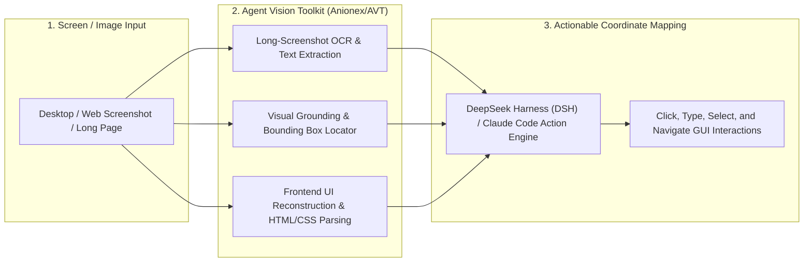

# 👁️ Agent Vision Toolkit & GUI Grounding (Anionex & DSH Vision)

Use this skill when processing desktop screenshots, webpage captures, visual UI layouts, extracting text from images via OCR, or translating visual interfaces into actionable element coordinates.

## Architecture

## Core Capabilities
1. **Visual UI Grounding**: Detects buttons, input fields, modals, and navigation bars, producing precise (x, y) interaction coordinates.
2. **DeepSeek Harness (DSH) Native Bridge**: Seamlessly extends DeepSeek R1/V3 text-only reasoning into full visual screen understanding.
3. **Long-Screenshot OCR**: Transcribes multi-page scrolling captures without truncating small fonts or tables.
4. **UI Design Reverse-Engineering**: Translates screenshots into clean, semantic Tailwind CSS and HTML code.

## How to Use
`Process image/screenshot [file_path] using Agent Vision Toolkit for [OCR / UI grounding / element extraction].`
