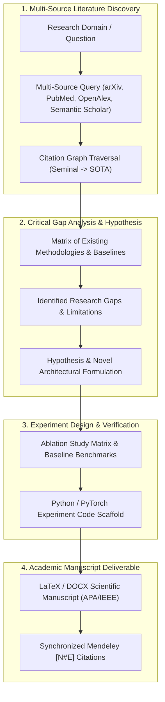

# 🔬 AI Research Deep Engine (Orchestra-Research + SOTA Literature Synthesis)

Use this skill when performing deep academic literature reviews, mapping citation graphs across arXiv/PubMed/OpenAlex, identifying research gaps, generating scientific hypotheses, or drafting LaTeX papers.

## Deep Research Pipeline

## Capabilities
1. **Citation Graph Traversal**: Automatically follows forward/backward citations to identify both foundational root papers and current year frontiers.
2. **Methodology Comparison Matrix**: Summarizes datasets, model architectures, metrics, and compute costs across top-20 benchmarked papers.
3. **Hypothesis & Novelty Verification**: Evaluates whether a proposed approach has prior art or represents genuine scientific novelty.
4. **Reproducible Experiment Scaffolding**: Generates clean evaluation harnesses, baseline comparisons, and statistical significance tests ($p$-value, confidence intervals).

## How to Use
`Conduct deep scientific literature review on [research topic] across arXiv/OpenAlex, map key baselines, identify gaps, and formulate experiment design.`
