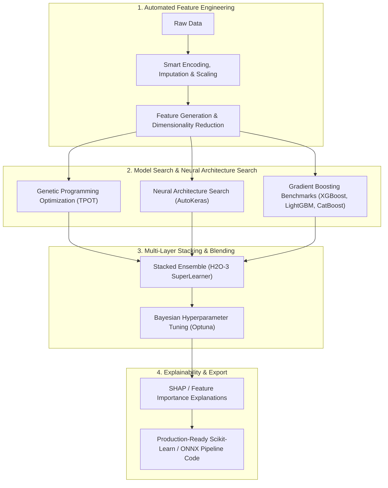

# ⚙️ AutoML Pipeline Optimizer (TPOT + AutoKeras + H2O-3 + MLJAR Fusion)

Use this skill when automating end-to-end machine learning workflows on tabular, image, or text datasets: automated preprocessing, model benchmarking, neural architecture search, hyperparameter tuning, and stacked ensemble creation.

## AutoML Multi-Stage Pipeline

## Core Modules
1. **Automated Feature Engineering**: Generates non-linear polynomial features, interaction terms, target encodings, and temporal aggregations.
2. **Genetic Pipeline Search (TPOT)**: Uses genetic programming to automatically assemble and optimize entire scikit-learn machine learning pipelines.
3. **Neural Architecture Search (AutoKeras)**: Efficient NAS for deep learning tasks with automatic layer sizing and learning rate schedules.
4. **Stacked Ensembles & Blending**: Combines predictions from diverse model families (Trees + Linear + Neural Nets) using a meta-learner to maximize accuracy and minimize variance.
5. **SHAP Interpretability**: Generates automated global feature importance and local instance-level SHAP force plots.

## How to Use
`Build and optimize AutoML pipeline for [dataset / target_variable] with automated feature engineering, ensemble stacking, and SHAP explanations.`
