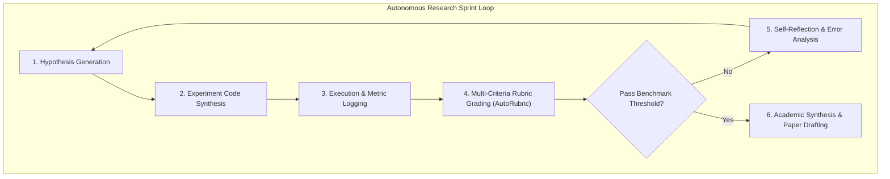

# 🔬 Autonomous Research & Auto-Rubric Engine (Karpathy AutoResearch + AutoAgent Fusion)

Use this skill when running end-to-end autonomous research sprints, generating objective grading rubrics, iterating on ML experiment loops, or conducting automated paper review scoring.

## Autonomous Research Iteration Loop

## Core Capabilities
1. **Karpathy-Style AutoResearch Loop**: Generates an initial hypothesis, executes training/testing scripts, parses metric output, reflects on failures, and iterates autonomously until a target metric is reached.
2. **AutoRubric Evaluation Engine**: Formulates multi-dimensional scoring rubrics (Novelty, Methodological Rigor, Statistical Validity, Reproducibility, Clarity) and assigns quantitative grades ($0-100\%$).
3. **Automated Peer Review & Gap Audit**: Simulates harsh academic peer review (NeurIPS/ICML/ICLR standard), pointing out unproven assumptions and baseline deficiencies.

## How to Use
`Run autonomous research sprint for [problem/dataset] with hypothesis iteration, metric logging, and AutoRubric validation.`
