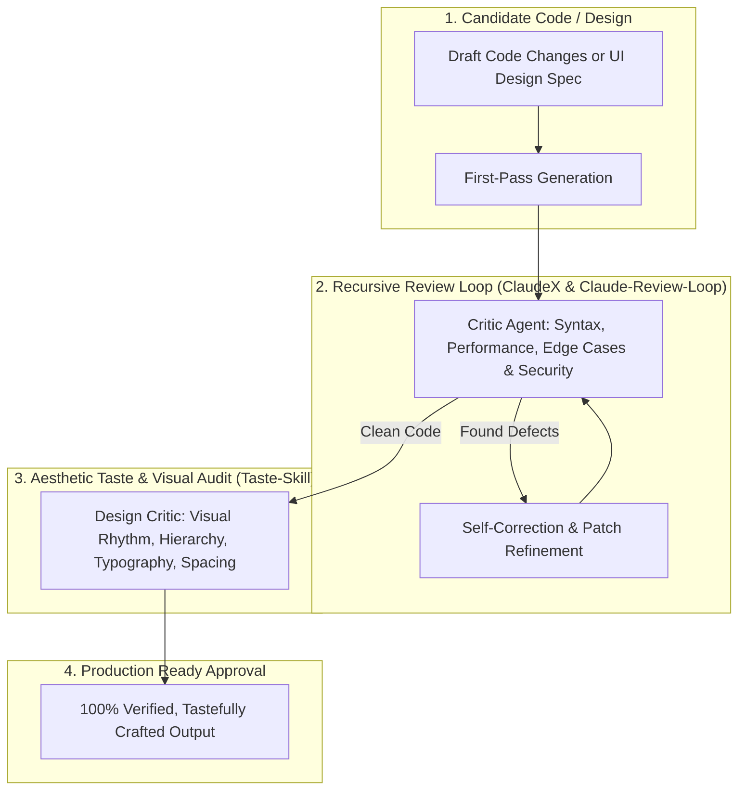

# 🔄 ClaudeX Recursive Review Loop & Taste Critic Suite

Use this skill when auditing code diffs iteratively, running multi-pass self-correcting refinement loops before committing, or critiquing UI/UX design aesthetics and typography against top-tier design standards.

## Architecture

## Key Capabilities
1. **Recursive Multi-Pass Review (ClaudeX Loop)**: Loops 3–5 iterations of critique and repair until all lint, logic, and edge-case errors reach zero.
2. **Taste-Skill Visual Discrimination**: Critiques frontend interfaces using high-end human aesthetic principles (contrast ratios, whitespace breathing room, font pairing, micro-interactions).
3. **Automated PR Diff Summarizer**: Generates executive pull-request descriptions with risk analysis and verification steps.

## How to Use
`Execute recursive review loop on [code/repo/component] applying ClaudeX self-correction and Taste-Skill aesthetic critique.`
