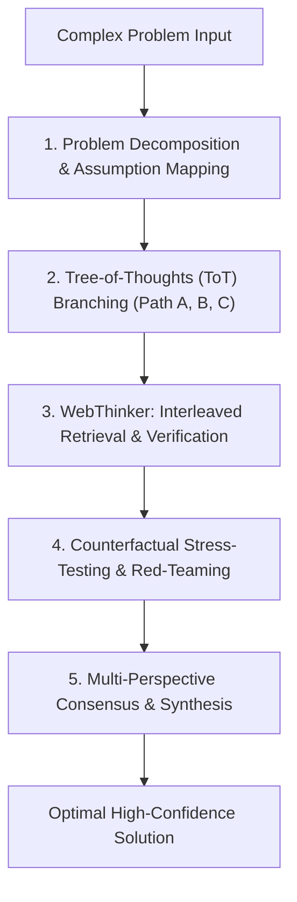

# 🧠 Cognitive Deep Thinking Strategies (WebThinker + Tree-of-Thoughts + Soft-Thinking)

Use this skill when tackling deeply ambiguous, highly complex algorithmic problems, multi-step mathematical proofs, architecture trade-off evaluations, or intricate root-cause debugging.

## Thinking Paradigms

## Core Thinking Frameworks
1. **Tree-of-Thoughts (ToT) Exploration**: Evaluates multiple divergent reasoning paths in parallel, pruning dead ends and backtracking before committing to code or architectural designs.
2. **Interleaved Search & Reasoning (WebThinker)**: Dynamically triggers targeted web queries between reasoning steps to verify empirical claims and ground inferences in real-world facts.
3. **Soft-Thinking & Dialectical Synthesis**: Weighs pros and cons, architectural trade-offs (latency vs throughput, consistency vs availability), and produces well-balanced engineering solutions.
4. **Metacognitive Self-Correction**: Identifies cognitive biases, unsupported leaps of logic, and circular reasoning.

## How to Use
`Apply deep cognitive thinking: Solve [complex problem/system architecture challenge] using Tree-of-Thoughts exploration and interleaved fact verification.`
