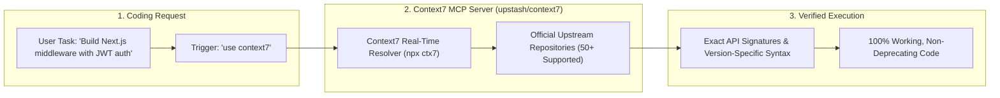

# 📚 Context7 Live Docs & Anti-Hallucination MCP Engine (Upstash Context7)

Use this skill when developing with modern frameworks (React, Next.js, Express, Prisma, Tailwind, FastMCP) to eliminate hallucinated methods, retrieve live version-specific docs, or verify API signatures.

## Architecture

## Core Capabilities
1. **Zero Hallucinated APIs**: Direct grounding in official upstream source code and documentation.
2. **Version-Specific Precision**: Supports Next.js App Router, React 19, Prisma v6, Tailwind v4, Pydantic v2.
3. **Dual Execution Modes**:
   - **MCP Native**: Operates as a background MCP server responding to AI agent tool calls.
   - **CLI Mode**: Direct lightweight lookups via `npx ctx7`.

## How to Use
`Write [feature/code] for [framework] using [version]. use context7.`
