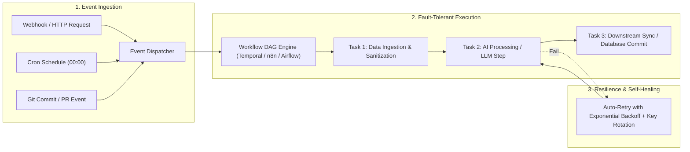

# ⚡ Continuous AI & Workflow Orchestrator (GitHub Next + n8n + Temporal Fusion)

Use this skill when designing, implementing, and deploying event-driven automation pipelines, background workers, scheduled cron jobs, webhook handlers, and self-healing multi-service integrations.

## Architecture & Flow

## Core Capabilities
1. **Self-Healing Automation**: Automatic error interception, exponential backoff, dead-letter queuing, and provider rotation.
2. **Visual & Declarative Workflows**: Generates structured n8n workflow JSON, Temporal activity definitions, and Airflow DAGs.
3. **Continuous AI Feedback Loops**: Automatically tests new code commits against benchmarks and logs telemetry.

## How to Use
`Design and deploy automated workflow for [integration/event] with scheduled triggers, error handling, and notification webhooks.`
