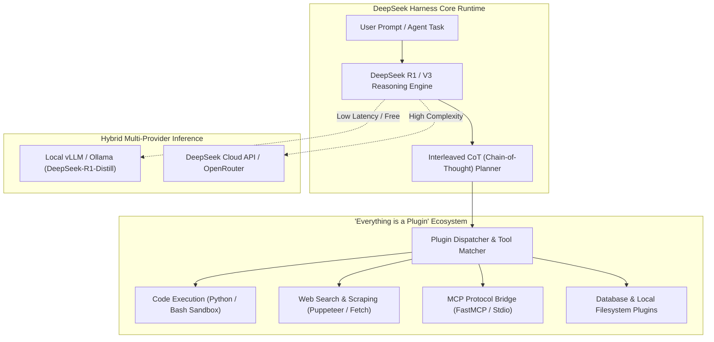

# ⚡ DeepSeek Harness Optimizer (DeepSeek-AI + Plugin Harness Fusion)

Use this skill when developing, optimizing, or running autonomous agents powered by DeepSeek models (R1 Reasoning, V3), configuring DeepSeek Harness plugins, managing local/cloud hybrid inference (Ollama/vLLM/DeepSeek API), or building sandboxed agentic toolkits.

## Architecture

## Core Capabilities
1. **DeepSeek R1 / V3 Reasoning Integration**: Native formatting and extraction of `<think>` reasoning chains for multi-step algorithmic problem solving and code generation.
2. **"Everything is a Plugin" Modular Harness**:
   - Hot-reloading of custom agent plugins without restarting host processes.
   - Strict JSON-RPC and stdio tool calling interfaces compliant with MCP.
3. **Hybrid Local-Cloud Fallback**: Automatically prioritizes free local inference (Ollama/vLLM) for routine tasks and seamlessly escalates to DeepSeek Cloud API for deep reasoning.
4. **Sandboxed Execution & Guardrails**: Enforces security boundaries, path validation, and resource limits on spawned subprocesses.

## How to Use
`Deploy DeepSeek Harness workflow for [task] with [local/cloud] R1 reasoning and [plugin names] tool execution.`
