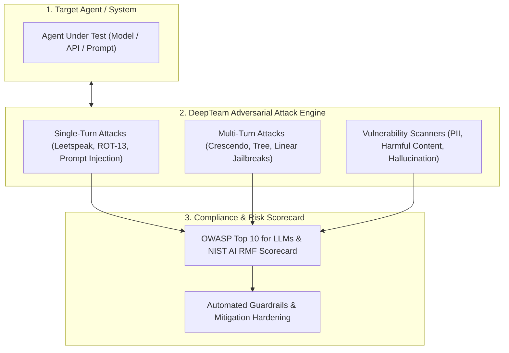

# 🛡️ DeepTeam AI Red Teamer & Safety Evaluator (Confident AI DeepTeam)

Use this skill when auditing AI agents, prompts, or model outputs for security vulnerabilities, safety compliance (OWASP Top 10 for LLMs, NIST AI RMF), jailbreak resistance, or bias/hallucination risks.

## Architecture

## Core Vulnerability Checks (40+ Categories)
1. **Prompt Injection & System Prompt Extraction**: Testing susceptibility to direct and indirect prompt overrides.
2. **Multi-Turn Crescendo Jailbreaks**: Gradual trust-building multi-turn conversations designed to bypass safety filters.
3. **Data Leakage & PII Protection**: Auditing model memory and responses for sensitive credential exposure.
4. **Factual Integrity & Hallucination Scoring**: Quantifying truthfulness against grounded ground-truth baselines.

## How to Use
`Run adversarial red team audit on [agent/model/prompt] testing for [vulnerability_types] with DeepTeam scorecard.`
