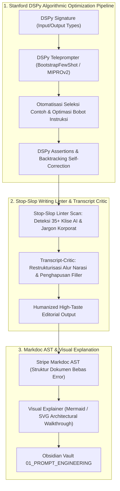

# ✍️ Super-Skill S103: DSPy & Stop-Slop Compiler
> **Super-Skill ID**: `S103` | **Kategori**: Algorithmic Prompting, Editorial Craft, Anti-AI Slop & AST Documentation
> **Sumber Utama**: Stanford NLP (`stanfordnlp/dspy`), Hardik Pandya (`hardikpandya/stop-slop`), Stripe (`markdoc/markdoc`), Jftuga (`jftuga/transcript-critic`), Nico Bailon (`nicobailon/visual-explainer`).
> **Integrasi**: Dola AI v4.0, `/omni-auto`, FK-17 Anti-Cliché Shield, Python DSPy Runtime, dan Obsidian Markdown.

---

## 🧭 1. Arsitektur Kompilasi Prompt & Audit Editorial

Skill ini menggantikan penulisan prompt coba-coba manual (*prompt hacking*) dengan **pemrograman prompt algoritmik (DSPy)** dipadukan dengan **linter editorial ketat anti-AI slop**:



---

## ⚡ 2. Fitur Unggulan

### 1. Stanford DSPy Compiler (`dspy`)
- Memperlakukan interaksi LLM sebagai kode modular, bukan string teks acak.
- Menggunakan pengoptimal teleprompter (*MIPROv2, BootstrapFewShotWithRandomSearch*) untuk menyempurnakan prompt secara matematis berdasarkan data validasi.
- Menerapkan `dspy.Suggest` dan `dspy.Assert` untuk menjamin format output 100% konsisten.

### 2. Hardik Pandya Stop-Slop Linter (`stop-slop`)
- Memeriksa teks dari kata-kata klise AI yang membosankan:
  - *Dilarang*: "delve into", "tapestry", "plethora", "beacon of", "testament to", "revolutionize", "pivotal role".
  - *Aturan*: Gunakan kata kerja aktif, bahasa lugas, dan data konkret.

### 3. Stripe Markdoc AST (`markdoc`)
- Sistem dokumentasi berbasis *Abstract Syntax Tree (AST)* yang aman, terstruktur, dan dapat diintegrasikan dengan komponen antarmuka kustom (*Generative UI*).

### 4. Transcript-Critic & Visual Explainer (`transcript-critic`, `visual-explainer`)
- Mengubah transkrip wawancara kualitatif yang berantakan menjadi naskah editorial terstruktur rapi lengkap dengan diagram konsep penjelas.

---

## 🛠️ 3. Cara Penggunaan di Omni-Auto

```text
# 1. Kompilasi Prompt Algoritmik dengan DSPy
/omni-auto dspy compile: Optimize signature [Input -> Output] using MIPRO teleprompter on dataset [data]

# 2. Audit & Bersihkan Tulisan dari AI Slop
/omni-auto stop-slop: Audit manuscript [text/file] removing all AI clichés and applying crisp human prose

# 3. Buat Penjelasan Visual Interaktif
/omni-auto visual-explain: Generate architectural breakdown and concept diagram for [complex_topic]
```
