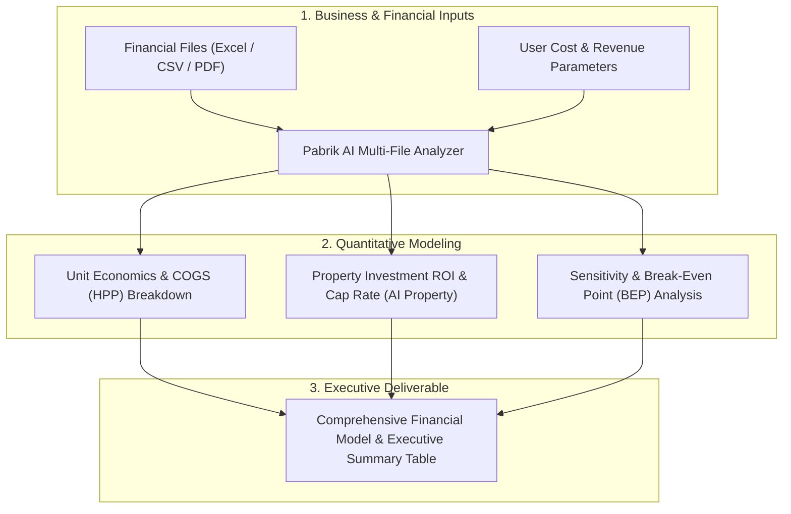

# 📈 Enterprise Business & Financial Analyzer (Pabrik AI + Dola Analytics Fusion)

Use this skill when calculating unit economics, breaking down CapEx/OpEx, calculating profit margins, modeling real estate/property investment ROI, or conducting deep multi-format financial file analysis.

## Analysis Framework

## Core Capabilities
1. **Pabrik AI Modal & Profit Breakdown**:
   - Fixed vs Variable cost decomposition.
   - Cost of Goods Sold (COGS / HPP) per unit.
   - Gross Margin, Net Margin, and Break-Even Point (BEP in units & currency).
2. **AI Property & Real Estate Valuation**:
   - Capitalization Rate (Cap Rate), Net Operating Income (NOI), Cash-on-Cash Return.
   - Rental yield projections and 5-10 year appreciation modeling.
3. **Automated Financial Statement Parsing**: Extracts income statements, balance sheets, and cash flow reports from PDFs and Excel sheets into structured analytical matrices.

## How to Use
`Analyze financial model for [business/property] with CapEx/OpEx breakdown, COGS, profit margin, BEP, and 5-year ROI forecast.`
