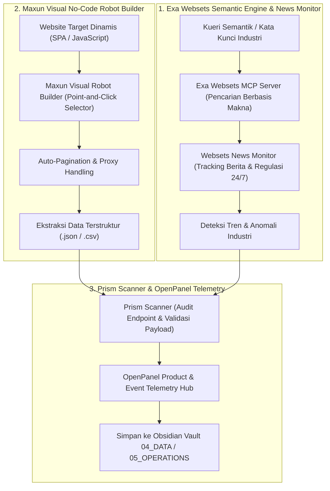

# 🌐 Super-Skill S101: Exa Websets & Maxun Intelligence
> **Super-Skill ID**: `S101` | **Kategori**: Web Intelligence, Live News Monitoring, Scraping & Event Telemetry
> **Sumber Utama**: Exa Labs (`exa-labs/websets-mcp-server`, `websets-news-monitor`), Maxun (`getmaxun/maxun`), Prism Scanner (`aidongise-cell/prism-scanner`), OpenPanel (`Openpanel-dev/openpanel`).
> **Integrasi**: Dola AI v4.0, `/omni-auto`, Model Context Protocol (MCP), Firecrawl, dan Webhook Pipelines.

---

## 🧭 1. Arsitektur Persepsi Internet Real-Time

Skill ini menghadirkan kemampuan pemantauan web dan pengumpulan data dinamis berkala tanpa biaya API perorangan yang mahal:



---

## ⚡ 2. Fitur Unggulan

### 1. Exa Websets MCP Server (`websets-mcp-server`)
- Melakukan pencarian semantik tingkat lanjut menggunakan embedding berbasis tautan (*link-based neural embeddings*).
- Menemukan dataset tersembunyi, artikel jurnal terbaru, dan siaran pers korporat yang tidak muncul di pencarian Google biasa.

### 2. Websets News Monitor (`websets-news-monitor`)
- Memantau perubahan regulasi perburuhan (Kemnaker/DPR), pergerakan suku bunga perbankan (BI/OJK), dan pengumuman akuisisi perusahaan secara *real-time*.

### 3. Maxun No-Code Visual Scraper (`maxun`)
- Memungkinkan pengguna dan agen AI mengekstrak data dari tabel web interaktif tanpa menulis kode selector CSS/XPath manual.
- Menjadwalkan pengunduhan data berkala (harian/mingguan).

### 4. OpenPanel Telemetry (`openpanel`)
- Menyimpan metrik dan log kejadian secara open-source dan *self-hosted* untuk transparansi audit.

---

## 🛠️ 3. Cara Penggunaan di Omni-Auto

```text
# 1. Pantau Berita dan Regulasi Real-Time
/omni-auto news-monitor: Track [topic/entity] across news websets with hourly alerts

# 2. Ekstrak Data Web Dinamis dengan Maxun
/omni-auto maxun scrape: Build visual extraction robot for [url] capturing [fields]

# 3. Kueri Semantik via Exa MCP
/omni-auto exa search: Find high-authority academic/industry resources on [topic]
```
