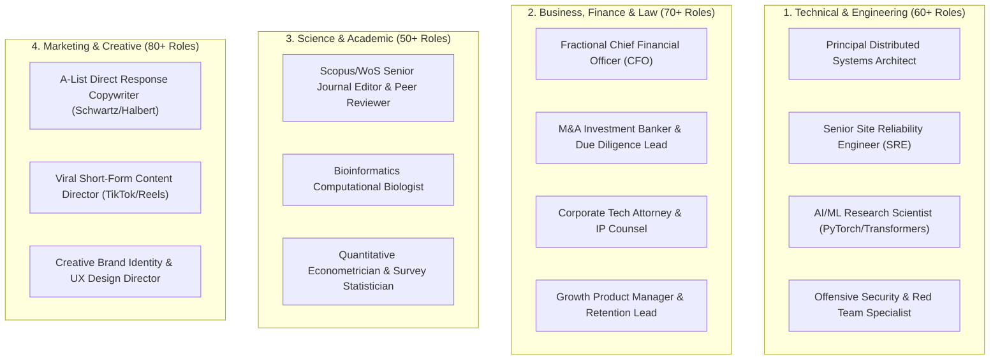

# 🎭 Expert Role Personas Library (268+ System Personas & Executive Archetypes)

Use this skill when seeking specialized consultation, simulating multi-expert peer review panels, or executing tasks under distinct professional personas with domain-specific authority.

## Primary Persona Domains

## How to Use
`Adopt persona [Persona Name / Role ID] and evaluate/execute [task] using professional standards, specialized terminology, and domain-specific heuristics.`
