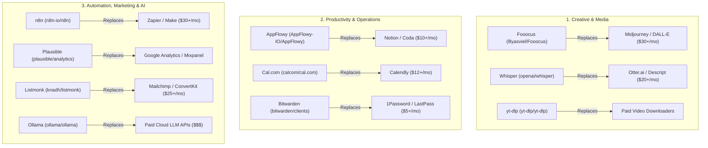

# 🆓 Free-Tier Open-Source Software Replacements (Zero-Cost Enterprise Stack)

Use this skill when seeking zero-cost, self-hosted, or free API alternatives to commercial paid software for automation, creative generation, notes, analytics, scheduling, password management, and local LLM execution.

## The 10 Essential Open-Source Replacements

## Free API & Cloud Gateway Integrations
1. **Awesome Free LLM APIs** (`open-free-llm-api/awesome-freellm-apis`): Curated index of keyless and free-tier LLM endpoints (Groq, Together, Mistral, HuggingFace, Gemini Free Tier).
2. **Public APIs Directory** (`public-apis/public-apis`): 1400+ free public APIs for finance, weather, crypto, development, science, and social media data extraction.
3. **Tokenin AI** (`tokenin.my.id`): Low-latency Indonesian token-optimized AI model routing.

## How to Use
`Deploy zero-cost replacement for [software_name] using [Fooocus/n8n/AppFlowy/Ollama/Cal.com] with configuration guide.`
