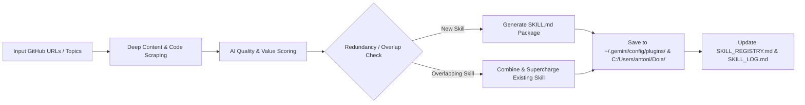

# 🌐 Autonomous GitHub Skill Harvester & Fusion Engine

Use this skill when the user provides GitHub repository URLs, trending links, or asks to search, evaluate, combine, and permanently install new agentic skills or tools.

## Operating Pipeline

### Steps:
1. **URL & Repo Extraction**:
   - Fetch README, manifest, and source code using `read_url_content` or `search_web`.
2. **Evaluation & Scoring (Threshold $\ge 80/100$)**:
   - **Utility (30%)**: Does this solve a real, recurring engineering/academic challenge?
   - **Agentic Compatibility (30%)**: Can an AI agent reliably invoke or follow these procedures?
   - **Code Quality & Architecture (20%)**: Clean, well-documented, and secure.
   - **Novelty vs Existing (20%)**: Does it bring unique value over current skills?
3. **Fusion & Supercharging**:
   - If an incoming tool overlaps with existing tools (e.g., another browser scraper or citation parser), merge their strengths into a superior unified skill.
4. **Standard Antigravity Packaging**:
   - Create `skills/<skill_name>/SKILL.md` with YAML frontmatter.
   - Write helper scripts in `scripts/` if required.
5. **Registry & Log Update**:
   - Log the new/upgraded skill into `C:\Users\antoni\Dola\SKILL_REGISTRY.md` and `C:\Users\antoni\Dola\SKILL_LOG.md`.
