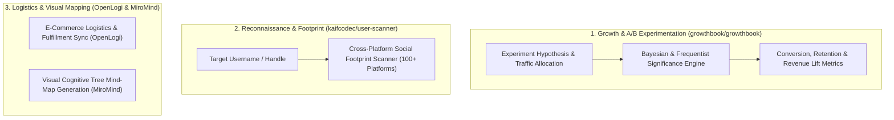

# 📈 Growth Experimentation, OSINT & Mind-Mapping Suite

Use this skill when designing statistical A/B testing experiments, evaluating feature flags with GrowthBook, performing cross-platform username reconnaissance (OSINT), automating logistics fulfillment APIs, or generating visual mind-map graphs.

## Architecture

## Key Capabilities
1. **GrowthBook Experiment Analysis**: Configures feature flags, assigns deterministic user buckets, and calculates Bayesian credible intervals for conversion metrics.
2. **OSINT Username Scanner**: Audits username availability and public profiles across 100+ developer, social, and professional networks.
3. **MiroMind Visual Mapping**: Transforms complex strategic plans into structured, hierarchical mind-map trees for visual cognition.

## How to Use
`Design growth experiment for [feature] via GrowthBook or conduct OSINT username reconnaissance for [target_handle].`
