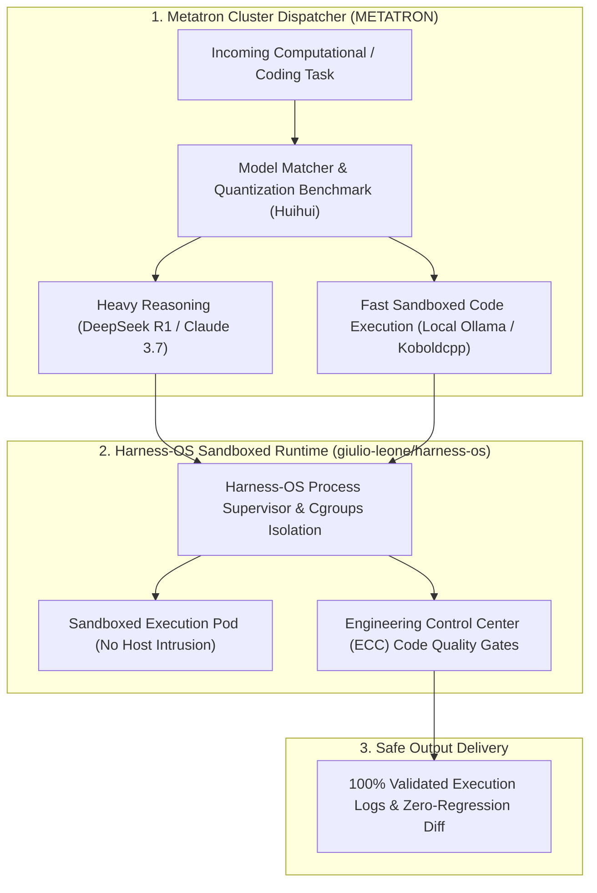

# 💻 Harness-OS Runtime & Metatron Cluster Supervisor

Use this skill when managing autonomous agent subprocesses, sandboxing code execution environments, throttling system resources, benchmarking quantized LLMs (GGUF/AWQ/EXL2), or orchestrating multi-model clusters.

## Architecture

## Core Capabilities
1. **Harness-OS Sandboxed Process Supervisor**: Isolates terminal and Python executions into virtualized process boundaries with strict RAM/CPU throttling.
2. **Metatron Meta-Model Orchestration**: Routes complex multi-agent steps across heterogeneous local and cloud models.
3. **ECC (Engineering Control Center)**: Multi-gate validation pipeline requiring unit test passing before code changes are committed.
4. **Huihui Model Benchmarking**: Evaluates local quantization efficiency, context retention, and token throughput on consumer hardware.

## How to Use
`Execute agent task [task] within Harness-OS sandbox using Metatron routing and ECC quality validation.`
