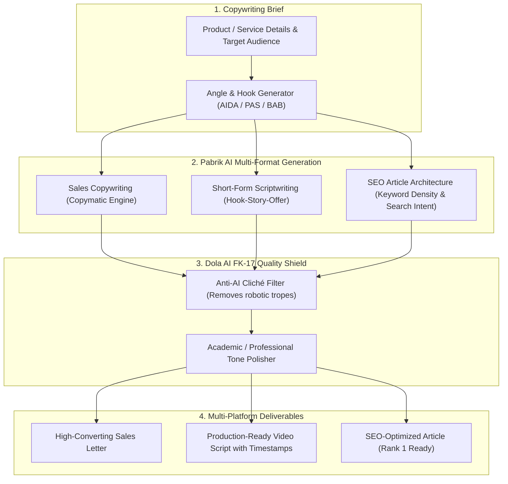

# ✍️ Hyper Copywriting & SEO Suite (Pabrik AI Copymatic + Dola FK-17 Fusion)

Use this skill when generating high-converting sales copy, viral social media scripts (TikTok, Reels, YouTube), long-form SEO articles, landing page copy, or humanizing promotional text.

## Fusion Architecture

## Core Frameworks
1. **Pabrik AI Copymatic Engine**: Multi-angle copy generation across AIDA (Attention, Interest, Desire, Action), PAS (Problem, Agitate, Solution), and BAB (Before, After, Bridge).
2. **Viral Scriptwriting Protocol**: 3-second hook formulation, visual B-roll cues, pacing instructions, and clear Call-to-Action (CTA).
3. **Advanced Semantic SEO Optimization**: Keyword clustering, LSI terminology integration, FAQ schema generation, and readability scoring (Flesch-Kincaid).
4. **FK-17 Humanization & Anti-Plagiarism Shield**: Replaces repetitive AI sentence structures with natural human authorial voice.

## How to Use
`Generate hyper-copywriting for [product/topic] targeting [audience] using [PAS/AIDA] framework with FK-17 humanization and SEO keyword optimization.`
