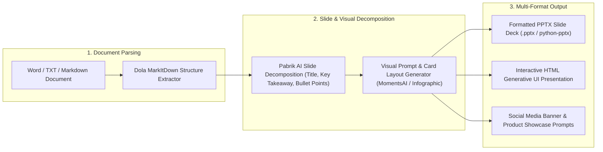

# 🎨 Hyper Visual & PPTX Orchestrator (Pabrik AI + MarkItDown + PPTX Deck Fusion)

Use this skill when converting unstructured text, research papers, Word docs, or business plans into professional presentation decks (PPTX), infographic data layouts, promotional banners, or product card mockups.

## Architecture

## Capabilities
1. **Automated Word/TXT to PPTX Deck**: Converts raw meeting notes, thesis chapters, or business pitches into structured 10-20 slide presentations with presenter speaker notes.
2. **Infographic & Data Visualization**: Transforms dense statistics and tables into clean infographic visual schemas and mermaid diagrams.
3. **Studio Banner & Product Card Creator**: Generates high-converting marketing banner text layouts and product card designs.

## How to Use
`Convert document [file/text] into professional PPTX presentation deck with executive summary, bullet points, speaker notes, and infographic diagrams.`
