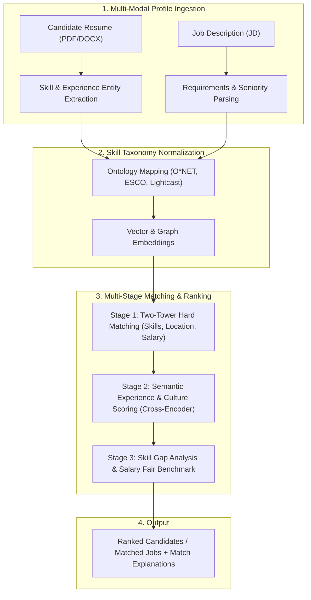

# 💼 Job & Career Recommendation Engine (ATS + Taxonomy + Two-Tower Matching)

Use this skill when building or optimizing job recommendation systems, candidate-job matching algorithms, resume parser & score matching, skill gap analysis, or career path forecasting.

## Architecture

## Core Modules
1. **Skill Taxonomy Normalization**: Standardizes non-standard skill terms (e.g. "ReactJS", "React.js", "React 18" $\to$ `Skill:React`) against O*NET and ESCO taxonomies.
2. **Two-Tower Candidate-Job Matching**:
   - Candidate Tower: Encodes resume skills, years of experience, education, domain velocity.
   - Job Tower: Encodes requirements, responsibility vectors, seniority level, industry sector.
3. **Skill Gap & Trajectory Analytics**:
   - Identifies missing critical skills vs "nice-to-haves".
   - Suggests upskilling pathways and next-step career promotions.
4. **Fairness & Debiasing**: Filters protected attributes (gender, age, ethnicity) to ensure compliance with hiring regulations and unbiased scoring.

## How to Use
`Match resume [resume_text/file] against job description [job_desc] with skill taxonomy normalization, ATS score, and gap analysis.`
