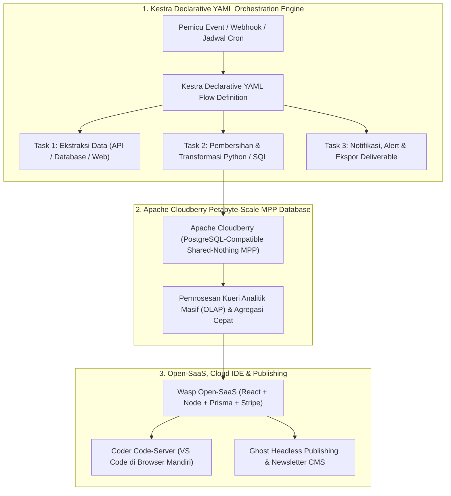

# 🏭 Super-Skill S102: Kestra & Cloudberry Enterprise Orchestrator
> **Super-Skill ID**: `S102` | **Kategori**: Workflow Orchestration, Big Data MPP, Open-SaaS & Cloud Infrastructure
> **Sumber Utama**: Kestra (`kestra-io/kestra`), Apache (`apache/cloudberry`), Wasp (`wasp-lang/open-saas`), Coder (`coder/code-server`), Ghost (`TryGhost/Ghost`), BerriAI (`terraform-google-litellm`).
> **Integrasi**: Dola AI v4.0, `/omni-auto`, Docker, PostgreSQL, Terraform, Kubernetes, dan Obsidian Vault.

---

## 🧭 1. Arsitektur Enterprise Workflow & MPP Warehousing

Skill ini mengintegrasikan otomasi alur kerja data skala industri (*event-driven DAGs*), pergudangan data analitik skala besar (*MPP Big Data*), serta infrastruktur pengembangan cloud mandiri:



---

## ⚡ 2. Fitur Unggulan

### 1. Kestra Declarative Workflows (`kestra`)
- Seluruh pipeline data didefinisikan dalam format **YAML deklaratif** yang dapat dibaca manusia dan agen AI.
- Memiliki 10,000+ plugin ekosistem (BigQuery, PostgreSQL, S3, Slack, Python, dbt, Spark).
- Eksekusi bebas server yang tangguh (*fault-tolerant*) dengan pencatatan status (*retry, fallback, alerting*).

### 2. Apache Cloudberry MPP Analytic Database (`cloudberry`)
- Basis data analitik berskala masif berbasis arsitektur *Shared-Nothing MPP* (kompatibel penuh dengan sintaks PostgreSQL).
- Mampu memproses ratusan juta baris data survei kependudukan atau transaksi finansial dalam hitungan detik.

### 3. Wasp Open-SaaS & Coder Code-Server (`open-saas`, `code-server`)
- Template SaaS modern siap pakai dengan autentikasi, pembayaran Stripe, dan dashboard analitik.
- Menjalankan lingkungan IDE VS Code lengkap di dalam browser pada server lokal atau cloud pribadi.

---

## 🛠️ 3. Cara Penggunaan di Omni-Auto

```text
# 1. Rancang Alur Kerja Deklaratif Kestra
/omni-auto kestra flow: Create declarative ETL pipeline extracting [source] and loading to [target]

# 2. Desain Skema Analitik Apache Cloudberry
/omni-auto cloudberry: Architect MPP partitioned table schema for [large_dataset] with optimized distribution keys

# 3. Deploy SaaS Boilerplate Open-SaaS
/omni-auto open-saas: Scaffold full-stack SaaS project for [use_case] with Stripe and Prisma
```
