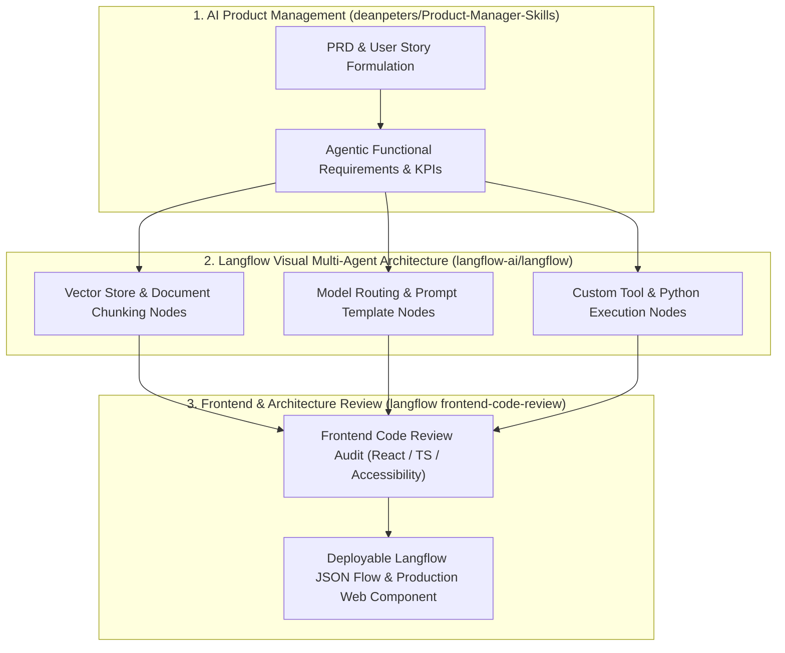

# 🧩 Langflow Visual RAG Builder & Product Engineering Suite

Use this skill when constructing modular RAG pipelines visually, auditing frontend code architecture, drafting AI Product Requirement Documents (PRDs), or mapping agentic logic into executable Langflow JSON graphs.

## Architecture

## Key Capabilities
1. **Langflow Flow Generation**: Builds valid, deployable Langflow JSON graph definitions containing vector stores, prompt chains, and agents.
2. **Frontend Code Review Skill**: Audits React/TypeScript components for state management efficiency, accessibility (a11y), and zero UI bloat.
3. **AI Product Manager Skills**: Generates structured PRDs, user stories with Gherkin acceptance criteria, and technical milestone roadmaps.

## How to Use
`Design Langflow multi-agent RAG graph for [product_concept] with PRD specification and frontend review checklist.`
