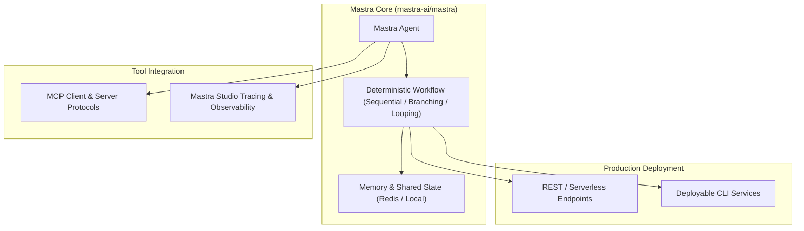

# 🚀 Mastra Agent Orchestrator (TypeScript-First Enterprise Agent Engine)

Use this skill when designing production-grade TypeScript AI agents, stateful multi-step workflows, persistent Redis memory architectures, or connecting agents to external systems via Model Context Protocol (MCP).

## Framework Overview

## Core Features
1. **Deterministic Workflow Graphs**: Chain LLM calls into rigorous DAGs with support for parallel steps, conditional branching, and error retries.
2. **Persistent Context & Memory**: Long-term conversational memory and session isolation.
3. **Mastra Studio Tracing**: Real-time execution tracing, step latency profiling, and visual testing environments.
4. **Native MCP Support**: Direct interop with GitHub, Notion, PostgreSQL, and filesystem MCP servers.

## How to Use
`Build Mastra TypeScript agent workflow for [task] with [tools/MCP servers] and persistent memory.`
