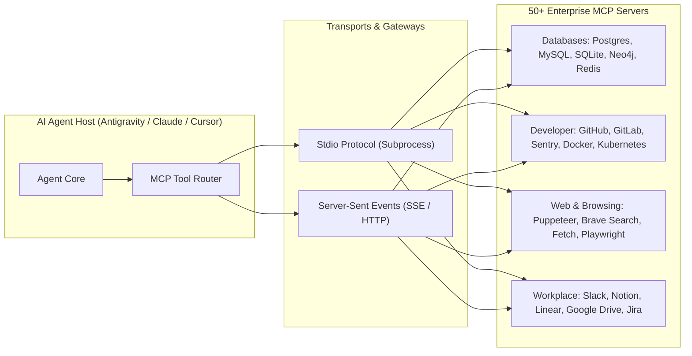

# 🔌 Enterprise MCP Gateway & Multi-Tool Router (FastMCP + 50+ Servers)

Use this skill when configuring, discovering, building, or managing Model Context Protocol (MCP) clients and servers across developer environments.

## Architecture



## Supported Server Categories & Tools
1. **Developer Tools**: `github` (PRs, issues, commits), `git` (local diffs), `sentry` (error monitoring), `docker` (container inspect/run).
2. **Databases**: `postgres` (schema inspect, read-only queries, transactions), `sqlite`, `redis` (cache key lookup).
3. **Web & Automation**: `brave-search` (web queries), `puppeteer` (full DOM interaction), `fetch` (HTML to markdown).
4. **Productivity**: `slack` (channel messages), `notion` (pages & databases), `linear` (issue tracking).

## Configuration Standard (`mcp_config.json`)
```json
{
  "mcpServers": {
    "github": {
      "command": "npx",
      "args": ["-y", "@modelcontextprotocol/server-github"],
      "env": { "GITHUB_PERSONAL_ACCESS_TOKEN": "<TOKEN>" }
    },
    "postgres": {
      "command": "npx",
      "args": ["-y", "@modelcontextprotocol/server-postgres", "postgresql://localhost/mydb"]
    },
    "brave-search": {
      "command": "npx",
      "args": ["-y", "@modelcontextprotocol/server-brave-search"],
      "env": { "BRAVE_API_KEY": "<KEY>" }
    }
  }
}
```

## How to Use
`Configure and register MCP server [server_name/package] with environment variables in mcp_config.json and test tool availability.`
