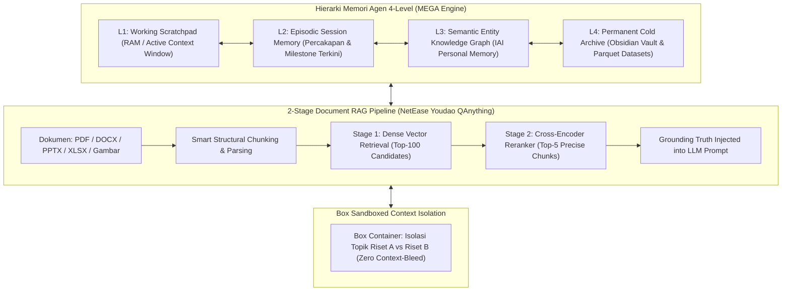

# 🧠 Super-Skill S100: Mega Personal Memory & QAnything Engine
> **Super-Skill ID**: `S100` | **Kategori**: Memory Systems, Local RAG, Knowledge Graph & Agent Persistence
> **Sumber Utama**: NetEase Youdao (`netease-youdao/QAnything`), CodeAbra (`CodeAbra/iai-personal-memory-engine`), Kevin (`0xK3vin/MegaMemory`), Dyamin (`dyamin/MEGA`), Haehnchen (`my-mega-memory`), Jegly (`Box`).
> **Integrasi**: Dola AI v4.0, `/omni-auto`, Obsidian Vault, SQLite/DuckDB, pgvector, dan Local Embeddings.

---

## 🧭 1. Arsitektur Memori Hirarkis 4-Level & 2-Stage RAG

Skill ini menyediakan infrastruktur memori jangka panjang dan penelusuran dokumen lokal tanpa biaya langganan cloud:



---

## ⚡ 2. Fitur Unggulan

### 1. 2-Stage RAG QAnything (`QAnything`)
- **Stage 1**: Pencarian cepat menggunakan embedding vektor (*Dense Retrieval*) untuk menyaring 100 kandidat teks paling relevan.
- **Stage 2**: Pemeringkat ulang (*Cross-Encoder Reranker*) yang mengevaluasi interaksi kata per kata antara kueri dan dokumen untuk menghasilkan 3–5 potongan teks dengan presisi ekstrem (akurasi mendekati 100%).
- Mendukung berbagai format: PDF hasil scan, tabel Excel rumit, presentasi PPTX, dan naskah Word.

### 2. IAI Personal Memory Engine (`iai-personal-memory-engine`)
- Membangun graf hubungan entitas pengguna:
  - *Preferensi Penelitian*: Metodologi favorit, struktur bab tesis, gaya kutipan Mendeley.
  - *Entitas Proyek*: Variabel penelitian, hipotesis aktif, nama dosen pembimbing, batas waktu pengiriman.
  - *Riwayat Interaksi*: Keputusan arsitektur yang disetujui pengguna sebelumnya.

### 3. Box Sandboxed Context Isolation (`Box`)
- Mengisolasi memori antar proyek berbeda di laptop Anda. Riset Tesis MM-HR tidak akan tercampur dengan proyek Software Engineering atau Finansial.

---

## 🛠️ 3. Cara Penggunaan di Omni-Auto

```text
# 1. Simpan Fakta ke Memori Permanen
/omni-auto memory store: [entity_name] -> [property/relationship/fact]

# 2. Ambil Riwayat Kontekstual Lintas Sesi
/omni-auto memory recall: Query personal preferences and project milestones for [project_name]

# 3. Kueri Dokumen dengan Reranking 2-Stage QAnything
/omni-auto qanything query: Ask [question] against document collection [path/to/docs] with cross-encoder verification
```
