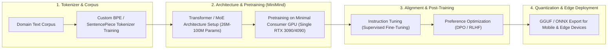

# 🔬 MiniMind SLM Training & Alignment Lab (From-Scratch Small LLMs)

Use this skill when training custom lightweight language models (26M–100M parameters) from scratch, designing domain-specific tokenizers, running Supervised Fine-Tuning (SFT), Direct Preference Optimization (DPO), or deploying ultra-fast edge AI models.

## Pipeline Architecture

## Key Capabilities
1. **Low-Compute Model Training**: Complete training scripts capable of training capable 26M–100M parameter LLMs in hours on a single consumer GPU.
2. **End-to-End Alignment Loop**: Covers pretraining $\to$ SFT instruction following $\to$ DPO human preference alignment.
3. **Edge Quantization & Export**: Compiles trained weights directly to GGUF format for instant execution via Ollama and Koboldcpp.

## How to Use
`Configure MiniMind SLM training pipeline for [domain/corpus] with [param_size: 26M/100M] covering pretraining, SFT, and GGUF export.`
