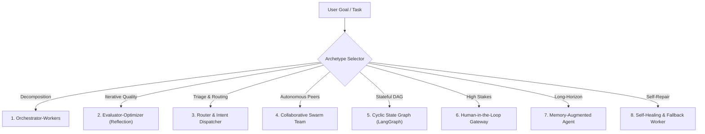

# 🤖 Multi-Agent Archetypes & Design Patterns Library (500+ Agents Fusion)

Use this skill when architecting, implementing, or debugging complex multi-agent systems, autonomous teams, generator-critic loops, or stateful agent workflows.

## 8 Core Architectural Archetypes

### 1. Orchestrator-Workers (Hierarchical Team)
- **Concept**: A central coordinator breaks high-level goals into sub-tasks, assigns them to specialized parallel subagents, and synthesizes the outputs.
- **Best For**: Complex software development, multi-chapter academic papers, extensive codebase migrations.

### 2. Evaluator-Optimizer (Generator-Critic Loop)
- **Concept**: Agent A generates a draft; Agent B evaluates against strict rubric criteria (syntax, test passes, citation authenticity, factual accuracy). Loops until passing threshold.
- **Best For**: Code generation with unit test verification, Publication Shield compliance.

### 3. Router & Intent Dispatcher
- **Concept**: Classifies input queries by complexity and intent, directing to specialized lightweight or high-reasoning models.
- **Best For**: Cost-effective token routing (Free-Priority, lightweight vs reasoning models).

### 4. Collaborative Swarm (Peer-to-Peer)
- **Concept**: Autonomous peer agents passing messages directly through a shared blackboard or conversation channel without a rigid top-down bottleneck.
- **Best For**: Multi-perspective brainstorming, threat modeling, debate and consensus.

### 5. Cyclic State Graph
- **Concept**: Deterministic state machine with typed shared state, conditional edges, retry limits, and persistent checkpoints.

### 6. Memory-Augmented Agent
- **Concept**: Short-term working context, episodic historical memory, and long-term vector semantic knowledge.

## How to Use
`Architect multi-agent system for [task] using [Orchestrator-Workers / Evaluator-Optimizer / Swarm / Cyclic Graph] pattern with step verification.`
