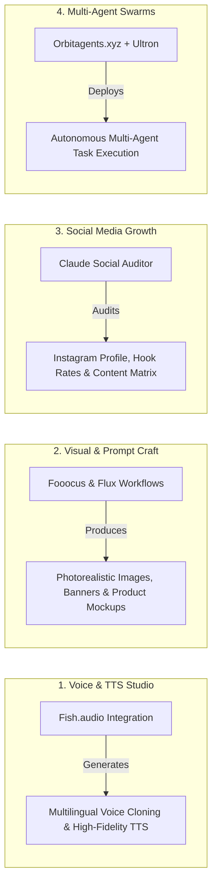

# 🎙️ Multimodal Creative Studio & Social Growth Suite

Use this skill when designing multimodal AI pipelines (voice cloning, TTS, photorealistic image prompting), conducting deep social media audits (Instagram/TikTok), or orchestrating autonomous agent swarms.

## Core Studio Modules

## Key Capabilities
1. **Fish Audio Voice Engine**: Voice cloning prompts, emotion-tagged speech synthesis, and multilingual narration scripts.
2. **Fooocus / Flux Photorealism Prompting**: Parameterized prompt engineering (Camera, Lighting, Lens, Film Stock, Negative Prompts).
3. **Claude Instagram Profile & Content Auditor**: Evaluates bio positioning, aesthetic cohesion, hook strength, carousel retention, and monetization CTA.
4. **Long-Context Reasoning**: Leverages Kimi K2.6 and Gemini 2M token context windows for full-book and repository-scale synthesis.

## How to Use
`Run creative studio pipeline: Generate [voice / image / social audit / agent swarm] for [project_name] with [specific parameters].`
