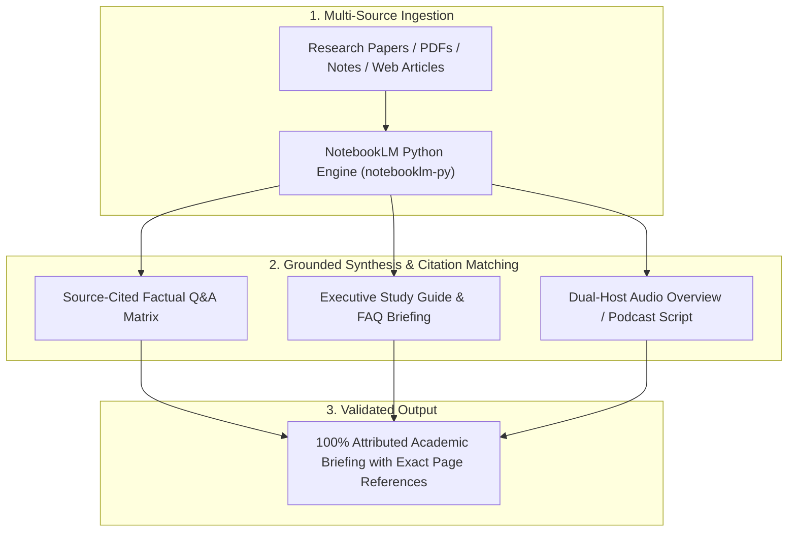

# 📖 NotebookLM Research Synthesizer & Audio Overview Engine

Use this skill when processing collections of research papers, generating source-grounded study guides, drafting dual-host podcast audio dialogues, or synthesizing complex PDF libraries with strict factual attribution.

## Architecture

## Key Capabilities
1. **Multi-Document Grounding**: Synthesizes up to 50+ source documents simultaneously with explicit inline citations.
2. **Audio Overview Podcast Scripting**: Formats conversational, natural dual-host dialogue scripts (Deep Dive style) explaining dense academic topics.
3. **Source Attributed Briefings**: Generates study guides, timelines, briefings, and FAQ documents directly tied to source coordinates.

## How to Use
`Synthesize sources [file_paths] using NotebookLM engine: generate [study guide / audio podcast script / citation matrix].`
