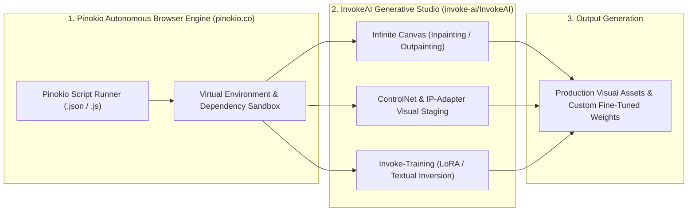

# 🎨 Pinokio Local AI Orchestrator & InvokeAI Studio

Use this skill when installing, scripting, or automating local open-source AI applications (ComfyUI, InvokeAI, Fooocus, Whisper, LLaMA), configuring LoRA training, or managing visual generative canvases.

## Architecture

## Key Capabilities
1. **Pinokio Automated Scripting**: Automates Git cloning, Python venv creation, CUDA dependency installation, and background server execution.
2. **InvokeAI Canvas Workflows**: Advanced visual compositing, regional prompting, inpainting, and outpainting for concept art.
3. **LoRA Visual Fine-Tuning**: Scripted workflows for training custom character, style, and object LoRAs with `invoke-training`.

## How to Use
`Deploy and run local AI app [app_name] via Pinokio script or configure InvokeAI visual workflow for [creative_task].`
