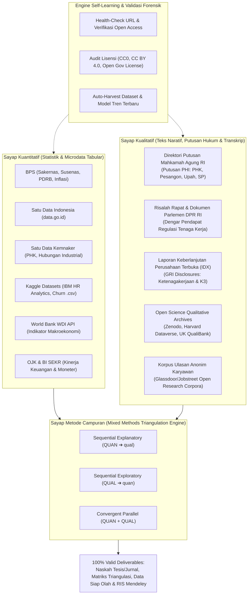
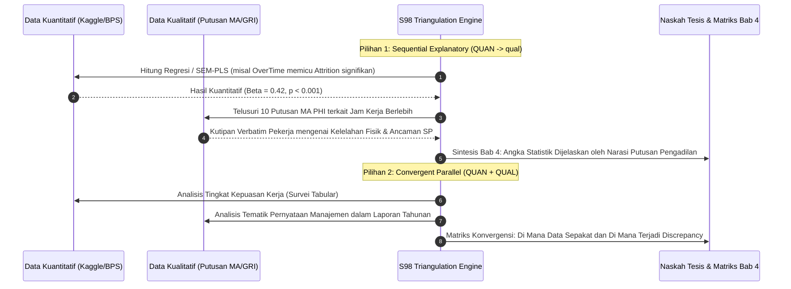

# 🌐 Super-Skill S98: Powerful Research Data Engine (Maximum Capacity)
> **Super-Skill ID**: `S98` | **Kategori**: Academic, Quantitative, Qualitative, Mixed Methods & Self-Learning
> **Peruntukan**: Dola AI, `/omni-auto`, Claude Code, Cline, Cursor, Antigravity, OpenCode, dan Asisten AI lainnya.
> **Format Deliverable**: Dataset Mentah (`.csv`, `.xlsx`), Korpus Teks Kualitatif (`.txt`, `.pdf`), Matriks Triangulasi (`.md`), Naskah Tesis/Jurnal (`.docx`), Sitasi Mendeley (`.ris`), dan Obsidian Vault (`.md`).

---

## 🧭 1. Arsitektur Komprehensif: Kuantitatif, Kualitatif & Metode Campuran

Skill ini dirancang dengan prinsip **100% Real, 100% Valid, dan Mengutamakan Akses Bebas Biaya (Zero-Cost / Open Access)**. Arsitektur data dibagi ke dalam 3 sayap utama yang bermuara pada **Triangulasi Metode Campuran (*Mixed Methods*)**:



---

## 📊 2. Sumber Data Kuantitatif (100% Real, Legal & Gratis)

1. **Badan Pusat Statistik (BPS)** (`https://www.bps.go.id/`):
   - **Sakernas**: Data makro dan mikro angkatan kerja, tingkat upah, pengangguran, struktur lapangan pekerjaan per provinsi/sektor.
   - **Susenas**: Konsumsi rumah tangga, tingkat kemiskinan, indeks gini, akses jaminan sosial.
   - **Format**: Tabel dinamis Excel (`.xlsx`), CSV, Berita Resmi Statistik (PDF). Akses instan tanpa syarat pendaftaran.
2. **Satu Data Indonesia** (`https://data.go.id/`):
   - Portal lintas kementerian/lembaga berbasis CKAN REST API berlisensi *Open Government License*.
3. **Satu Data Kemnaker** (`https://satudata.kemnaker.go.id/`):
   - Kasus pemutusan hubungan kerja (PHK), mogok kerja, perselisihan hak/kepentingan, penempatan vokasi.
4. **Kaggle Datasets** (`https://www.kaggle.com/datasets`):
   - Dataset benchmark tervalidasi internasional: *IBM HR Analytics Employee Attrition & Performance* (1,470 sampel karyawan), *Employee Engagement Surveys*, *Customer Churn*.
5. **World Bank Open Data** (`https://data.worldbank.org/`):
   - Indikator pembangunan dunia (WDI) lintas negara dari tahun 1960–sekarang (API publik tanpa API key).

---

## 📝 3. Sumber Data Kualitatif Sekunder (100% Real, Legal & Autentik)

Banyak penelitian kesulitan memperoleh data wawancara mendalam karena izin perusahaan yang rumit. Skill ini menyediakan akses ke **data kualitatif sekunder primer** yang sah secara hukum dan metodologis:

### 1. Direktori Putusan Mahkamah Agung RI (Pengadilan Hubungan Industrial - PHI)
- **URL Resmi**: `https://putusan3.mahkamahagung.go.id/`
- **Klasifikasi Khusus**: Pilih Kategori *"Perdata Khusus"* $\rightarrow$ *"Perselisihan Hubungan Industrial (PHI)"*.
- **Karakteristik Data Kualitatif**:
  - Puluhan ribu berkas putusan resmi lengkap (format PDF 20–100 halaman per berkas).
  - Memuat **argumen verbatim pekerja** (alasan gugatan PHK, intimidasi manajemen, pemotongan upah sepihak).
  - Memuat **jawaban dan pembelaan pihak perusahaan / HRD** (alasan efisiensi, pelanggaran SOP, evaluasi kinerja).
  - Memuat **pertimbangan hukum majelis hakim** (*ratio decidendi*) berbasis UU Ketenagakerjaan & PP 35/2021.
- **Pemanfaatan Riset**: Analisis isi (*content analysis*) dan pengkodean tematik (*thematic coding*) dengan NVivo / ATLAS.ti untuk menemukan akar penyebab konflik ketenagakerjaan dan turnover tidak sukarela.

### 2. Risalah Rapat & Dokumen Parlemen DPR RI
- **URL Resmi**: `https://www.dpr.go.id/dokumen/`
- **Karakteristik**: Transkrip verbatim rapat dengar pendapat umum (RDPU) Komisi IX (Ketenagakerjaan & Kesehatan) bersama serikat buruh, asosiasi pengusaha (APINDO), dan kementerian.
- **Pemanfaatan**: Meneliti dinamika kebijakan publik, implementasi regulasi upah, jaminan kehilangan pekerjaan (JKP), dan keselamatan kerja.

### 3. Laporan Keberlanjutan (Sustainability / ESG Reports) Emiten BEI
- **URL Resmi**: `https://www.idx.co.id/id/perusahaan-tercatat/laporan-keuangan-dan-tahunan/`
- **Karakteristik**: Seluruh perusahaan terbuka (Tbk) diwajibkan menerbitkan Sustainability Report berbasis standar GRI (*Global Reporting Initiative*).
- **Data Kualitatif Kunci**: Pengungkapan kualitatif mengenai program kesejahteraan karyawan, jam pelatihan per karyawan, kesetaraan gender, mitigasi kecelakaan kerja, dan kebijakan *work-life balance*.

### 4. Repositori Data Kualitatif Terbuka Internasional
- **Harvard Dataverse Qualitative Collections**: Transkrip wawancara terbuka riset sosial.
- **UK Data Service QualiBank**: Repositori kutipan wawancara kualitatif terindeks tema.
- **Zenodo Open Science Archive**: Dataset teks wawancara dan transkrip FGD berlisensi Creative Commons.

---

## 🔄 4. Engine Metode Campuran (Mixed Methods Triangulation)

Skill ini mengotomatiskan tiga desain metode campuran berstandar Creswell (2018):



### Format Matriks Triangulasi Data Campuran (Wajib di Bab 4):
| Variabel / Dimensi Riset | Temuan Kuantitatif (Statistik) | Bukti Kualitatif (Putusan MA / Laporan GRI) | Status Konvergensi | Kode Sitasi Forensik |
| :--- | :--- | :--- | :---: | :---: |
| **Beban Lembur (OverTime)** | $t = 4.89, p < 0.001$, *Odds Ratio* $= 2.45$ (Lembur meningkatkan risiko keluar 2.4x lipat). | *"Pekerja dituntut lembur rata-rata 4 jam setiap hari kerja tanpa uang lembur memadai, memicu penurunan kondisi kesehatan..."* (Putusan MA No. 128/Pdt.Sus-PHI/2023). | **Konvergen (Saling Menguatkan)** | `[1#E]` & `[2#E]` |
| **Kompensasi & Tunjangan** | $R^2 = 0.38$. Upah berpengaruh negatif terhadap intensi pindah ($\beta = -0.31$). | Perusahaan mengalokasikan program insentif kinerja, namun pekerja mengeluhkan ketidakpastian target (Sustainability Report PT XYZ 2023, hal. 45). | **Komplementer (Memperdalam Konteks)** | `[3#E]` |

---

## 🧠 5. Mekanisme Self-Learning & Audit Validitas Otonom

Skill ini memiliki modul evaluasi mandiri (*self-learning*) yang memastikan seluruh data berstatus **100% Real, 100% Valid, dan Zero Hallucination**:
1. **Automated URL & Endpoint Health-Check**: Menguji apakah tautan repositori aktif (HTTP 200 OK) atau mengalami perubahan rute (*redirect/deprecated*).
2. **License Forensic Verification**: Menolak dataset tanpa lisensi terbuka yang jelas untuk mencegah risiko plagiasi dan gugatan hukum hak cipta.
3. **Autonomous Harvesting & Schema Mapping**: Memetakan struktur dataset baru yang terdeteksi ke dalam template variabel tesis secara otomatis.
4. **Zero-Hallucination Fallback**: Jika suatu variabel tidak tersedia secara publik, sistem secara eksplisit mendeklarasikan `"DATA TIDAK TERSEDIA"` alih-alih mengarang nilai statistik.

---

## 🤖 6. Prompt Triggers Instan untuk Dola AI & AI Lainnya

### Prompt 1: Riset Metode Campuran MM-HR (Mixed Methods)
```text
/omni-auto research-data mixed-methods:
Topik: [Contoh: Mitigasi Turnover Karyawan & Hubungan Industrial di Era AI]
Desain: [Sequential Explanatory / Convergent Parallel]
Data Kuantitatif: [IBM HR Analytics / Sakernas BPS]
Data Kualitatif: [Putusan MA Kasus PHI / Laporan Keberlanjutan Emiten IDX]
Tugas AI:
1. Formulasikan kerangka konseptual metode campuran.
2. Petakan hasil statistik kuantitatif bersanding dengan kutipan teks putusan hukum kualitatif.
3. Buatkan Matriks Triangulasi Bab 4 lengkap dengan kode sitasi [N#E].
```

### Prompt 2: Penelusuran Kasus Kualitatif Putusan Mahkamah Agung
```text
/omni-auto research-data qualitative:
Kata Kunci Masalah: [Contoh: PHK efisiensi sepihak, perselisihan upah lembur]
Wilayah Pengadilan: [Pengadilan Hubungan Industrial Jakarta / Surabaya / Nasional]
Tugas AI:
1. Rancang kueri pencarian presisi untuk portal Putusan Mahkamah Agung RI.
2. Buatkan skema pengkodean tematik (Thematic Coding: Induk Tema, Sub-Tema, Kode Verbatim).
3. Hubungkan temuan tema kualitatif ke teori perilaku organisasi (Bab 2).
```

---

## 💻 7. Eksekusi Toolkit CLI Mandiri (`scripts/data_hunter.py`)

Jalankan perintah berikut di terminal untuk operasi data riset instan:

```bash
# Bantuan perintah lengkap
python scripts/data_hunter.py --help

# 1. Cari artikel & data kualitatif via OpenAlex (Gold/Green Open Access)
python scripts/data_hunter.py search-qualitative --query "employee turnover qualitative interview" --limit 5

# 2. Generate kueri pencarian Mahkamah Agung PHI otomatis
python scripts/data_hunter.py generate-ma-phi-queries --topic "pemutusan hubungan kerja pesangon"

# 3. Generate Blueprint Riset Metode Campuran lengkap
python scripts/data_hunter.py generate-mixed-methods --topic "Turnover Intention & Hubungan Industrial"

# 4. Jalankan Self-Audit kesehatan API & keabsahan data sekunder
python scripts/data_hunter.py self-audit
```
