# 📈 Super-Skill S104: Quant Finance, Media Shotcraft & Offer Toolkit
> **Super-Skill ID**: `S104` | **Kategori**: Quantitative Finance, Video Production, Career Negotiation & IoT Telemetry
> **Sumber Utama**: Wilson Freitas (`wilsonfreitas/awesome-quant`), Vincent Wei (`Vincentwei1021/video-shotcraft`), WyattBlue (`WyattBlue/auto-editor`), Yan Liu (`yanliudesign/offer-toolkit-skill`), Stably (`stablyai/orca`), ArcBox (`arcboxlabs/arcbox`), Eigent (`eigent-ai/eigent`), Mxtiv (`BlueJammer`).
> **Integrasi**: Dola AI v4.0, `/omni-auto`, Python NumPy/SciPy/pandas, FFmpeg, Wan2.1, dan Obsidian Vault.

---

## 🧭 1. Arsitektur Multidisiplin: Finansial, Media Sinematik & Negosiasi Karir

Skill ini menyatukan pemodelan kuantitatif tingkat tinggi dengan produksi media cerdas dan strategi karir profesional:

```mermaid
flowchart TD
    subgraph QuantFinance ["1. Awesome-Quant Financial Engineering Engine"]
        DATA["Data Harga Pasar / Indikator Makro"] --> RISK["Pemodelan Risiko: Value at Risk (VaR), CVaR & GARCH Volatility"]
        RISK --> PORT["Optimasi Portofolio Markowitz & Sharpe Ratio"]
        PORT --> DERIV["Penetapan Harga Opsi Black-Scholes & Ekonometrika"]
    end

    subgraph MediaShotcraft ["2. Video Shotcraft & Auto-Editor Production"]
        SCRIPT["Naskah Cerita / Ide Video"] --> SHOT["Video-Shotcraft: Desain Sudut Kamera, Pencahayaan & Framing Sinematik"]
        SHOT --> PROMPT["Kompilasi Prompt Generatif Wan2.1 / Runway / Sora"]
        RAWVID["Rekaman Audio / Video Mentah"] --> AUTOEDIT["Auto-Editor: Pemotongan Jeda Hening & Dead Space Otomatis"]
    end

    subgraph CareerNegotiation ["3. Offer-Toolkit & Hardware Telemetry"]
        OFFER["Tawaran Kerja / Kontrak Eksekutif"] --> COMP["Kalkulasi Total Kompensasi (Base, Bonus, Equity Vesting)"]
        COMP --> NEGOTIATE["Generator Surat Negosiasi Gaji & Strategi Counter-Offer"]
        BLE["BlueJammer Telemetri: Audit Protokol Nirkabel Bluetooth & IoT"]
    end
```



---

## ⚡ 2. Fitur Unggulan

### 1. Awesome-Quant Financial Engineering (`awesome-quant`)
- Repositori ekonometrika dan rekayasa finansial terlengkap:
  - Analisis deret waktu finansial (*Time Series Analysis*).
  - Algoritma perdagangan kuantitatif (*Backtesting Engine*).
  - Model faktor Fama-French, analisis risiko kredit, dan optimasi alokasi aset.

### 2. Video-Shotcraft Sinematik (`video-shotcraft`)
- Mengonversi naskah tulisan menjadi storyboard visual profesional dengan parameter kamera nyata:
  - *Shot Types*: Extreme Long Shot, Over-the-Shoulder, Low-Angle Hero Shot, Dutch Tilt.
  - *Camera Movement*: Dolly in, Pan left, Orbit 360, FPV Drone fly-through.
  - *Lighting & Tone*: Chiaroscuro noir, Golden hour diffuse, Cyberpunk neon, Anamorphic flares.

### 3. Auto-Editor Algorithmic Trimming (`auto-editor`)
- Menghilangkan jeda diam (*silence/pauses*) dari video rekaman presentasi, kuliah umum, atau podcast secara otomatis berbasis ambang batas desibel dan deteksi gerakan visual.

### 4. Offer-Toolkit Career Negotiation (`offer-toolkit-skill`)
- Menghitung nilai bersih kompensasi (*Total Compensation - TC*):
  - Gaji pokok, bonus tahunan, nilai saham bertahap (*RSU / Stock Options 4-year vesting with 1-year cliff*).
  - Menghasilkan argumen negosiasi berbasis nilai (*value-based negotiation templates*).

---

## 🛠️ 3. Cara Penggunaan di Omni-Auto

```text
# 1. Pemodelan Finansial Kuantitatif
/omni-auto quant: Calculate portfolio risk metrics (VaR, Sharpe ratio, max drawdown) for [asset_list]

# 2. Desain Storyboard & Parameter Kamera AI Video
/omni-auto shotcraft: Convert scene description [scene] into cinematic camera prompts for Wan2.1/Runway

# 3. Potong Jeda Hening Rekaman Video
/omni-auto auto-editor: Trim silence from recording [file.mp4] with threshold -30dB and speed 1.5x

# 4. Analisis & Negosiasi Tawaran Gaji
/omni-auto offer-evaluate: Benchmark job offer [salary_details] and generate executive counter-offer strategy
```
