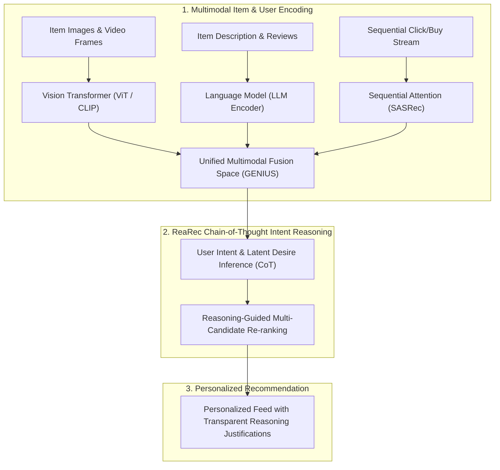

# 🎯 Reasoning & Multimodal Recommendation Engine (ReaRec + GENIUS CVPR'25 Fusion)

Use this skill when building multi-modal recommendation systems (images + text + video + user behavior), reasoning-enhanced recommendation algorithms, or generative personalization models.

## Architecture

## Core Capabilities
1. **Multimodal Representation Fusion**: Embeds image visual features, textual descriptions, and user behavioral graphs into a shared metric space.
2. **Reasoning-Augmented Retrieval (ReaRec)**: Uses Chain-of-Thought prompting to infer latent user motivation (e.g. why a user who bought item A and B would now need item C).
3. **Transparent Recommendation Justification**: Generates user-friendly explanations for every recommended item.

## How to Use
`Build multimodal reasoning recommendation pipeline for [domain/catalog] combining image/text embeddings and ReaRec Chain-of-Thought ranking.`
