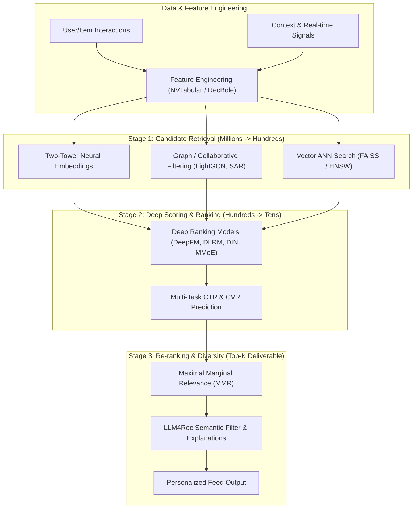

# 🎯 Recommendation Systems Engine (RecBole + Microsoft Recommenders + NVIDIA Merlin + LLM4Rec Fusion)

Use this skill when designing, building, training, evaluating, or optimizing recommendation engines, personalization algorithms, candidate retrieval, click-through-rate (CTR) ranking, or LLM-based recommender systems.

## Multi-Stage Industrial Architecture

---

## 1. Candidate Retrieval & Candidate Generation
1. **Two-Tower Neural Retrieval**:
   - Separate User Tower $U(x)$ and Item Tower $V(y)$ mapped to a shared $d$-dimensional embedding space.
   - Cosine / Dot product similarity scored with Sampled Softmax or In-Batch Negative Loss.
2. **Sequential & Graph Retrieval**:
   - **SASRec / BERT4Rec**: Self-attention on historical user interaction sequences for next-item prediction.
   - **LightGCN**: Simplified graph convolutions propagating collaborative signals across bipartite user-item graphs.
3. **Item-to-Item Collaborative Filtering (SAR)**:
   - Co-occurrence matrix with time-decay and item frequency regularization.

---

## 2. Deep Ranking & Multi-Task CTR/CVR
1. **Feature Interaction Models**:
   - **DeepFM**: Dual architecture combining factorization machines (low-order explicit interactions) and deep neural networks (high-order non-linear interactions).
   - **DLRM (Deep Learning Recommendation Model)**: Sparse categorical embedding tables combined with dense bottom MLPs and dot-product interaction layers.
2. **Sequential & Attention-Based Rankers**:
   - **DIN (Deep Interest Network)**: Local activation attention matching historical items with candidate target items.
   - **MMoE / PLE (Multi-gate Mixture-of-Experts)**: Multi-task learning simultaneously optimizing Click-Through Rate (CTR) and Conversion Rate (CVR) without task interference.

---

## 3. LLM4Rec & Generative Recommendation
1. **LLM as Semantic Encoder**: Generate rich text/multimodal embeddings from item metadata and user purchase history.
2. **LLM as Zero-Shot / Few-Shot Re-Ranker**: Present top-20 candidates in prompt with user profile; output ranked sequence with natural language justifications.
3. **Conversational Recommendation**: Multi-turn dialogue clarifying user preferences in real-time.

---

## 4. Offline & Online Evaluation Metrics

### Ranking & Retrieval Metrics:
- **NDCG@K (Normalized Discounted Cumulative Gain)**:
  $$\text{DCG}@K = \sum_{i=1}^K \frac{2^{rel_i} - 1}{\log_2(i + 1)}, \quad \text{NDCG}@K = \frac{\text{DCG}@K}{\text{IDCG}@K}$$
- **Recall@K & Precision@K**: Proportion of relevant items retrieved in top-$K$.
- **MAP (Mean Average Precision) & MRR (Mean Reciprocal Rank)**.

### Diversity & Fairness Metrics:
- **Intra-List Diversity (ILD)**: Cosine distance between recommended items in a session.
- **Coverage & Gini Coefficient**: Measuring catalog long-tail exposure and popularity bias.

---

## How to Use
`Build [retrieval / ranking / LLM4Rec] recommendation pipeline for [dataset / domain] using [Two-Tower / DeepFM / RecBole / Merlin] with NDCG@10 evaluation.`
