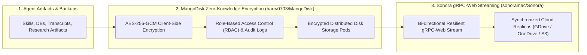

# 🔒 Secure Distributed Storage & Resilient Transport (MangoDisk + Sonora)

Use this skill when managing sensitive agent artifacts, configuring encrypted distributed file storage, auditing cloud disk access controls, or designing high-throughput gRPC-Web transport pipelines.

## Architecture

## Key Capabilities
1. **MangoDisk Encrypted Storage Engine**: End-to-end client-side encryption ensuring zero-knowledge privacy for AI training files and proprietary codebases.
2. **Access Control & Security Auditing**: Automated vulnerability scans against storage endpoints, permission leaks, and unauthenticated file exposures.
3. **Sonora Streaming Transport**: Ultra-low latency binary serialization over gRPC-Web, enabling fast cross-machine skill synchronization.

## How to Use
`Store and encrypt [file/directory] via MangoDisk security protocol with Sonora streaming replication.`
