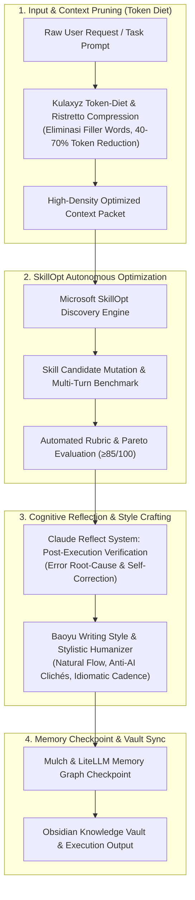

# 🧬 Super-Skill S99: Self-Improving SkillOpt Matrix
> **Super-Skill ID**: `S99` | **Kategori**: Meta-Learning, Prompt Optimization, Agent Evolution & Token Diet
> **Sumber Utama**: Microsoft (`microsoft/SkillOpt`), BerriAI (`BerriAI/self-improving-agent`), Haddock (`claude-reflect-system`), Baoyu (`jzOcb/baoyu-skills`, `ristretto`), Kulaxyz (`self-learning-skills`, `token-diet`), Mulch (`austindixson/mulch`), SkillHack, SkillsLLM, SkillHub.
> **Integrasi**: Dola AI v4.0, `/omni-auto`, Claude Code, Cursor, Cline, OpenCode, dan Obsidian Vault.

---

## 🧭 1. Arsitektur Meta-Learning & Self-Evolution

Skill ini menghadirkan sistem evaluasi mandiri rekursif tingkat lanjut yang memungkinkan agen AI mengevaluasi kinerjanya sendiri, memangkas token yang tidak perlu, dan mengoptimalkan instruksi secara adaptif:



---

## ⚡ 2. Lima Pilar Komponen Inti

### 1. Microsoft SkillOpt Engine (`microsoft/SkillOpt`)
- **Prinsip**: Algoritma optimasi instruksi berbasis iterasi diskrit.
- **Mekanisme**:
  1. Mengevaluasi prompt awal terhadap metrik keberhasilan (*accuracy, latency, token consumption*).
  2. Menghasilkan variasi (*mutations*) pada instruksi peran, batasan, dan contoh *few-shot*.
  3. Memilih varian dengan skor tertinggi untuk dijadikan keterampilan permanen (*frozen optimal skill*).

### 2. Kulaxyz Token-Diet & Ristretto Compression (`token-diet`, `ristretto`)
- **Prinsip**: Kompresi semantik presisi tinggi tanpa kehilangan makna esensial.
- **Rasio Kompresi**: 40% hingga 70% penghematan token.
- **Aturan Diet Token**:
  - Menghapus frasa basa-basi AI (*"Sure, I can help with that"*, *"Let's dive into..."*).
  - Mengubah narasi panjang menjadi format terstruktur minimal (*bullet tokens*).
  - Mengonversi contoh berulang menjadi satu representasi kanonikal.

### 3. Claude Reflect System (`claude-reflect-system`)
- **Prinsip**: Refleksi kognitif sebelum menghasilkan jawaban final.
- **Siklus 3 Langkah**:
  1. *Pre-Execution Sanity Check*: Apakah semua parameter dan data tersedia?
  2. *In-Flight Monitoring*: Apakah penalaran melenceng dari batasan pengguna?
  3. *Post-Execution Audit*: Apakah ada halusinasi, tautan mati, atau inkonsistensi matematis?

### 4. Baoyu Writing Style & Humanization (`baoyu-skills`, `writing-style-skill`)
- **Prinsip**: Menghilangkan nada mekanis khas AI dan mengadopsi gaya penulisan editorial manusiawi berkualitas tinggi.
- **Ciri Khas**:
  - Menghindari kata klise berulang (*"delve", "tapestry", "plethora", "crucial role"*).
  - Menggunakan variasi panjang kalimat (ritme staccato dan legato).
  - Menghadirkan analogi konkret dan sudut pandang praktisi dunia nyata.

### 5. Mulch & LiteLLM Self-Evolving Swarm (`mulch`, `self-improving-agent`)
- Menyimpan histori perbaikan performa ke dalam basis data memori lokal.
- Ketika masalah serupa dihadapi di masa mendatang, agen secara instan memuat pola solusi terbaik yang telah diverifikasi sebelumnya.

---

## 🛠️ 3. Cara Penggunaan di Omni-Auto

### Pemicu Perintah Cepat:
```text
# 1. Optimasi Keterampilan & Prompt Mandiri
/omni-auto skillopt: Optimize prompt [prompt/task] using Microsoft SkillOpt multi-pass refinement

# 2. Pangkas Token dengan Token-Diet
/omni-auto token-diet: Compress context [context_text] achieving maximum density with zero loss

# 3. Refleksi & Humanisasi Editorial
/omni-auto reflect-polish: Audit [manuscript/draft] with Claude Reflect and Baoyu Writing Style
```

---

## 📜 4. Template Eksekusi Mandiri (Prompt Master Format)

```text
[ROLE]: Metacognitive Skill Optimizer & Token Architect (S99)
[OBJECTIVE]: Recursively refine input instructions for maximum reasoning fidelity and minimum token bloat.
[TASK]:
1. Apply Token-Diet: Prune all conversational fillers and redundant framing.
2. Formulate SkillOpt mutations: Generate 3 candidate formulations with distinct cognitive framings.
3. Benchmark: Score each candidate against clarity, determinism, and zero-hallucination standards.
4. Reflect & Finalize: Output the single winning prompt wrapped in production-grade execution tokens.
```
