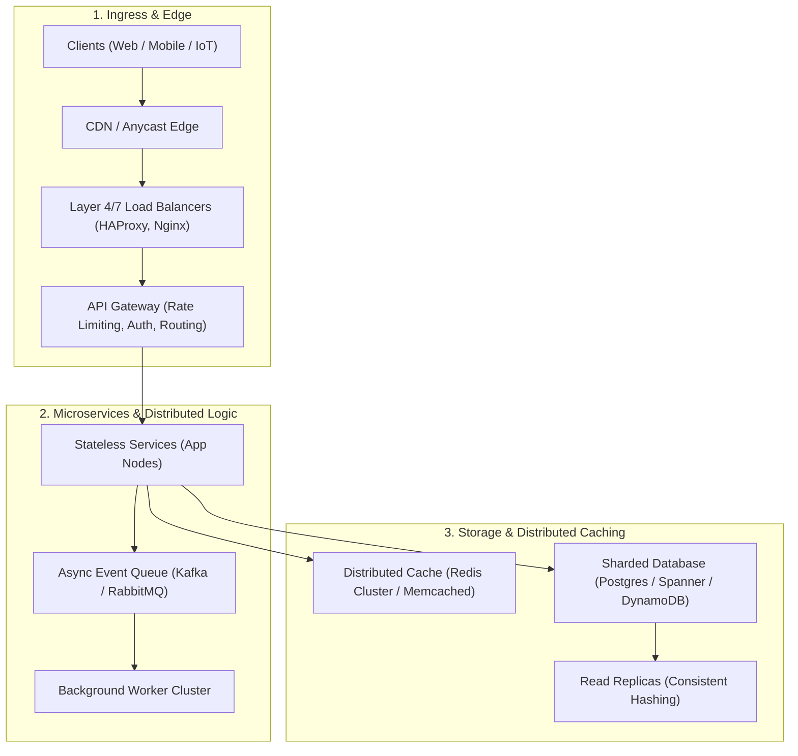

# 🏗️ System Architecture & Distributed Foundations (System Design Primer + Build Your Own X Fusion)

Use this skill when designing scalable distributed systems, microservices architectures, low-latency caching layers, distributed databases, or implementing low-level protocols from scratch (databases, key-value stores, event brokers).

## Architectural Patterns & Trade-offs

## Core Architectural Pillars
1. **Scalability & Partitioning**: Consistent hashing, horizontal database sharding, partition keys, read/write splitting.
2. **Resilience & Fault Tolerance**: Circuit breakers, exponential backoff with jitter, leader election (Raft/Paxos), idempotent APIs.
3. **Data Consistency Models**: ACID vs BASE, event-driven eventual consistency, Saga pattern for distributed transactions.
4. **Low-Level Protocol Implementation**: Deep knowledge of implementing socket networking, binary wire protocols, write-ahead logs (WAL), and LSM-tree / B-tree storage engines.

## How to Use
`Design high-scale distributed system architecture for [system/service] handling [target QPS/scale] with high availability and partition tolerance.`
