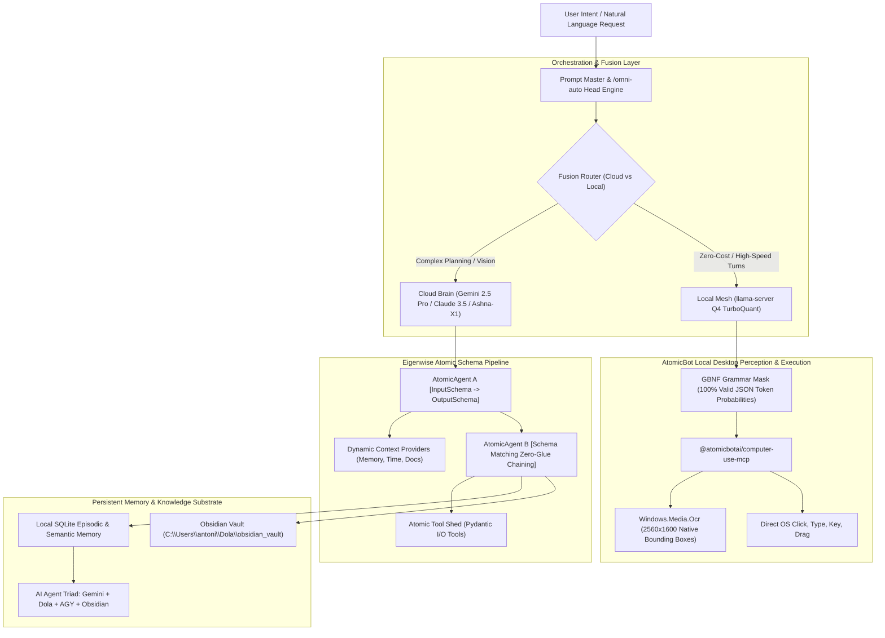

# ⚛️ Super-Skill S208: Atomic Agents Schema-Chaining & Local GBNF Operator Mesh

## 🎯 Architecture Overview
Super-Skill **S208** combines two cutting-edge agentic architectures into a single, unified operational framework:
1. **Eigenwise `atomic-agents` (Kenny Vaneetvelde)**: A modular, Python-native framework where each agent is an atomic, single-responsibility component governed by strict Pydantic `BaseIOSchema` contracts, dynamic context providers, and zero-glue pipeline chaining.
2. **AtomicBot `atomic-agent` (`https://atomicagent.io/`)**: A local-first autonomous desktop operator runtime achieving **69.8% on GAIA Level 1** via token-level GBNF grammar-constrained decoding, TurboQuant WHT-compressed KV caching, native Windows Media OCR computer-use MCP, and Cloud-Local Fusion orchestration.



---

## ⚡ Core Capabilities & Pillars

### 1. Eigenwise Atomic Agent Schema-Chaining
- **Strict I/O Typing**: Every agent inherits from `AtomicAgent[InputSchema, OutputSchema]` powered by Pydantic and Instructor. An agent cannot return unvalidated text; it must output an instance of its declared schema.
- **Zero-Glue Pipeline Composition**: If Agent A's `OutputSchema` structurally satisfies Agent B's `InputSchema`, they chain directly:
  ```python
  result = agent_b.run(agent_a.run(initial_input))
  ```
- **Dynamic Context Injection (`BaseDynamicContextProvider`)**: Injects live, non-static context (timestamps, user state, retrieved RAG chunks) into the agent's system prompt at runtime without mutating prompt templates.
- **Declarative System Prompt Construction (`SystemPromptGenerator`)**: System prompts are assembled systematically from distinct components: Background, Steps, Output Instructions, and Context Providers.
- **Provider Agnostic**: Hot-swap across Groq, Anthropic, Gemini, OpenAI, Ollama, and LiteLLM without rewriting agent logic.

### 2. AtomicBot Local-First GBNF Runtime (`atomicagent.io`)
- **Token-Level GBNF Grammar Masking**: Uses GGML BNF grammars at the inference sampling level in `llama.cpp`. The model physically cannot emit invalid JSON or hallucinated function names; tokens violating the grammar receive probability 0.
- **TurboQuant WHT KV-Cache Compression**: Employs Walsh-Hadamard Transform (WHT) rotated 4-bit KV caching, reducing memory footprint by up to 60% while maintaining accuracy.
- **Speculative Decoding**: Utilizes Gemma 4 MTP or Qwen 3.6 NextN drafting models for +30–50% token generation speed on local hardware.
- **Local SQLite Memory**: Dual-tier episodic (interaction history) and semantic (vector embeddings) storage kept 100% on-device.

### 3. Native Windows Desktop Perception (`@atomicbotai/computer-use-mcp`)
- **Full-Resolution Capture**: Bypasses the 1000px downscaling bottleneck by taking 2560×1600 lossless screen captures.
- **Windows Media OCR Integration**: Runs `Windows.Media.Ocr` directly on desktop frames to extract exact text bounding boxes `[x, y, w, h]`, eliminating coordinate hallucination.
- **Atomic OS Primitives**: Precise mouse moves, left/right clicks, key strokes, hotkey combinations, and scroll actions.

### 4. Cloud-Local Fusion Mode
- **Dual-Brain Architecture**:
  - **Cloud Orchestrator**: Gemini 2.5 Pro / Ashna-X1 / Claude 3.5 handles high-level goal decomposition, ambiguity resolution, and synthesis.
  - **Local Workers**: Local `llama-server` handles intermediate repetitive turns, data formatting, grammar-constrained extraction, and desktop OCR coordinate clicks.
  - **Result**: Slashes cloud API token consumption by 85%+ while delivering sub-second responsiveness for repetitive actions.

---

## 🛠️ Step-by-Step Implementation Workflow

### Step 1: Define Atomic Schemas
Define strict Pydantic schemas for inputs and outputs:
```python
from pydantic import BaseModel, Field
from typing import List, Optional

class SearchRequestSchema(BaseModel):
    query: str = Field(..., description="Target search query")
    max_results: int = Field(default=5, description="Max items to retrieve")

class SearchResultItem(BaseModel):
    title: str
    url: str
    snippet: str

class SearchResponseSchema(BaseModel):
    results: List[SearchResultItem]
    summary: str

class SynthesizedAnalysisSchema(BaseModel):
    key_findings: List[str] = Field(..., description="Top 3 key findings")
    action_items: List[str] = Field(..., description="Executable next steps")
    confidence_score: float = Field(..., ge=0.0, le=1.0)
```

### Step 2: Assemble System Prompt with Dynamic Context
```python
from datetime import datetime

class TimeContextProvider:
    def get_context(self) -> str:
        return f"Current System Time: {datetime.now().strftime('%Y-%m-%d %H:%M:%S')}"

class SystemPromptGenerator:
    def __init__(self, background: str, steps: list[str], context_providers: list = None):
        self.background = background
        self.steps = steps
        self.context_providers = context_providers or []

    def build(self) -> str:
        sections = [f"# Background\n{self.background}\n"]
        if self.steps:
            sections.append("# Operational Steps\n" + "\n".join(f"{i+1}. {s}" for i, s in enumerate(self.steps)))
        if self.context_providers:
            sections.append("\n# Live Dynamic Context\n" + "\n".join(cp.get_context() for cp in self.context_providers))
        return "\n".join(sections)
```

### Step 3: Enforce GBNF Grammar for Local Tool Execution
Compile tool signatures into a strict GBNF grammar file or string:
```bnf
root ::= ToolCall
ToolCall ::= "{" ws "\"name\":" ws "\"computer_click\"" ws "," ws "\"arguments\":" ws "{" ws "\"x\":" ws integer ws "," ws "\"y\":" ws integer ws "}" ws "}"
ws ::= [ \t\n\r]*
integer ::= [0-9]+
```

### Step 4: Chain Agents in Zero-Glue Pipeline
```python
# Agent A extracts verified findings
# Agent B generates executive action plan
# Input of Agent B matches Output of Agent A directly
analysis_agent = AtomicAgent(
    input_schema=SearchResponseSchema,
    output_schema=SynthesizedAnalysisSchema,
    system_prompt=prompt_gen.build()
)

output = analysis_agent.run(search_response)
print(f"Confidence: {output.confidence_score}")
print(f"Action Items: {output.action_items}")
```

---

## 💡 Prompt Master Integration Patterns

Whenever user requests involve multi-step automation or schema extraction, Prompt Master automatically formats them into the **Atomic Prompt Template**:

```markdown
### ⚛️ ATOMIC AGENT PROMPT CONTRACT
**Role**: [Single Responsibility Role]
**Objective**: Transform [InputSchema] into [OutputSchema] without deviation.
**Context**:
- System Environment: Windows 11 Desktop
- Dynamic State: [Injected Context]
**Strict Constraints**:
1. Zero unformatted conversational text.
2. Emit strictly valid JSON adhering to the specified schema contract.
3. Every claim must have an associated confidence score and citation tag.
**Output Schema Contract**:
```json
{
  "status": "success | error",
  "data": {},
  "metadata": {
    "execution_time_ms": 0,
    "model_tier": "cloud | local"
  }
}
```
```

---

## 🔗 AI Agent Triad & Obsidian Vault Mapping
- **Obsidian Storage Path**: `C:\Users\antoni\Dola\obsidian_vault\09_AI_WORKFLOW\ATOMIC_AGENTS_ECOSYSTEM_MASTER_GUIDE.md`
- **Canvas Blueprint**: `C:\Users\antoni\Dola\obsidian_vault\00-Canvas\Atomic_Agents_Local_Operator_Mesh.canvas`
- **Execution Script**: `C:\Users\antoni\Dola\obsidian_vault\scripts\atomic_agents_mesh.py`
- **Dataview Tags**: `#dola #agy #atomic-agents #gbnf #local-mesh #s208`
