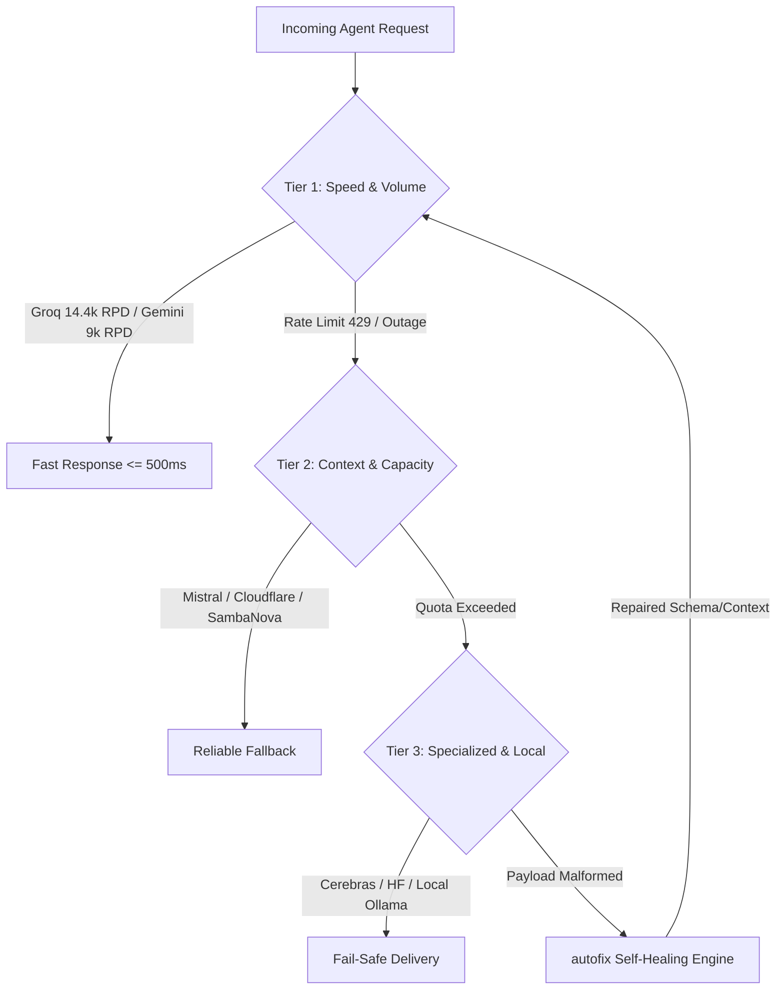

# ⚡ S125 — Free LLM Mesh Failover Gateway (`free-llm-mesh-failover-gateway`)

## 📌 Overview & Upstream Origin
- **Upstream Repositories & Benchmarks**:
  - [nejib1/Free-LLM](https://github.com/nejib1/Free-LLM) (Directory of 120+ free models across 41 providers).
  - [mnfst/manifest](https://github.com/mnfst/manifest), [llm-gateway](https://github.com/mnfst/llm-gateway), [autofix](https://github.com/mnfst/autofix), and `awesome-free-llm-apis`.
  - [tashfeenahmed/freellmapi](https://github.com/tashfeenahmed/freellmapi) (~1B tokens/month multi-key failover proxy).
  - OpenRouter 13-Provider Comparative Analysis (2026) & KDnuggets Top 5 Free Providers.
- **Core Methodology**: High-availability multi-provider routing mesh exposing a unified OpenAI-compatible endpoint. Features score-based routing, automatic cascading failover, request payload healing (`autofix`), daily/monthly quota tracking, and ready-to-run configurations for Claude Code CLI, Cursor, Codex CLI, and Python/Node.js agents.

---

## 🌐 41 Provider Free-Tier Matrix (Key Tiers)

| Provider | Credit Card? | RPM / RPD Limits | Free Monthly Quota | Flagship Free Models | Best Use Case |
|---|:---:|---|---|---|---|
| **Google AI Studio** | ❌ No | 5–30 RPM / 9,000 RPD | Permanent Free Tier | `gemini-3.7-flash`, `gemini-3.1-pro` | 1M context analysis, multimodal reasoning |
| **Groq Cloud** | ❌ No | 30 RPM / 14,400 RPD | Permanent Free Tier | `llama-3.3-70b-versatile`, `whisper-large-v3` | Sub-second ultra-low latency, speech-to-text |
| **Mistral La Plateforme** | 📱 Phone | 1 req/sec ($10/mo credit) | Free Experimentation | `mistral-small-2501`, `codestral-2501`, `pixtral-12b` | Agentic coding, vision reasoning |
| **Cloudflare Workers AI** | ❌ No | Dynamic neuron cap | 10,000 neurons/day (~300k/mo) | `qwen-2.5-72b-instruct`, `llama-3.2-3b` | Edge execution, serverless workers |
| **Cohere** | ❌ No | 20 RPM | 1,000 requests/month | `command-r-plus`, `command-r` | RAG citations, reranking |
| **Hugging Face Serverless** | ❌ No | 300 requests/hour | $0.10/mo free routing credits | `Qwen/Qwen2.5-72B-Instruct`, `meta-llama/Llama-3.1-8B` | Open-weight SOTA testing |
| **NVIDIA NIM** | 📱 Phone | 40 RPM | 1,000 free API calls | `meta/llama-3.3-70b-instruct`, `deepseek-ai/deepseek-r1` | Enterprise GPU acceleration |
| **SambaNova Systems** | ❌ No | High throughput | Free Cloud Tier | `Meta-Llama-3.3-70B-Instruct`, `DeepSeek-R1-Distill` | High-speed SN40L inference |
| **Cerebras Cloud** | ❌ No | 30 RPM | Generous Free Tier | `llama3.1-8b`, `llama3.3-70b` | 2,000+ tokens/sec extreme generation |
| **Z.AI (GLM)** | ❌ No | ~1 req/sec | ~1,000 requests/day | `glm-4.5-flash`, `glm-4.7-flash` | Bilingual Chinese/English reasoning |
| **LLM7.io** | ❌ No | 30 RPM (anon) / 120 RPM (auth) | Up to 5M tokens/day | `DeepSeek-R1`, `Qwen-2.5` | Zero-signup rapid experimentation |
| **Ollama Cloud / Local** | ❌ No | Unlimited (Hardware bound) | 100% Free Forever | `deepseek-r1:14b`, `qwen2.5-coder:7b` | Air-gapped zero-cost offline privacy |

---

## 🏛️ 3-Tier Dynamic Failover Cascade



---

## 🛠️ Self-Healing Engine (`autofix`) Principles

1. **Context Window Auto-Trimming**: Automatically truncates middle messages if payload exceeds model context limit, preserving System Prompt and the most recent 3 turns.
2. **Schema & Temperature Normalization**:
   - Strips unsupported parameters (e.g. `presence_penalty` on providers that only support `temperature`).
   - Converts reasoning models (`DeepSeek-R1`, `o1`) to `temperature=1.0` or removes `temperature` when required.
3. **Model Deprecation Auto-Aliasing**:
   - Queries `modeldeprecations.dev` to map retired IDs (e.g. `llama-3.1-70b-versatile` $\to$ `llama-3.3-70b-versatile`).
4. **Exponential Jitter Backoff**:
   - Upon HTTP 429, retries with $T_{\text{wait}} = 2^k \times (1 + \text{rand}(0, 0.5))$ seconds before falling back to the next provider tier.

---

## 💻 Client Integration Configurations

### 1. Claude Code CLI (`~/.claude.json` or Shell Environment)
```bash
export ANTHROPIC_BASE_URL="http://localhost:8080/v1" # Local FreeLLMAPI Mesh Proxy
export ANTHROPIC_AUTH_TOKEN="free-mesh-key"
```

### 2. Codex CLI (`~/.codex/config.toml`)
```toml
[model]
base_url = "https://api.groq.com/openai/v1"
api_key = "env:GROQ_API_KEY"
default_model = "llama-3.3-70b-versatile"
fallback_model = "gemini-3.7-flash"
```

### 3. Python OpenAI SDK Universal Failover Wrapper
```python
from openai import OpenAI
import os

PROVIDERS = [
    {"base_url": "https://api.groq.com/openai/v1", "api_key": os.getenv("GROQ_API_KEY"), "model": "llama-3.3-70b-versatile"},
    {"base_url": "https://generativelanguage.googleapis.com/v1beta/openai/", "api_key": os.getenv("GEMINI_API_KEY"), "model": "gemini-3.7-flash"},
    {"base_url": "https://api.mistral.ai/v1", "api_key": os.getenv("MISTRAL_API_KEY"), "model": "mistral-small-2501"}
]

def generate_completion(messages):
    for p in PROVIDERS:
        try:
            client = OpenAI(base_url=p["base_url"], api_key=p["api_key"])
            res = client.chat.completions.create(model=p["model"], messages=messages, timeout=10)
            return res.choices[0].message.content
        except Exception as e:
            print(f"[!] Provider {p['base_url']} failed: {e}. Cascading to next...")
    raise RuntimeError("All free mesh providers exhausted.")
```

---

## 🚀 Triggers & Operational Commands
- `/omni-auto free-mesh: Route [prompt] through optimal zero-cost tier with autofix enabled.`
- `/omni-auto free-mesh status: Audit live rate limits, neuron usage, and provider health.`
- `/omni-auto free-mesh benchmark: Measure latency and throughput across Groq, Gemini, and Mistral.`