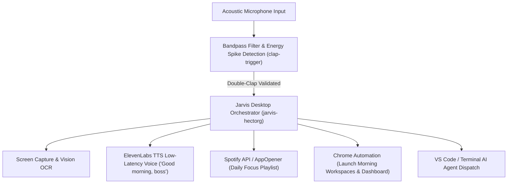

# 🎙️ S156 — Jarvis Multimodal Voice & Desktop Automation System

## 📌 Executive Overview
Derived from `hectorg2211/jarvis`, `hectorg2211/clap-trigger`, `FatihMakes/Mark-XXXIX-OR`, `Jarvis_Setup_Guide.docx`, and `Jarvis AI - Full Setup Tutorial.docx`. This Super-Skill bridges physical world acoustic sensing (microphone double-clap detection) and real-time voice synthesis with automated OS-level desktop orchestration on Windows.

---

## 🔊 Architecture & Execution Pipeline

---

## 🛠️ Core Engineering Components
1. **Acoustic Clap Trigger (`clap-trigger`)**:
   - Uses `PyAudio` to monitor ambient sound in a lightweight background thread.
   - Applies an acoustic threshold and bandpass filter (2 kHz – 4 kHz) to isolate sharp high-frequency hand claps from human speech and background music.
   - Dual-spike detection window: 2 claps within 400ms – 1200ms triggers action.
2. **ElevenLabs Low-Latency Voice Engine**:
   - Streams realistic AI voice responses with sub-300ms latency.
   - Dynamic voice prompts customizable per operational state.
3. **Desktop & Application Automation**:
   - Windows API and `AppOpener` to launch VS Code, Chrome profiles, and Antigravity visualizer.
   - Spotify API integration for automated audio ambiance control.

---

## ⚡ CLI Triggers & Slash Commands
- `/jarvis-setup`: Check dependencies (PyAudio, scipy, elevenlabs, AppOpener) and configure API keys.
- `/clap-trigger start`: Launch background acoustic double-clap listener.
- `/jarvis-voice [text]`: Speak response via ElevenLabs voice synthesis.
- `/desktop-routine [morning|deep_work|meeting]`: Execute full multi-app desktop routine.
