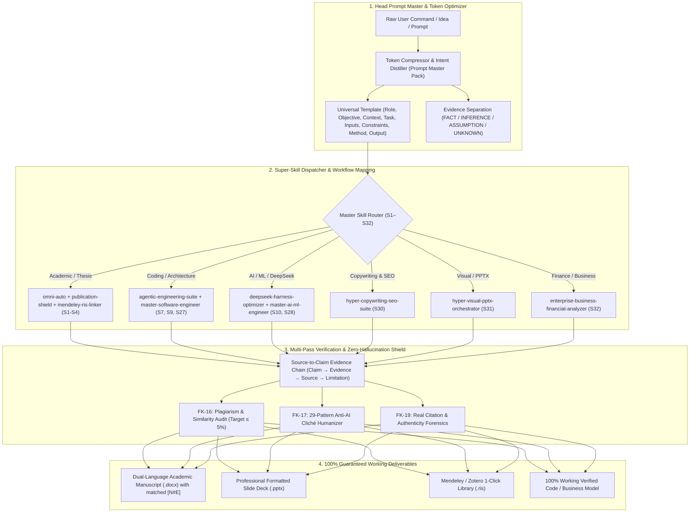

# 👑 `/omni-auto` — Head Meta-Router & Master Prompt Optimizer v4.0

Use this skill unconditionally as the **Head Pre-Processor** for all complex commands, research workflows, academic theses, software engineering, and business modeling tasks.

## Head Architecture & Workflow Routing



## Core Pre-Processing Protocols

### 1. Token & Credit Compression
- Strips redundant tokens and filler phrasing while preserving 100% of underlying user intent.
- Structures request into: **Role**, **Objective**, **Context**, **Task**, **Inputs**, **Constraints**, **Method**, **Output Format**, **Quality Control**, and **Failure Handling**.

### 2. Zero-Hallucination & Anti-Bias Forensics
- **Evidence Separation**: Clearly demarcates verified facts from inferences and assumptions.
- **Missing Data Rule**: Never fabricates DOIs, statistics, citations, or regulations. Uses `"DATA TIDAK TERSEDIA"` or queries live databases when unverified.
- **Source-to-Claim Chain**: Every claim is grounded in peer-reviewed Scopus/WoS literature or authentic datasets.

### 3. Guaranteed Deliverable Production
- **Bahasa Indonesia `.docx`**: Complete structured naskah with `[N#E]` numbered claims.
- **English `.docx`**: Exact 1-to-1 matching `[N#E]` numbered claims and terminology.
- **Presentation `.pptx`**: Structured slide deck with clear narrative flow and presenter notes.
- **Daftar Pustaka `.ris`**: Matching `ID - N` metadata for 1-click import into Mendeley/Zotero.

## Command Syntaxes
```text
/omni-auto [Thesis / Journal]: [Topic]. Type: [QUANTITATIVE/QUALITATIVE/MIXED]. Variables: [...]. Region: [...]. Years: [...].
/omni-auto prompt [raw idea] -> Optimizes into high-density master prompt.
/omni-auto [any task] -> Automatic head routing and verified execution.
```
